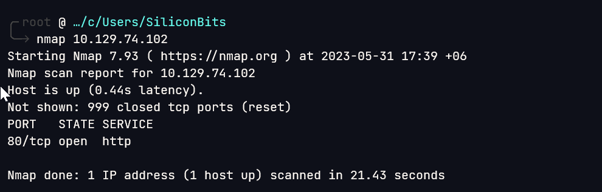

# Bashed

## Overview

This was a fairly easy box. Initial foothold was achieved by a backdoor and from there exploit a root cron to get into root.


**Name -** Bashed

**Difficulty -** Easy

**OS -** Linux

**Points -** 20

## Information Gathering

### **Port Scan**

Basic nmap scan



Service Scan

```bash
╭╴root @ …/c/Users/SiliconBits took 21s
╰─ nmap 10.129.74.102 -sC -sV -p 80
Starting Nmap 7.93 ( https://nmap.org ) at 2023-05-31 17:45 +06
Nmap scan report for 10.129.74.102
Host is up (0.11s latency).

PORT   STATE SERVICE VERSION
80/tcp open  http    Apache httpd 2.4.18 ((Ubuntu))
|_http-server-header: Apache/2.4.18 (Ubuntu)
|_http-title: Arrexel's Development Site

Service detection performed. Please report any incorrect results at https://nmap.org/submit/ .
Nmap done: 1 IP address (1 host up) scanned in 24.68 seconds
```

### **HTTP Enumeration**

Visiting the website gives us the following


Gobuster found some interesting directory.


on the php directory there is a single file but not usable at the moment. Will look at it later if necessary


/dev directory contains backdoor


phpbash.php


## Getting User.txt

From the user’s home directory, It was easy to get the user.txt file


User flag - c56de767dcc62cf4aa6e763943b13573

## Enumeration for privilege escalation

I took a reverse shell for further testing


It was very easy to switch to scriptmanager user


## Getting root.txt

There was a cron running as root. It is running every .py file from /scripts directory.


So, I changed the [text.py](http://text.py) file with following payload


And after some time I got the flag


Root flag - 03801dfb739f482192e659dc9019d61e

## Flags

**user.txt -** c56de767dcc62cf4aa6e763943b13573

**root.txt -** 03801dfb739f482192e659dc9019d61e
