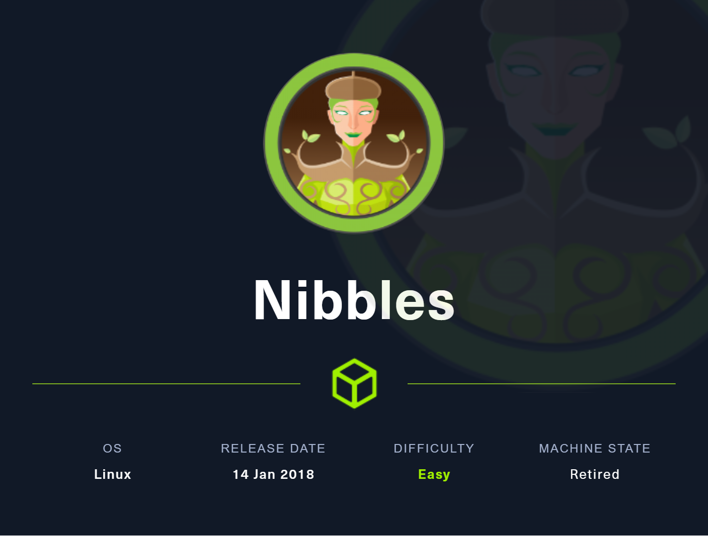
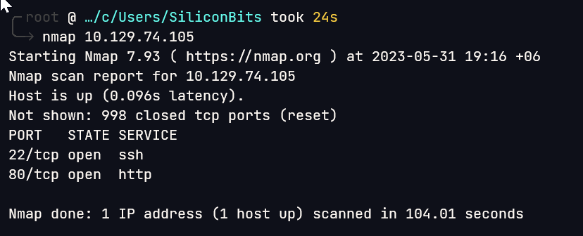

# Nibbles

## Overview

This was a bit guessy box at first. But after that it was fairly straight forward to root



**Name -** Nibbles

**Difficulty -** Easy

**OS -** Linux

**Points -** 20

## Information Gathering

### **Port Scan**

Basic Scan



Version scan

```bash
╭╴root @ …/c/Users/SiliconBits took 1m44s
╰─ nmap -sC -sV -p 22,80 10.129.74.105
Starting Nmap 7.93 ( https://nmap.org ) at 2023-05-31 19:19 +06
Nmap scan report for 10.129.74.105
Host is up (0.057s latency).

PORT   STATE SERVICE VERSION
22/tcp open  ssh     OpenSSH 7.2p2 Ubuntu 4ubuntu2.2 (Ubuntu Linux; protocol 2.0)
| ssh-hostkey:
|   2048 c4f8ade8f80477decf150d630a187e49 (RSA)
|   256 228fb197bf0f1708fc7e2c8fe9773a48 (ECDSA)
|_  256 e6ac27a3b5a9f1123c34a55d5beb3de9 (ED25519)
80/tcp open  http    Apache httpd 2.4.18 ((Ubuntu))
|_http-server-header: Apache/2.4.18 (Ubuntu)
|_http-title: Site doesn't have a title (text/html).
Service Info: OS: Linux; CPE: cpe:/o:linux:linux_kernel

Service detection performed. Please report any incorrect results at https://nmap.org/submit/ .
Nmap done: 1 IP address (1 host up) scanned in 26.49 seconds
```

### **HTTP Enumeration**

Visiting the website gives us the following


The source reveals a hidden directory.


It’s a nibbleblog.


After searching in google I found this CVE-2015-6967. Got an exploit from [github](https://github.com/dix0nym/CVE-2015-6967). But the script needs the credentials. But I was not able to find any credentials in the site. So, I tried to bruteforce it using hydra


But somehow It is not the correct result. I found out I was blocked by nibbleblog security


At this moment I was not able to find a way. I tired to view a writeup of another person and to my surprise the password was the name of the box. It was so much guessy. But, I found another solution from [here](https://eightytwo.net/blog/brute-forcing-the-admin-password-on-nibbles/). He was trying to bypass the blacklist by using **X-FORWARDED-FOR** header. It was very interesting method to bypass the protection.

So, Finally I logged into the admin panel using admin:nibbles


As I have the credentials now, I can try to exploit it using the above mentioned CVE

I was successful to exploit it


I converted this to a reverse shell


## Getting User.txt

nibbleblog directory was not readable. So, I gave it the read permission


But nothing interesting. So, I went to the home directory and grabbed the flag


User flag - 87f3b27d5cd80ab99b7cb54888756bbb

## Getting root.txt

The user has the following privileges.

```bash
nibbler@Nibbles:/tmp/test/personal/stuff$ sudo -l
sudo -l
Matching Defaults entries for nibbler on Nibbles:
    env_reset, mail_badpass,
    secure_path=/usr/local/sbin\:/usr/local/bin\:/usr/sbin\:/usr/bin\:/sbin\:/bin\:/snap/bin

User nibbler may run the following commands on Nibbles:
    (root) NOPASSWD: /home/nibbler/personal/stuff/monitor.sh
nibbler@Nibbles:/tmp/test/personal/stuff$
```

So, I append “/bin/bash -p” at the end of that script and run that using sudo.


Root flag - 03ed509908133de734ba1666f1f5a063

## Flags

**user.txt -** 87f3b27d5cd80ab99b7cb54888756bbb

**root.txt -** 03ed509908133de734ba1666f1f5a063
