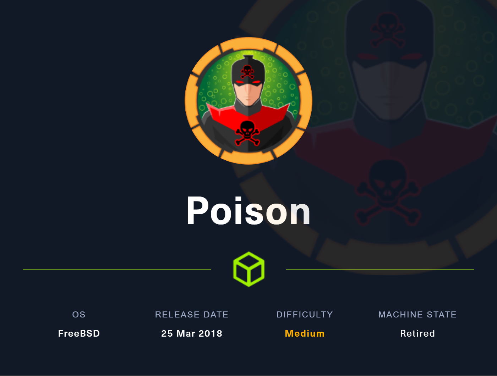
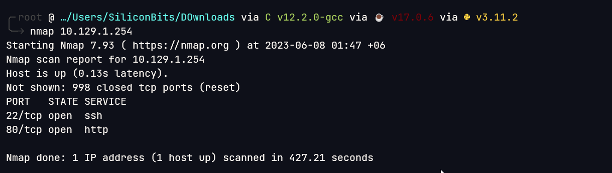

# Poison

## Overview

This was a fairly easy box. Initial foothold was the easiest I have solved. Later a vnc server process was exploited to get the root.



**Name -** Poison

**Difficulty -** Medium

**OS -** FreeBSD

**Points -** 30

## Information Gathering

### **Port Scan**



### **HTTP Enumeration**

Visiting the website gives us the following


Looks like lfi to me


And I was right


Checking the other files I got this


pwdbackup.txt looks interesting


and after several time decoding it as base64 I got a password for charix user


So, The creds are - **charix:Charix!2#4%6&8(0**


## Getting User.txt

Getting user flag was very easy


User Flag - eaacdfb2d141b72a589233063604209c

## Getting root.txt

In the previous image, I can see a secret.zip file. The file was encrypted. The same password was used to unzip this. but there was some binary content.


Also, I found VNC server is running as root user


The previous file might be some necessary file for exploiting the vnc


The default vnc port is listening to 5901. I did a local port forwarding

```bash
ssh -L 5901:127.0.0.1:5901 charix@10.129.1.254
```

I used the following command to connect with the server

```bash
vncviewer -passwd secret localhost:5901
```


Root Flag - 716d04b188419cf2bb99d891272361f5

## Flags

**user.txt -** eaacdfb2d141b72a589233063604209c

**root.txt -** 716d04b188419cf2bb99d891272361f5
