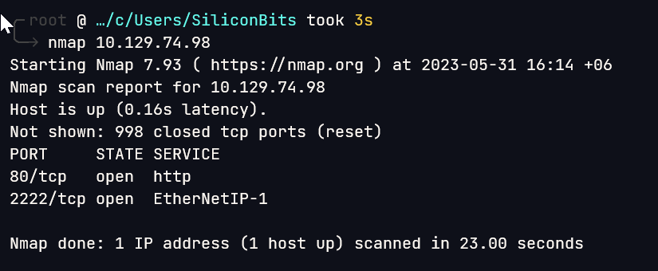

# Shocker

## Overview

This was a very easy box with just shellshock exploit.


**Name -** Shocker

**Difficulty -** Easy

**OS -** Linux

**Points -** 20

## Information Gathering

### **Port Scan**



Service scan

```bash
╰─ nmap -sC -sV -p80,2222 10.129.74.98
Starting Nmap 7.93 ( https://nmap.org ) at 2023-05-31 16:16 +06
Nmap scan report for 10.129.74.98
Host is up (0.072s latency).

PORT     STATE SERVICE VERSION
80/tcp   open  http    Apache httpd 2.4.18 ((Ubuntu))
|_http-title: Site doesn't have a title (text/html).
|_http-server-header: Apache/2.4.18 (Ubuntu)
2222/tcp open  ssh     OpenSSH 7.2p2 Ubuntu 4ubuntu2.2 (Ubuntu Linux; protocol 2.0)
| ssh-hostkey:
|   2048 c4f8ade8f80477decf150d630a187e49 (RSA)
|   256 228fb197bf0f1708fc7e2c8fe9773a48 (ECDSA)
|_  256 e6ac27a3b5a9f1123c34a55d5beb3de9 (ED25519)
Service Info: OS: Linux; CPE: cpe:/o:linux:linux_kernel

Service detection performed. Please report any incorrect results at https://nmap.org/submit/ .
Nmap done: 1 IP address (1 host up) scanned in 24.84 seconds
```

### **HTTP Enumeration**

Visiting the website gives us the following


Gobuster gives me the following. But it needs the -f flag.


I again run gobuster on cgi-bin/ directory


I got a file cgi-bin/user.sh

The name shocker hints to some kind of shellshock vulnerability ([cve-2014-6271](https://cve.mitre.org/cgi-bin/cvename.cgi?name=cve-2014-6271)). I tried to do that and was able to run commands. Though it was a blind command injection but it can be understand by the following

```bash
() { :;}; /bin/bash -c 'sleep 10'
```

And the response comes 10 seconds late.


## Getting User.txt

After replacing the `sleep 10` with a reverse shell I managed to get into the system.


From the home directory, I was able to get the flag


User flag - 097b6e974c0bfeb8c4c4009938775974

## Getting root.txt

Rooting was fairly simple with sudo priviledge on perl binary


## Flags

**user.txt -** 097b6e974c0bfeb8c4c4009938775974

**root.txt -** 317b0d5a5f58587ebaa935c5d386c826
