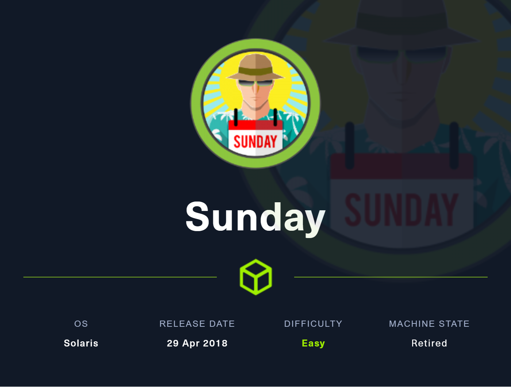
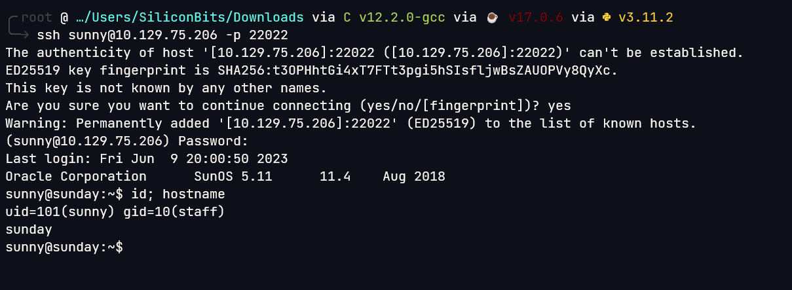

# Sunday

## Overview

This was a fairly easy but boring box with guesses.



**Name -** Sunday

**Difficulty -** Easy

**OS -** Solaris

**Points -** 20

## Information Gathering

### Port Scan

Basic Scan

```bash
╭╴root @ …/Users/SiliconBits/Downloads via C v12.2.0-gcc via ☕ v17.0.6 via  v3.11.2 took 23s
╰─ rustscan -a 10.129.75.206 --ulimit 1000
.----. .-. .-. .----..---.  .----. .---.   .--.  .-. .-.
| {}  }| { } |{ {__ {_   _}{ {__  /  ___} / {} \ |  `| |
| .-. \| {_} |.-._} } | |  .-._} }\     }/  /\  \| |\  |
`-' `-'`-----'`----'  `-'  `----'  `---' `-'  `-'`-' `-'
The Modern Day Port Scanner.
________________________________________
: https://discord.gg/GFrQsGy           :
: https://github.com/RustScan/RustScan :
 --------------------------------------
Nmap? More like slowmap.🐢

[~] The config file is expected to be at "/root/.rustscan.toml"
[~] Automatically increasing ulimit value to 1000.
[!] File limit is lower than default batch size. Consider upping with --ulimit. May cause harm to sensitive servers
[!] Your file limit is very small, which negatively impacts RustScan's speed. Use the Docker image, or up the Ulimit with '--ulimit 5000'.
Open 10.129.75.206:79
Open 10.129.75.206:111
Open 10.129.75.206:515
Open 10.129.75.206:6787
Open 10.129.75.206:22022
[~] Starting Script(s)
[>] Script to be run Some("nmap -vvv -p {{port}} {{ip}}")

[~] Starting Nmap 7.93 ( https://nmap.org ) at 2023-06-10 01:55 +06
Initiating Ping Scan at 01:55
Scanning 10.129.75.206 [4 ports]
Completed Ping Scan at 01:55, 0.16s elapsed (1 total hosts)
Initiating Parallel DNS resolution of 1 host. at 01:55
Completed Parallel DNS resolution of 1 host. at 01:55, 0.06s elapsed
DNS resolution of 1 IPs took 0.06s. Mode: Async [#: 3, OK: 0, NX: 1, DR: 0, SF: 0, TR: 1, CN: 0]
Initiating SYN Stealth Scan at 01:55
Scanning 10.129.75.206 [5 ports]
Discovered open port 79/tcp on 10.129.75.206
Discovered open port 22022/tcp on 10.129.75.206
Discovered open port 6787/tcp on 10.129.75.206
Discovered open port 111/tcp on 10.129.75.206
Discovered open port 515/tcp on 10.129.75.206
Completed SYN Stealth Scan at 01:55, 0.20s elapsed (5 total ports)
Nmap scan report for 10.129.75.206
Host is up, received reset ttl 62 (0.085s latency).
Scanned at 2023-06-10 01:55:41 +06 for 0s

PORT      STATE SERVICE   REASON
79/tcp    open  finger    syn-ack ttl 58
111/tcp   open  rpcbind   syn-ack ttl 62
515/tcp   open  printer   syn-ack ttl 58
6787/tcp  open  smc-admin syn-ack ttl 58
22022/tcp open  unknown   syn-ack ttl 62

Read data files from: /usr/bin/../share/nmap
Nmap done: 1 IP address (1 host up) scanned in 0.64 seconds
           Raw packets sent: 9 (372B) | Rcvd: 6 (260B)
```

Version Scan

```bash
╭╴root @ …/Users/SiliconBits/Downloads via C v12.2.0-gcc via ☕ v17.0.6 via  v3.11.2 took 3m4s
╰─ nmap -sC -sV 10.129.75.206 -p79,111,515,6787,22022
Starting Nmap 7.93 ( https://nmap.org ) at 2023-06-10 01:56 +06
Stats: 0:01:39 elapsed; 0 hosts completed (1 up), 1 undergoing Script Scan
NSE Timing: About 99.71% done; ETC: 01:58 (0:00:00 remaining)
Debugging Increased to 1.
NSE: Finished http-cors against 10.129.75.206:6787.
NSE: Finished finger against 10.129.75.206:79.NSE: Starting runlevel 2 (of 3) scan.
NSE: Starting ssl-known-key against 10.129.75.206:6787.
NSE: Finished ssl-known-key against 10.129.75.206:6787.
NSE: Starting ssl-cert against 10.129.75.206:6787.
NSE: Finished ssl-cert against 10.129.75.206:6787.
NSE: Starting tls-nextprotoneg against 10.129.75.206:6787.
NSE: Starting tls-alpn against 10.129.75.206:6787.
NSE: Starting http-server-header against 10.129.75.206:6787.
NSE: Starting rpc-grind against 10.129.75.206:79.
NSE: Starting rpc-grind against 10.129.75.206:111.
NSE: Starting ssl-date against 10.129.75.206:6787.
NSE: [tls-nextprotoneg 10.129.75.206:6787] Server does not support TLS NPN extension.
NSE: Finished tls-nextprotoneg against 10.129.75.206:6787.
NSE: Finished rpc-grind against 10.129.75.206:111.
NSE: [tls-alpn 10.129.75.206:6787] Chosen ALPN protocol http/1.1 was not offered
NSE: Finished tls-alpn against 10.129.75.206:6787.
NSE: Finished ssl-date against 10.129.75.206:6787.
NSE: Finished http-server-header against 10.129.75.206:6787.
NSE: [rpc-grind 10.129.75.206:79] isRPC didn't receive response.
NSE: [rpc-grind 10.129.75.206:79] Target port 79 is not a RPC port.
NSE: Finished rpc-grind against 10.129.75.206:79.
NSE: Starting runlevel 3 (of 3) scan.
Nmap scan report for 10.129.75.206
Host is up (0.16s latency).
Scanned at 2023-06-10 01:56:50 +06 for 105s

PORT      STATE SERVICE  VERSION
79/tcp    open  finger?
|_finger: No one logged on\x0D
| fingerprint-strings:
|   GenericLines:
|     No one logged on
|   GetRequest:
|     Login Name TTY Idle When Where
|     HTTP/1.0 ???
|   HTTPOptions:
|     Login Name TTY Idle When Where
|     HTTP/1.0 ???
|     OPTIONS ???
|   Help:
|     Login Name TTY Idle When Where
|     HELP ???
|   RTSPRequest:
|     Login Name TTY Idle When Where
|     OPTIONS ???
|     RTSP/1.0 ???
|   SSLSessionReq, TerminalServerCookie:
|_    Login Name TTY Idle When Where
111/tcp   open  rpcbind  2-4 (RPC #100000)
515/tcp   open  printer
6787/tcp  open  ssl/http Apache httpd 2.4.33 ((Unix) OpenSSL/1.0.2o mod_wsgi/4.5.1 Python/2.7.14)
| ssl-cert: Subject: commonName=sunday
| Subject Alternative Name: DNS:sunday
| Not valid before: 2021-12-08T19:40:00
|_Not valid after:  2031-12-06T19:40:00
|_http-server-header: Apache/2.4.33 (Unix) OpenSSL/1.0.2o mod_wsgi/4.5.1 Python/2.7.14
|_ssl-date: TLS randomness does not represent time
| http-title: Solaris Dashboard
|_Requested resource was https://10.129.75.206:6787/solaris/
| tls-alpn:
|_  http/1.1
22022/tcp open  ssh      OpenSSH 7.5 (protocol 2.0)
| ssh-hostkey:
|   2048 aa0094321860a4933b87a4b6f802680e (RSA)
|_  256 da2a6cfa6bb1ea161da654a10b2bee48 (ED25519)
1 service unrecognized despite returning data. If you know the service/version, please submit the following fingerprint at https://nmap.org/cgi-bin/submit.cgi?new-service :
SF-Port79-TCP:V=7.93%I=7%D=6/10%Time=64838408%P=x86_64-pc-linux-gnu%r(Gene
SF:ricLines,12,"No\x20one\x20logged\x20on\r\n")%r(GetRequest,93,"Login\x20
SF:\x20\x20\x20\x20\x20\x20Name\x20\x20\x20\x20\x20\x20\x20\x20\x20\x20\x2
SF:0\x20\x20\x20\x20TTY\x20\x20\x20\x20\x20\x20\x20\x20\x20Idle\x20\x20\x2
SF:0\x20When\x20\x20\x20\x20Where\r\n/\x20\x20\x20\x20\x20\x20\x20\x20\x20
SF:\x20\x20\x20\x20\x20\x20\x20\x20\x20\x20\x20\x20\?\?\?\r\nGET\x20\x20\x
SF:20\x20\x20\x20\x20\x20\x20\x20\x20\x20\x20\x20\x20\x20\x20\x20\x20\?\?\
SF:?\r\nHTTP/1\.0\x20\x20\x20\x20\x20\x20\x20\x20\x20\x20\x20\x20\x20\x20\
SF:?\?\?\r\n")%r(Help,5D,"Login\x20\x20\x20\x20\x20\x20\x20Name\x20\x20\x2
SF:0\x20\x20\x20\x20\x20\x20\x20\x20\x20\x20\x20\x20TTY\x20\x20\x20\x20\x2
SF:0\x20\x20\x20\x20Idle\x20\x20\x20\x20When\x20\x20\x20\x20Where\r\nHELP\
SF:x20\x20\x20\x20\x20\x20\x20\x20\x20\x20\x20\x20\x20\x20\x20\x20\x20\x20
SF:\?\?\?\r\n")%r(HTTPOptions,93,"Login\x20\x20\x20\x20\x20\x20\x20Name\x2
SF:0\x20\x20\x20\x20\x20\x20\x20\x20\x20\x20\x20\x20\x20\x20TTY\x20\x20\x2
SF:0\x20\x20\x20\x20\x20\x20Idle\x20\x20\x20\x20When\x20\x20\x20\x20Where\
SF:r\n/\x20\x20\x20\x20\x20\x20\x20\x20\x20\x20\x20\x20\x20\x20\x20\x20\x2
SF:0\x20\x20\x20\x20\?\?\?\r\nHTTP/1\.0\x20\x20\x20\x20\x20\x20\x20\x20\x2
SF:0\x20\x20\x20\x20\x20\?\?\?\r\nOPTIONS\x20\x20\x20\x20\x20\x20\x20\x20\
SF:x20\x20\x20\x20\x20\x20\x20\?\?\?\r\n")%r(RTSPRequest,93,"Login\x20\x20
SF:\x20\x20\x20\x20\x20Name\x20\x20\x20\x20\x20\x20\x20\x20\x20\x20\x20\x2
SF:0\x20\x20\x20TTY\x20\x20\x20\x20\x20\x20\x20\x20\x20Idle\x20\x20\x20\x2
SF:0When\x20\x20\x20\x20Where\r\n/\x20\x20\x20\x20\x20\x20\x20\x20\x20\x20
SF:\x20\x20\x20\x20\x20\x20\x20\x20\x20\x20\x20\?\?\?\r\nOPTIONS\x20\x20\x
SF:20\x20\x20\x20\x20\x20\x20\x20\x20\x20\x20\x20\x20\?\?\?\r\nRTSP/1\.0\x
SF:20\x20\x20\x20\x20\x20\x20\x20\x20\x20\x20\x20\x20\x20\?\?\?\r\n")%r(SS
SF:LSessionReq,5D,"Login\x20\x20\x20\x20\x20\x20\x20Name\x20\x20\x20\x20\x
SF:20\x20\x20\x20\x20\x20\x20\x20\x20\x20\x20TTY\x20\x20\x20\x20\x20\x20\x
SF:20\x20\x20Idle\x20\x20\x20\x20When\x20\x20\x20\x20Where\r\n\x16\x03\x20
SF:\x20\x20\x20\x20\x20\x20\x20\x20\x20\x20\x20\x20\x20\x20\x20\x20\x20\x2
SF:0\x20\?\?\?\r\n")%r(TerminalServerCookie,5D,"Login\x20\x20\x20\x20\x20\
SF:x20\x20Name\x20\x20\x20\x20\x20\x20\x20\x20\x20\x20\x20\x20\x20\x20\x20
SF:TTY\x20\x20\x20\x20\x20\x20\x20\x20\x20Idle\x20\x20\x20\x20When\x20\x20
SF:\x20\x20Where\r\n\x03\x20\x20\x20\x20\x20\x20\x20\x20\x20\x20\x20\x20\x
SF:20\x20\x20\x20\x20\x20\x20\x20\x20\?\?\?\r\n");
Final times for host: srtt: 159998 rttvar: 122800  to: 651198

NSE: Script Post-scanning.
NSE: Starting runlevel 1 (of 3) scan.
NSE: Starting ssh-hostkey.
NSE: Finished ssh-hostkey.
NSE: Starting runlevel 2 (of 3) scan.
NSE: Starting runlevel 3 (of 3) scan.
```

### Port 79 - finger Enumeration

```bash
╭╴root @ …/finger-user-enum on  mast… (  ) via 🐪 v5.36.0 took 7m16s
╰─ perl finger-user-enum.pl -U /mnt/d/tools/SecLists-master/SecLists-master/Usernames/Names/names.txt -t 10.129.75.206
Starting finger-user-enum v1.0 ( http://pentestmonkey.net/tools/finger-user-enum )

 ----------------------------------------------------------
|                   Scan Information                       |
 ----------------------------------------------------------

Worker Processes ......... 5
Usernames file ........... /mnt/d/tools/SecLists-master/SecLists-master/Usernames/Names/names.txt
Target count ............. 1
Username count ........... 10177
Target TCP port .......... 79
Query timeout ............ 5 secs
Relay Server ............. Not used

######## Scan started at Sat Jun 10 02:36:12 2023 #########
access@10.129.75.206: access No Access User                     < .  .  .  . >..nobody4  SunOS 4.x NFS Anonym               < .  .  .  . >..
admin@10.129.75.206: Login       Name               TTY         Idle    When    Where..adm      Admin                              < .  .  .  . >..dladm    Datalink Admin                     < .  .  .  . >..netadm   Network Admin                      < .  .  .  . >..netcfg   Network Configuratio               < .  .  .  . >..dhcpserv DHCP Configuration A               < .  .  .  . >..ikeuser  IKE Admin                          < .  .  .  . >..lp       Line Printer Admin                 < .  .  .  . >..
anne marie@10.129.75.206: Login       Name               TTY         Idle    When    Where..anne                  ???..marie                 ???..
bin@10.129.75.206: bin             ???                         < .  .  .  . >..
dee dee@10.129.75.206: Login       Name               TTY         Idle    When    Where..dee                   ???..dee                   ???..
ike@10.129.75.206: ikeuser  IKE Admin                          < .  .  .  . >..
jo ann@10.129.75.206: Login       Name               TTY         Idle    When    Where..ann                   ???..jo                    ???..
la verne@10.129.75.206: Login       Name               TTY         Idle    When    Where..la                    ???..verne                 ???..
line@10.129.75.206: Login       Name               TTY         Idle    When    Where..lp       Line Printer Admin                 < .  .  .  . >..
message@10.129.75.206: Login       Name               TTY         Idle    When    Where..smmsp    SendMail Message Sub               < .  .  .  . >..
miof mela@10.129.75.206: Login       Name               TTY         Idle    When    Where..mela                  ???..miof                  ???..
root@10.129.75.206: root     Super-User            console      <Apr 13, 2022>..
sammy@10.129.75.206: sammy           ???            ssh          <Apr 13, 2022> 10.10.14.13         ..
sunny@10.129.75.206: sunny           ???            ssh          <Apr 13, 2022> 10.10.14.13         ..
sys@10.129.75.206: sys             ???                         < .  .  .  . >..
```

## Getting User.txt

After trying many things, It came out the machine name as the password of the user sunny



Got the user flag from sammy’s home directory


User flag - b6a1aba25116281eb5315cf09da576f6

## Getting root.txt

I got shadow backup

```bash
sunny@sunday:/$ ls -al
total 1858
drwxr-xr-x  25 root     sys           28 Jun  9 18:57 .
drwxr-xr-x  25 root     sys           28 Jun  9 18:57 ..
drwxr-xr-x   2 root     root           4 Dec 19  2021 backup
lrwxrwxrwx   1 root     root           9 Dec  8  2021 bin -> ./usr/bin
drwxr-xr-x   5 root     sys            9 Dec  8  2021 boot
drwxr-xr-x   2 root     root           4 Dec 19  2021 cdrom
drwxr-xr-x 219 root     sys          219 Jun  9 18:57 dev
drwxr-xr-x  11 root     sys           11 Jun  9 20:14 devices
drwxr-xr-x  81 root     sys          173 Jun  9 18:57 etc
drwxr-xr-x   3 root     sys            3 Dec  8  2021 export
dr-xr-xr-x   4 root     root           4 Dec 19  2021 home
drwxr-xr-x  21 root     sys           21 Dec  8  2021 kernel
drwxr-xr-x  11 root     bin          342 Dec  8  2021 lib
drwxr-xr-x   2 root     root           3 Jun  9 18:57 media
drwxr-xr-x   2 root     sys            2 Aug 17  2018 mnt
dr-xr-xr-x   1 root     root           1 Jun  9 18:58 net
dr-xr-xr-x   1 root     root           1 Jun  9 18:58 nfs4
drwxr-xr-x   2 root     sys            2 Aug 17  2018 opt
drwxr-xr-x   4 root     sys            4 Aug 17  2018 platform
dr-xr-xr-x  83 root     root      480032 Jun  9 20:19 proc
drwx------   2 root     root          10 Apr 13  2022 root
drwxr-xr-x   3 root     root           3 Dec  8  2021 rpool
lrwxrwxrwx   1 root     root          10 Dec  8  2021 sbin -> ./usr/sbin
drwxr-xr-x   7 root     root           7 Dec  8  2021 system
drwxrwxrwt   3 root     sys          276 Jun  9 20:19 tmp
drwxr-xr-x  29 root     sys           41 Dec  8  2021 usr
drwxr-xr-x  42 root     sys           51 Dec  8  2021 var
-r--r--r--   1 root     root      298504 Aug 17  2018 zvboot
sunny@sunday:/$ cd backup/
sunny@sunday:/backup$ ls -al
total 28
drwxr-xr-x   2 root     root           4 Dec 19  2021 .
drwxr-xr-x  25 root     sys           28 Jun  9 18:57 ..
-rw-r--r--   1 root     root         319 Dec 19  2021 agent22.backup
-rw-r--r--   1 root     root         319 Dec 19  2021 shadow.backup
sunny@sunday:/backup$ cat shadow.backup
mysql:NP:::::::
openldap:*LK*:::::::
webservd:*LK*:::::::
postgres:NP:::::::
svctag:*LK*:6445::::::
nobody:*LK*:6445::::::
noaccess:*LK*:6445::::::
nobody4:*LK*:6445::::::
sammy:$5$Ebkn8jlK$i6SSPa0.u7Gd.0oJOT4T421N2OvsfXqAT1vCoYUOigB:6445::::::
sunny:$5$iRMbpnBv$Zh7s6D7ColnogCdiVE5Flz9vCZOMkUFxklRhhaShxv3:17636::::::
sunny@sunday:/backup$ cat agent22.backup
mysql:NP:::::::
openldap:*LK*:::::::
webservd:*LK*:::::::
postgres:NP:::::::
svctag:*LK*:6445::::::
nobody:*LK*:6445::::::
noaccess:*LK*:6445::::::
nobody4:*LK*:6445::::::
sammy:$5$Ebkn8jlK$i6SSPa0.u7Gd.0oJOT4T421N2OvsfXqAT1vCoYUOigB:6445::::::
sunny:$5$iRMbpnBv$Zh7s6D7ColnogCdiVE5Flz9vCZOMkUFxklRhhaShxv3:17636::::::
sunny@sunday:/backup$
```

I received password hash of sammy. Let’s break the hash with hashcat


So the password for sammy is - **cooldude!**


The sammy user has sudo access to wget


And exploiting sudo wget, I got the root flag


Root Flag - 5c02236b2bc3bcd05b093549f908d52b

## Flags

**user.txt -** b6a1aba25116281eb5315cf09da576f6

**root.txt -** 5c02236b2bc3bcd05b093549f908d52b
